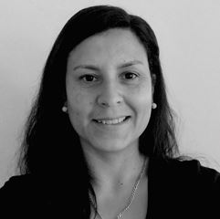

# Sobre mi

**Un poquito sobre mi**

Nací en Paysandú en 1986, crecí en una familia pequeña, trabajadora y llena de amor.

Me mude a Salto en 2004 a cursar los primeros años de la Facultad de Arquitectura en la Regional Norte, donde conocí a mi compañero de vida. 

Nos mudamos a Montevideo en 2008 para terminar la Facultad en la Udelar y realizamos el viaje de Arquitectura en 2012, conociendo los lugares más increíbles del mundo.
Me recibí de Arquitecta en 2014, e ingresé al Ejército unos meses antes. 

Soy mamá de dos niños de 7 y 5 años, el desafío más intenso y hermoso que me dió la vida. 

Recientemente nos mudamos a Rivera por temas laborales y tuve la oportunidad de dar clases en UTU, con lo cual me llevó a replantear mi formación. 
Con mis pequeños más independientes, me encuentro con muchas ganas de crear nuevos proyectos y expandir mis conocimientos profesionales es por ese motivo que *soy parte* de **EFDI 2024**. 
 
Los invito a mi web **[my website](https://community.emergentfutures.io/courses/5566525/content)** 

[foto]: ../images/foto.jpg 