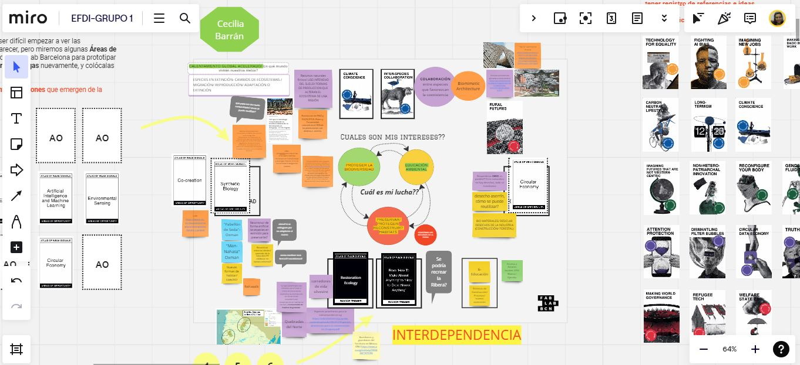
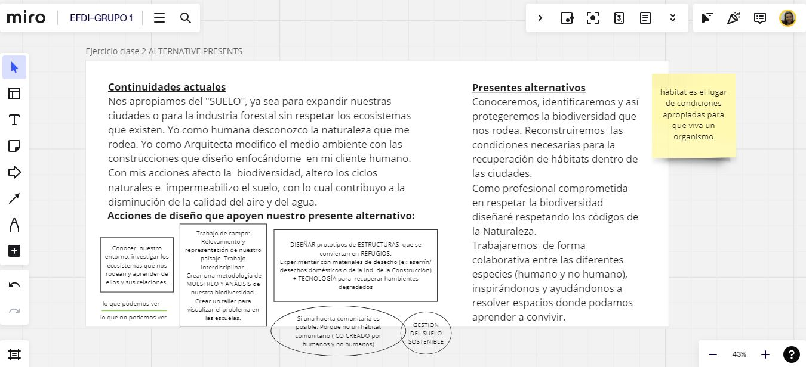
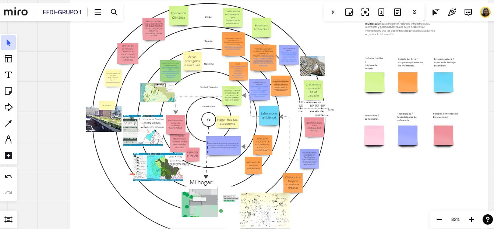
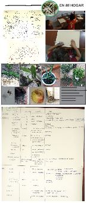

---
hide:
    - toc
---

# MD01
# **Cuál es mi lucha?** Contextualizar el DISEÑO con JANA
Es la primer semana de diseño,  *intensa* y de **mucha investigación**. 
La herramienta de diseño **Atlas de Señales débiles** me puso de lleno a trabajar en la temática del proyecto. Al iniciar el curso no tenía idea cual sería el tema a trabajar y con el trabajo realizado esta semana, mediante el juego y el intercambio, puedo decir que estoy *en camino*.
Al inicio me costó entender la herramienta, y la emoción que sentí cuando presentaron el juego se transformó en frustración.. más tranquila un rato más tarde, buscando información y con el traductor *en la mano* pude ir entendiendo los conceptos detrás de las tarjetas que seleccionaba e ir entrando en tema. Hasta hace una semana atras mi preocupación eran mi familia,las compras, la rutina de los gurises y las cuentas. 
Esta metodología cambio mi perspectiva.

Ejercicio 1 **Espacio de DISEÑO**:

Las señales débiles que elegí son : *CONCIENCIA CLIMÁTICA* y *COLABORACIÓN ENTRE ESPECIES*  

Ejercicio 2 **PRESENTES ALTERNATIVOS**

Ejercicio 3 **DISEÑO MULTIESCALAR**

Ejercicio  opcional **24hs con *mi idea***
Teniendo en cuenta que *mi interés* es conocer / preservar/ proteger/ recuperar la BIODIVERSIDAD local y el SUELO que pisamos. Me propongo representar inicialemente cuanta biodiversidad tengo en **mi hogar**.

Conclusión:
Me preocupa mi desconocimiento, me averguenza mi falta de compromiso con la Naturaleza. Les enseño sobre respeto y empatía a mis hijos y me doy cuenta que tengo mucho por aprender.. 
Gracias Jana por esta herramienta que me ha abierto la cabeza y ha puesto a reflexionar que estoy dentro del problema y depende de mi el poder actuar para reescribir el mañana.  