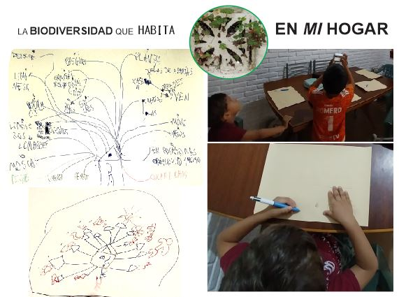

---
hide:
    - toc
---

# MD01
# **Cuál es mi lucha?** Contextualizar el DISEÑO con JANA
Es la primer semana de diseño,  *intensa* y de **mucha investigación**. 
La herramienta de diseño **Atlas de Señales débiles** me puso de lleno a trabajar en la temática del proyecto. Al iniciar el curso no tenía idea cual sería el mi TEMA y con el trabajo realizado esta semana, mediante el juego y el intercambio, puedo decir que estoy *en camino*.

Al inicio me costó entender la herramienta, la emoción que sentí cuando presentaron el juego se transformó en frustración.. Más tranquila busque información y con el traductor *en la mano* pude ir entendiendo los conceptos detrás de las tarjetas que seleccionaba e ir entrando en tema. Hasta hace una semana mi preocupación era mi familia, las compras, la rutina de los peques y las cuentas. 
Esta metodología cambio mi perspectiva.

Ejercicio 1 **Espacio de DISEÑO**:

Mi mesa de trabajo fue cambiando, inicialmente realice el ejercicio siguendo las indicaciones del juego pero no logre conectar  las tarjetas que tome al azar con mis intereses. A medida que fui descubriendolas encontré aquellas que englobaban un concepto o una idea que podía sumar.  Las señales débiles que elegí  son : *CONCIENCIA CLIMÁTICA* y *COLABORACIÓN ENTRE ESPECIES*  
el mal uso de los recursos, el calentamiento global, el aumento de población, cómo serán las ciudades y cómo será el habitat donde vamos a vivir, son interrogantes que me surgen. 
Las áreas de oportunidad  que despiertan mi interés son *BIOLOGÍA SINTÉTICA* , *ECONOMÍA CIRCULAR*  sumé un área más *COCREACIÓN* sería posible pensar en reconstruir habitats degradados o incluso perdidos mediante la biología sintética? Si todo se transforma, porque nuestras construcciones no? 
  
Ejercicio 2 **PRESENTES ALTERNATIVOS**

Con muchas preguntas y pocas respuestas se complicó la tareas de poder escribir en primera persona el problema. Realicé el ejercicio 3 y luego de leer mucho e investigar sobre referentes, proyectos y ejemplos volví a redefinir mi presente  actual (aquello que quiero ROMPER) y mi presente ALTERNATIVO. 

Ejercicio 3 **DISEÑO MULTIESCALAR**

Cuando realicé la tarea en clase me di cuenta que solo abarcaba el anillo exterior de las escalas. Me falta información!, y siguiendo los anillos fui buscando referentes y proyectos en las escalas regional y nacional. Identifique los actores y los Proyectos similares que estan llevando a cabo referente a la temática de biodiversidad y eso me ayudó a visualizar metodologías de actuación. Estoy pensando cómo podría aportar desde mi proycto.

Ejercicio  opcional **24hs con *mi idea***
Teniendo en cuenta que *mi interés* es conocer / preservar/ proteger/ recuperar la BIODIVERSIDAD local y el SUELO que pisamos. Me propongo representar inicialemente cuanta biodiversidad tengo en **mi hogar**.

Perfecto día de lluvia para investigar qué ser vivo convive en casa, botas, piló, celu y a registrar / anotar / dibujar todo lo que reconocemos.

Tratamos de cuantificar pero nos fue muyy dificil. 
Mañana si no llueve saldremos a recorrer la cuadra.

Conclusión:
Me preocupa mi desconocimiento, me averguenza mi falta de compromiso con la Naturaleza. Les enseño sobre respeto y empatía a mis hijos y me doy cuenta que tengo mucho por aprender.. 
Gracias Jana por esta herramienta que me ha abierto la cabeza y ha puesto a reflexionar que estoy dentro del problema y depende de mi el poder actuar para reescribir el mañana.  

Los invito a mi miro **[cecilia barran](https://miro.com/app/board/uXjVKQ8BQl4=/)**