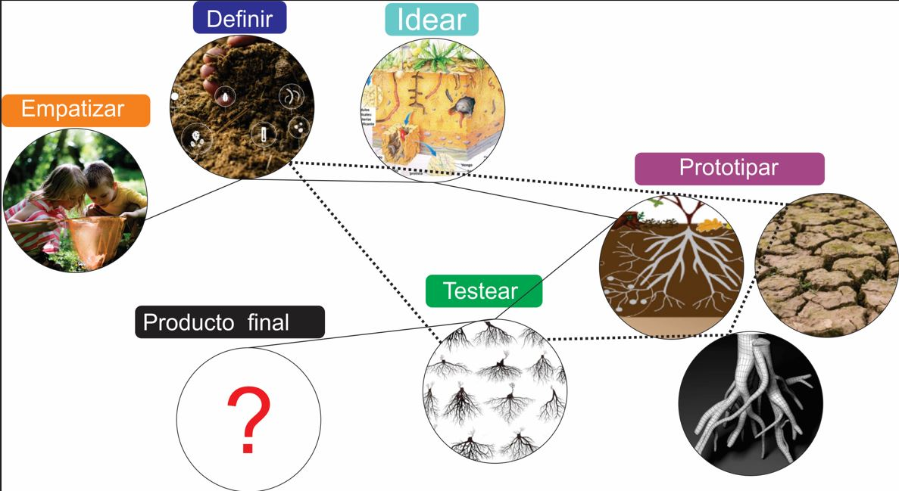
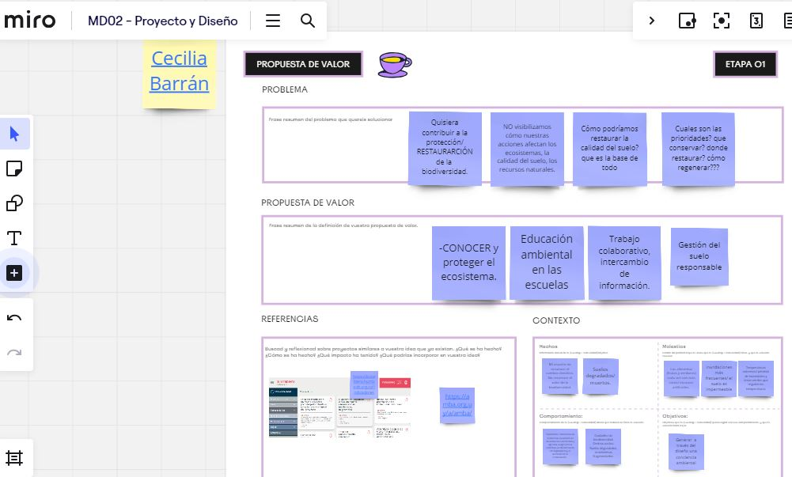
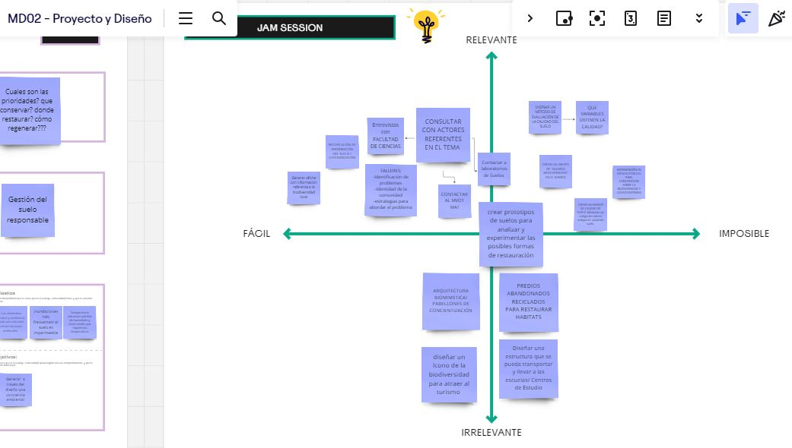
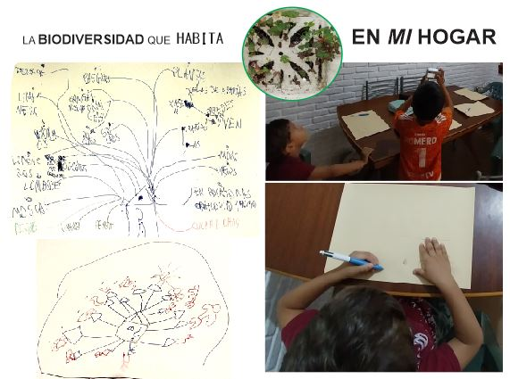
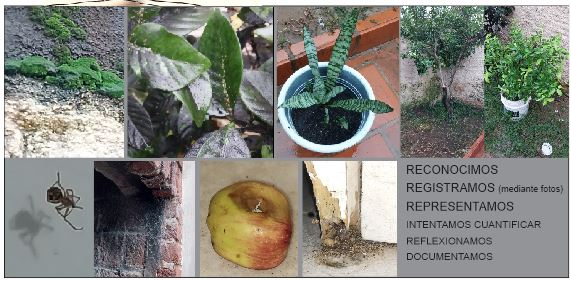
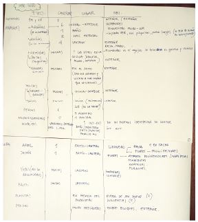

---
hide:
    - toc
---

# MD02
# *Desingn Thinking* con Joaquin Vega

En esta semana hicimos un repaso del proceso realizado hasta el momento y los "MIROS" trabajados. 
Joaquín nos planteó realizar una mirada desde el diseño, centrado en el usuario y los sistemas con los cuales interactúa. Indicadores como las características del usuario, el contexto, la situación de uso y los materiales definen el diseño. 
*Entender para poder CREAR*
Con un esquema sencillo de las diferentes fases del proceso de diseño, lograr comprender el desarrollo que realizamos y cómo este puede reiniciarse en distintas fases para ratificar o rectificar la idea.

1_ Entender las necesidades del USUARIO, ver cómo hacen las cosas, generar entrevistas. Consultar con diferentes actores para tener distintos puntos de vista. Comprenderlo dentro de un sistema.
2_ Para lograr definir el problema es necesario  sistematizar y organizar la información. Definirlo para encararlo. Qué requisitos tiene que cumplir y cuales son opcionales. A través de la definición de criterios de exito, lograr saber si mi proyecto es exitoso.
3_ Idear en conjunto con colaboradores, *abrir la mente* para sumar variedad. 
4_ Prototipar para probar ideas. Al inicio del diseño y  aprender del error. Los distintos Niveles de definición del prototipo, dependiendo de los materiales utilizados y las herramientas. Un prototipo de Baja fidelidad sería aquel que utiliza materiles símples como el cartón. Uno de fidelidad media utilizaría por ejemplo fbricación digital o corte láser y se podría poner a prueba con el usuario. Y un prototipo de fidelidad alta sería una versión de producción que se podría poner  a prueba en el contexto final.

5_ Testear con el usuario, es útil?, se entiende? definir criterios de evaluación y validación.

# Ejercicio 1 **PROPUESTA DE VALOR** ETAPA 01:

La hipótesis que quisiera corroborar es la siguiente: **¿Es posible restaurar un ecosistema dañado mediante acciones regenerativas? Poniendo el foco en el suelo degradado.**
Es un poco vago aún, y no encuentro un usuario específico para especializar el estudio en un caso particular.

# Ejercicio 2 **JAM SESSION**

Con muchas preguntas y pocas respuestas se complicó la tarea de poder escribir en primera persona el problema. Realicé el ejercicio 3 y luego de leer mucho e investigar sobre referentes, proyectos y ejemplos volví a redefinir mi presente  actual (aquello que quiero ROMPER) y mi presente ALTERNATIVO. 

Ejercicio 3 **DISEÑO MULTIESCALAR**

Cuando realicé la tarea en clase me di cuenta que solo abarcaba el anillo exterior de las escalas. Me falta información!, y siguiendo los anillos fui buscando referentes y proyectos en las escalas regional y nacional. Identifique los actores y los Proyectos que se están llevando a cabo referente a la temática de biodiversidad y eso me ayudó a visualizar metodologías de actuación. Estoy pensando qué podría aportar desde mi proyecto.

Ejercicio  opcional **24hs con *mi idea***
Teniendo en cuenta que *mi interés* es conocer / preservar/ proteger/ recuperar la BIODIVERSIDAD local y el SUELO que pisamos. Me propongo representar inicialmente cuanta biodiversidad tengo en **mi hogar**.

Perfecto día de lluvia para investigar qué ser vivo convive en casa, botas, piló, celu y a registrar / anotar / dibujar todo lo que reconocemos.

Tratamos de cuantificar pero nos fue muy difícil. 
Mañana si no llueve saldremos a recorrer la cuadra.

Conclusión:
Me preocupa mi desconocimiento, me averguenza mi falta de compromiso con la Naturaleza. Les enseño sobre respeto y empatía a mis hijos y me doy cuenta que tengo mucho por aprender. 
Gracias Jana por esta herramienta que me ha abierto la cabeza y ha puesto a reflexionar que estoy dentro del problema y depende de mí el poder actuar para reescribir el mañana.  

Los invito a mi miro **[cecilia barran](https://miro.com/app/board/uXjVKQ8BQl4=/)**