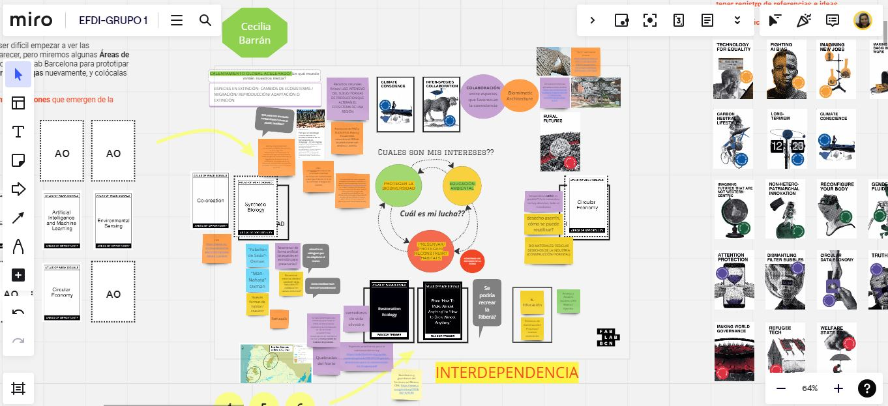
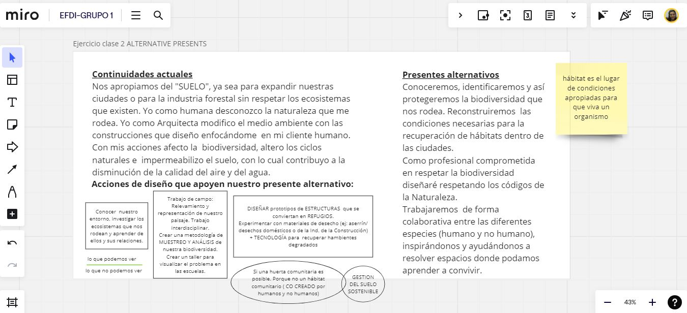

---
hide:
    - toc
---

# MD02
# *Desingn Thinking* con Joaquin Vega

En esta semana hicimos un repaso del proceso realizado hasta el momento y los "MIROS" trabajados. 
Joaquín nos planteó realizar una mirada desde el diseño, centrado en el usuario y los sistemas con los cuales interactúa. Indicadores como las características del usuario, el contexto, la situación de uso y los materiales definen el diseño. 
*Entender para poder CREAR*
Con un esquema sencillo de las diferentes fases del proceso de diseño, lograr comprender el desarrollo que realizamos y cómo este puede reiniciarse en distintas fases para ratificar o rectificar la idea.

Ejercicio 1 **Espacio de DISEÑO**:

Mi mesa de trabajo fue cambiando, inicialmente realice el ejercicio siguiendo las indicaciones del juego pero no logre conectar  las tarjetas que tome al azar con mis intereses. A medida que fui descubriéndolas encontré aquellas que englobaban un concepto o una idea que podía sumar.  Las señales débiles que elegí  son : *CONCIENCIA CLIMÁTICA* y *COLABORACIÓN ENTRE ESPECIES*  
El abuso de los recursos, el calentamiento global, el aumento de población, cómo serán las ciudades y cómo será el hábitat donde vamos a vivir, son interrogantes que me surgen. 
Las áreas de oportunidad  que despiertan mi interés son *BIOLOGÍA SINTÉTICA* , *ECONOMÍA CIRCULAR* y sumé un área más *COCREACIÓN*, sería posible pensar en reconstruir habitats degradados o incluso perdidos mediante la biología sintética? Si todo se transforma, por qué nuestras construcciones no? 
  Podríamos hacer crecer casi todo? Podríamos mediante la impresión 3D + Tecnología crear las condiciones para que se desarrolle la VIDA?

Ejercicio 2 **PRESENTES ALTERNATIVOS**

Con muchas preguntas y pocas respuestas se complicó la tarea de poder escribir en primera persona el problema. Realicé el ejercicio 3 y luego de leer mucho e investigar sobre referentes, proyectos y ejemplos volví a redefinir mi presente  actual (aquello que quiero ROMPER) y mi presente ALTERNATIVO. 

Ejercicio 3 **DISEÑO MULTIESCALAR**

Cuando realicé la tarea en clase me di cuenta que solo abarcaba el anillo exterior de las escalas. Me falta información!, y siguiendo los anillos fui buscando referentes y proyectos en las escalas regional y nacional. Identifique los actores y los Proyectos que se están llevando a cabo referente a la temática de biodiversidad y eso me ayudó a visualizar metodologías de actuación. Estoy pensando qué podría aportar desde mi proyecto.

Ejercicio  opcional **24hs con *mi idea***
Teniendo en cuenta que *mi interés* es conocer / preservar/ proteger/ recuperar la BIODIVERSIDAD local y el SUELO que pisamos. Me propongo representar inicialmente cuanta biodiversidad tengo en **mi hogar**.

Perfecto día de lluvia para investigar qué ser vivo convive en casa, botas, piló, celu y a registrar / anotar / dibujar todo lo que reconocemos.

Tratamos de cuantificar pero nos fue muy difícil. 
Mañana si no llueve saldremos a recorrer la cuadra.

Conclusión:
Me preocupa mi desconocimiento, me averguenza mi falta de compromiso con la Naturaleza. Les enseño sobre respeto y empatía a mis hijos y me doy cuenta que tengo mucho por aprender. 
Gracias Jana por esta herramienta que me ha abierto la cabeza y ha puesto a reflexionar que estoy dentro del problema y depende de mí el poder actuar para reescribir el mañana.  

Los invito a mi miro **[cecilia barran](https://miro.com/app/board/uXjVKQ8BQl4=/)**