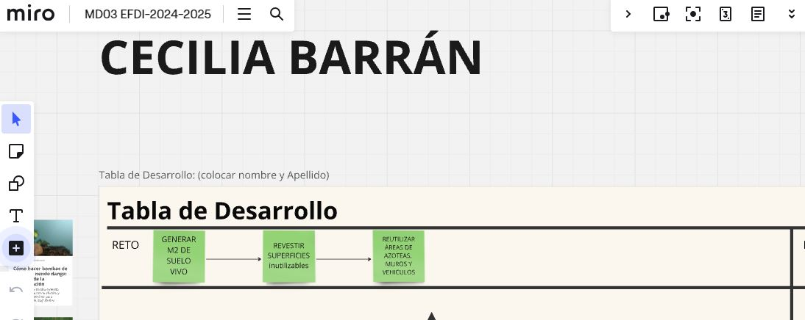
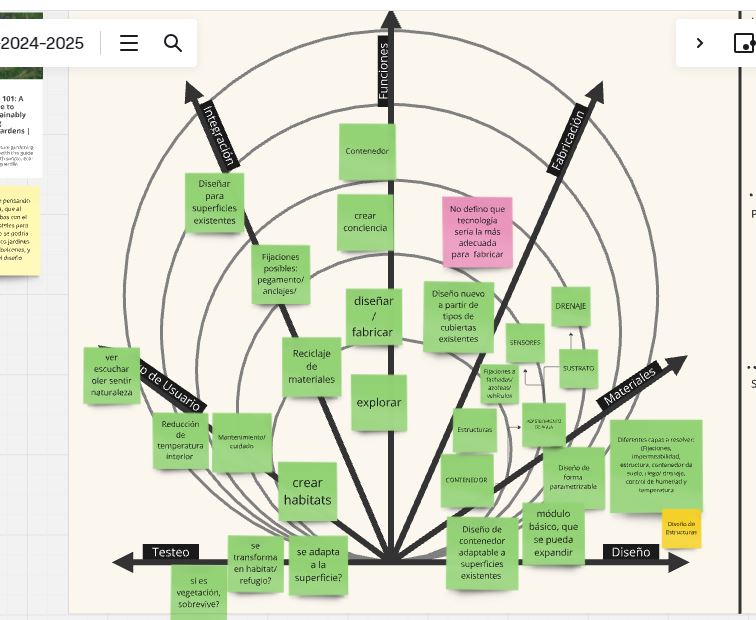
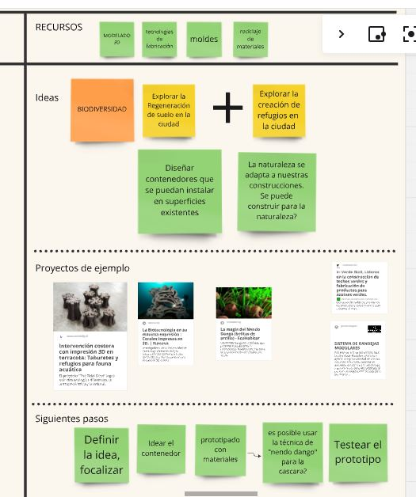
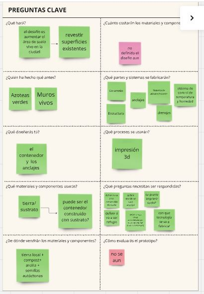

---
hide:
    - toc
---

# **MD03**
## **Prototipado y Fabricación** con Joaquin Vega y Maximiliano Torres

Al iniciar este módulo, se nos planteó revisar el trabajo realizado en el módulo previo de diseño el MD02.   
Joaquín propuso realizar una mirada crítica para evaluar si nuestro proyecto actual mantiene el espiritu inicial o ha mutado de tal forma que no nos reconocemos con esos objetivos. 

Al realizar este ejercicio, me surgen cuestionamientos referente al enfoque del tema general. La necesidad de representar suelo para visibilizarlo es una necesidad enfocada en MI. 
Un cambio de perspectiva, un cambio de escala.

Arquitectura regenerativa, en los suelos construidos. Crear m2 de suelo vivo en áreas que no son utilizadas. 
La naturaleza de una fórma mágica se apropia de nuestras construcciones/ infraestructuras/ desechos y sobrevive... cómo sería construir para la naturaleza?
El nuevo objetivo es experimentar en la creación de suelo vivo.

Inicia un nuevo proceso de investigación con la eperimentación de las herramientas adquiridas y la nueva información relevada. 

Diseñar observando en cómo lo hace sin mi intervención. 

Definir cuáles serán los recursos necesarios para elaborar el proyecto. Planificando las etapas y cómo conseguir los materiales necesarios.

Cuales son las preguntas clave a definir:
