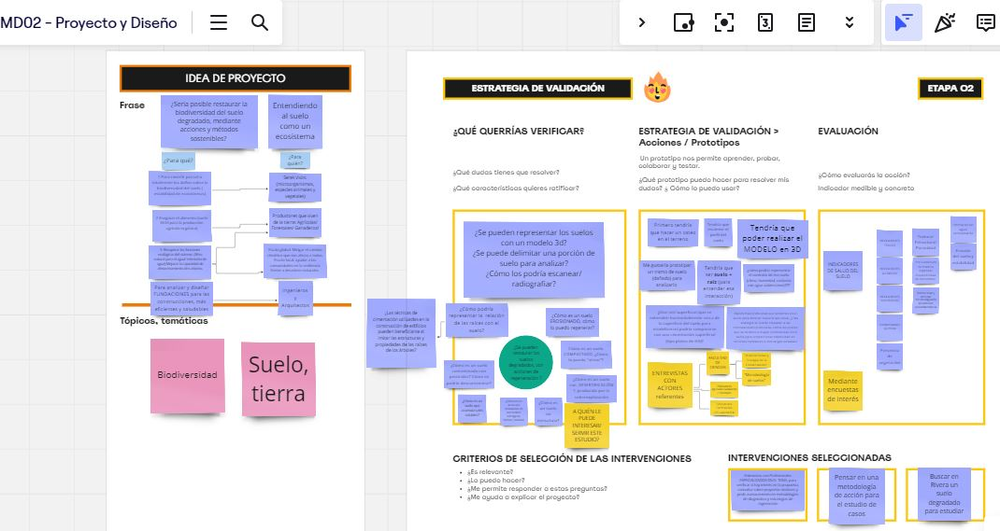

---
hide:
    - toc
---

# **MD03**
## **Prototipado y Fabricación** con Joaquin Vega y Maximiliano Torres

Al iniciar este módulo, se nos planteó revisar el trabajo realizado en el módulo previo de diseño el MD02.   
Joaquín propuso realizar una mirada crítica para evaluar si nuestro proyecto actual mantiene el espiritu inicial o ha mutado de tal forma que no nos reconocemos con esos objetivos. 

Al realizar este ejercicio, me surgen cuestionamientos referente al enfoque del tema general. La necesidad de representar suelo para visibilizarlo es una necesidad enfocada en MI. 
Un cambio de perspectiva, un cambio de escala.

Arquitectura regenerativa, en los suelos construidos. Crear m2 de suelo vivo en áreas que no son utilizadas. 
La naturaleza de una fórma mágica se apropia de nuestras construcciones/ infraestructuras/ desechos y sobrevive... cómo sería construir para la naturaleza?
El nuevo objetivo es experimentar en la creación de suelo vivo.

1_ Entender las necesidades del USUARIO, ver cómo hacen las cosas, generar entrevistas. Consultar con diferentes actores para tener distintos puntos de vista. Comprenderlo dentro de un sistema.

2_ Para lograr definir el problema es necesario  sistematizar y organizar la información. Definirlo para encararlo. Qué requisitos tiene que cumplir y cuales son opcionales. A través de la definición de criterios de éxito, lograr saber si mi proyecto es exitoso.

3_ Idear en conjunto con colaboradores, *abrir la mente* para sumar variedad. 

4_ Prototipar para probar ideas. Al inicio del diseño y  aprender del error. Los distintos Niveles de definición del prototipo, dependiendo de los materiales utilizados y las herramientas. Un prototipo de Baja fidelidad sería aquel que utiliza materiales simples como el cartón. Uno de fidelidad media utilizaría por ejemplo fabricación digital o corte láser y se podría poner a prueba con el usuario. Y un prototipo de fidelidad alta sería una versión de producción que se podría poner  a prueba en el contexto final.

5_ Testear con el usuario, es útil?, se entiende? definir criterios de evaluación y validación.

## **Ejercicio 1 PROPUESTA DE VALOR** ETAPA 01:**

La hipótesis que quisiera corroborar es la siguiente:
 **¿Es posible restaurar un ecosistema dañado mediante acciones regenerativas? Poniendo el foco en el suelo degradado.**

Es un poco vago aún, y no encuentro un usuario específico para especializar el estudio en un caso particular.

## **Ejercicio 2 JAM SESSION**

Las acciones que podría realizar apuntan a concientizar, visibilizar, lograr representar algo que no lo vemos diariamente.  

## **Ejercicio 3 IDEA DE PROYECTO ETAPA 02**

Tomando como inspiración la charla realizada por la Doctora Silvina Zabala Travers del Área de Innovación del Departamento de Imagenología del Centro Hospitalario Pereira Rossell en la "Segunda Mesa de diálogo de Fabricación digital en Uruguay". Donde expuso el trabajo que está realizando un equipo de médicos imagenólogos construyendo modelos 3d a partir de imágenes de tomografías y resonancias magnéticas para mejorar la comprensión de la enfermedad del paciente, planificar estrategias de tratamiento y poder practicar con anticipación en caso de necesitar cirugía.   Es que me propongo investigar en la posibilidad de diseñar una metodología de estudios de suelos que aporte en la toma de decisiones. 

En esta etapa hay muchos procesos para verificar si realmente lo puedo hacer. 
Desde el escaneo del terreno, el dominio de la herramienta de 3d, el detectar actores  que les parezca relevante mi estudio, el diseñar un prototipo en dos meses y poder verificar su validez.

Los invito a mi miro **[cecilia barran](https://miro.com/app/board/uXjVK9Q-_oY=/)**