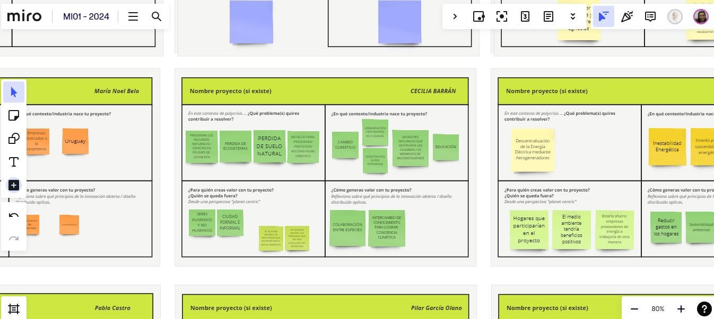

---
hide:
    - toc
---

# MI01 

Herramientas de aproximación con **Paola Zanchetta**

##  Semana 1 **Diseño Distribuido e Innovación abierta**

Esta semana con Paola,  reflexionamos sobre  los **VALORES** que empujan nuestros Proyectos.
A través de su experiencia, presentando sus proyectos y las colaboraciones que ha realizado nos introdujo en el DISEÑO DISTRIBUIDO como *una fórmula  de creación que fomenta Futuros ABIERTOS, COLABORATIVOS y REGENERATIVOS.*

Pensamos juntos y compartimos nuestras opiniones.

### 1.	Qué genera VALOR en un Proyecto?

### 2. En QUIÉN pensamos a la hora de generar VALOR y crear un Proyecto? 

### 3. Quién es el USUARIO FINAL? , Quién se queda AFUERA?

### 4. Qué elementos generan VALOR en la INNOVACIÓN ABIERTA?

*Dentro del contexto OPEN SOURSE  la **Innovación Abierta** como una forma de pensar que busca colaborar con el usuario final para interactuar durante todo el proceso de diseño y a la hora de la validación del producto poder verificar cuanto se acerca a las necesidades reales.  Así como también interactuar con la industria en la que trabaja para intercambiar conocimiento, ITERAR,  entender el CONTEXTO en el que vivo.*  

*Dentro del contexto del **Diseño Distribuido**  como una filosofía una forma de entender el Diseño impulsado por el VALOR. Buscando transitar de un modelo **PITO** (Produc IN Trash OUT) a un modelo **DIDO** (Data IN Data ON)*

A través de un ejercicio en MIRO bajamos estas nuevas ideas a nuestro proyecto, pensamos cuales son los VALORES o las ideas fuerza que nos impulsan en *nuestra BATALLA*.

En el contexto de Poli crisis en el que vivimos me gustaría contribuir a proponer soluciones efectivas para preservar los recursos naturales, restaurar los ecosistemas dañados, regenerar los suelos degradados y construir estructuras que puedan transformarse en nichos ecológicos o hábitats.  Mi proyecto nace en un contexto de cambio climático,  me preocupa la pérdida de suelo vivo. Nuestras ciudades están haciendo uso del suelo (mediante la construcción y la forestación) sin considerar la biodiversidad.  Estamos viviendo inundaciones sin precedentes en el Norte de Brasil que nos muestran las consecuencias que podremos tener en breve si no empezamos a actuar de forma consciente con nuestro medio ambiente. Pienso que es muy importante generar conciencia ambiental y la educación es clave.
El usuario final de mi proyecto son los seres humanos y no humanos conviviendo en un  equilibrio eco sistémico. Lograr involucrar a la comunidad en la generación del proyecto es mi desafío.  Es el espacio público una oportunidad? 
Quedan afuera las personas y la industria que no respetan el medio ambiente.

Entender que no se trata de pensar en un producto final de forma aislada, no se trata de resolver la caja que haga tal o cual cosa, sino pensar en un diseño integral que resuelva un problema real. Y eso es lo más difícil...