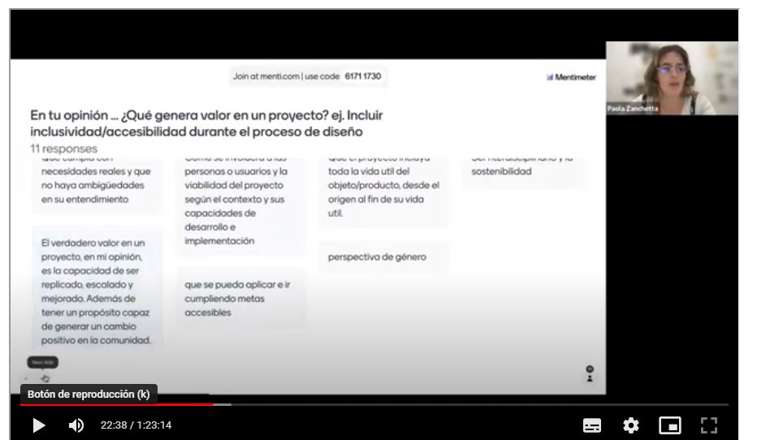

---
hide:
    - toc
---

# MI01 

Herramientas de aproximación con **Paola Zanchetta**

##  Semana 1 **Diseño Distribuido e Innovación abierta**

Esta semana con Paola,  reflexionamos sobre  los **VALORES** que empujan nuestros Proyectos.
A través de su experiencia, presentando sus proyectos y las colaboraciones que ha realizado nos introdujo en el DISEÑO DISTRIBUIDO como *una fórmula  de creación que fomenta Futuros ABIERTOS, COLABORATIVOS y REGENERATIVOS.*

Pensamos juntos y compartimos nuestras opiniones.

1.	Qué genera VALOR en un Proyecto?

2. En QUIÉN pensamos a la hora de generar VALOR y crear un Proyecto? 

3. Quién es el USUARIO FINAL? , Quién se queda AFUERA?

4. Qué elementos generan VALOR en la INNOVACIÓN ABIERTA?

*Dentro del contexto OPEN SOURSE  la **Innovación Abierta** como una forma de pensar que busca colaborar con el usuario final para interactuar durante todo el proceso de diseño y a la hora de la validación del producto poder verificar cuanto se acerca a las necesidades reales.  Así como también interactuar con la industria en la que trabaja para intercambiar conocimiento, ITERAR,  entender el CONTEXTO en el que vivo.*  