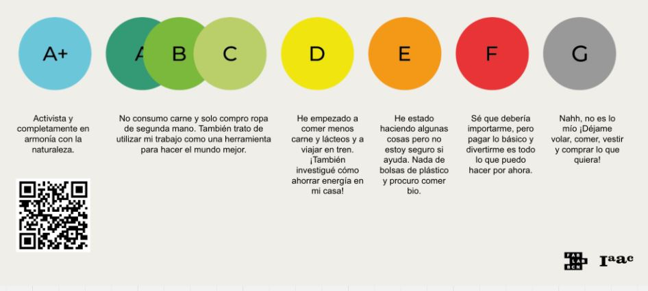
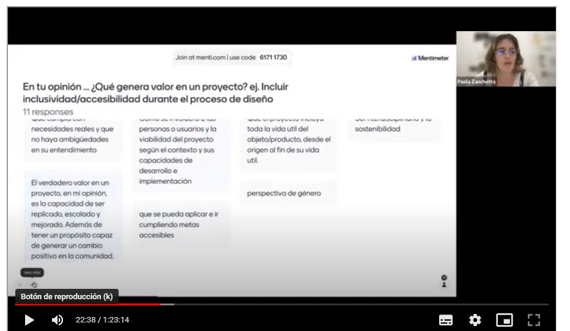
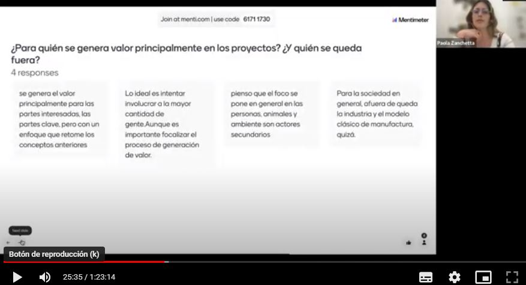
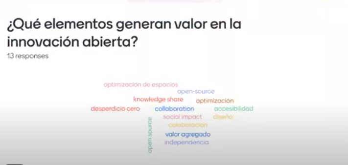
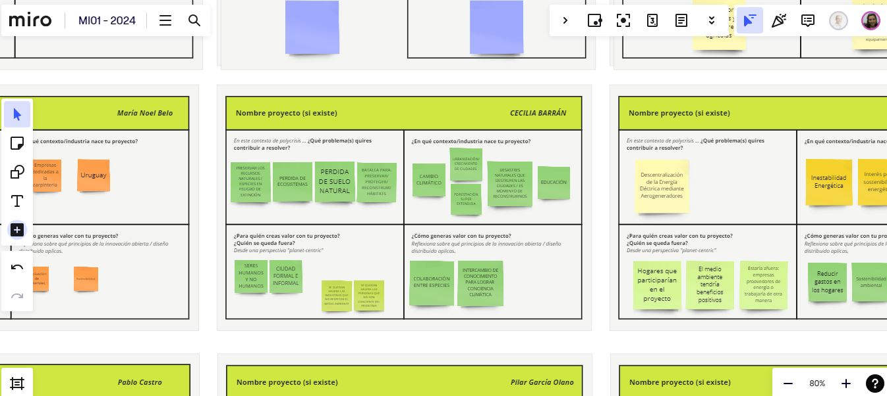
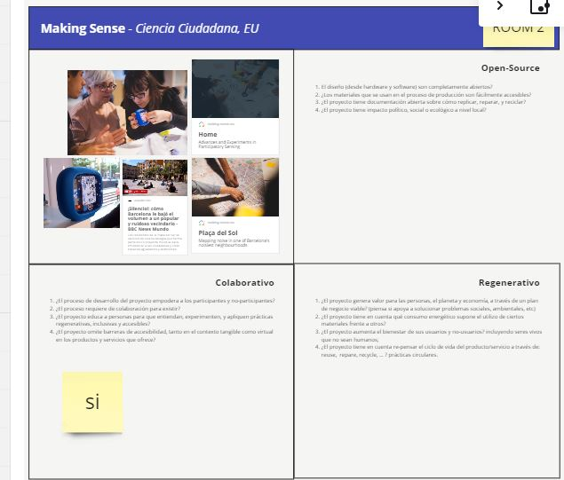

---
hide:
    - toc
---

# MI02 

Desarrollo Sostenible y Economía Circular con **Paola Zanchetta**

##  Clase 1 

Esta semana con Paola,  reflexionamos sobre  cuan Sostenibles es nuestro estilo de vida. Con un ejercicio práctico, realizamos una autoevaluación acorde a un rango de colores para definir nuestra situación actual.

Según las referencias estoy en un entorno de  gris y un rojo. Desearía ser un celeste!!!, pero mis acciones diarias, mi rutina, el entorno me trasladan hasta la casilla del rojo.

Pensamos juntos y compartimos nuestras opiniones.

### 1.	Qué genera VALOR en un Proyecto?

### 2. En QUIÉN pensamos a la hora de generar VALOR y crear un Proyecto? 

### 3. Quién es el USUARIO FINAL? , Quién se queda AFUERA?

### 4. Qué elementos generan VALOR en la INNOVACIÓN ABIERTA?

*Dentro del contexto OPEN SOURSE  la **Innovación Abierta** como una forma de pensar que busca colaborar con el usuario final para interactuar durante todo el proceso de diseño y a la hora de la validación del producto poder verificar cuanto se acerca a las necesidades reales.  Así como también interactuar con la industria en la que trabaja para intercambiar conocimiento, ITERAR,  entender el CONTEXTO en el que vivo.*  

*Dentro del contexto del **Diseño Distribuido**  como una filosofía una forma de entender el Diseño impulsado por el VALOR. Buscando transitar de un modelo **PITO** (Produc IN Trash OUT) a un modelo **DIDO** (Data IN Data ON)*

A través de un ejercicio en MIRO bajamos estas nuevas ideas a nuestro proyecto, pensamos cuales son los VALORES o las ideas fuerza que nos impulsan en *nuestra BATALLA*.

### RESUMEN

En el contexto de Poli crisis en el que vivimos me gustaría contribuir a proponer soluciones efectivas para preservar los recursos naturales, restaurar los ecosistemas dañados, regenerar los suelos degradados y construir estructuras que puedan transformarse en nichos ecológicos o hábitats.  Mi proyecto nace en un contexto de cambio climático,  me preocupa la pérdida de suelo vivo. Nuestras ciudades están haciendo uso del suelo (mediante la construcción y la forestación) sin considerar la biodiversidad.  Estamos viviendo inundaciones sin precedentes en el Norte de Brasil que nos muestran las consecuencias que podremos tener en breve si no empezamos a actuar de forma consciente con nuestro medio ambiente. Pienso que es muy importante generar conciencia ambiental y la educación es clave.
El usuario final de mi proyecto son los seres humanos y no humanos conviviendo en un  equilibrio eco sistémico. Lograr involucrar a la comunidad en la generación del proyecto es mi desafío.  Es el espacio público una oportunidad? 
Quedan afuera las personas y la industria que no respetan el medio ambiente.

**Entender que no se trata de pensar en un producto final de forma aislada, no se trata de resolver la caja que haga tal o cual cosa, sino pensar en un diseño integral que resuelva un problema real. Y eso es lo más difícil...**

##  Clase 2 **Diseño Distribuido e Innovación abierta**

Ejercicio "CURIOUS RESEARCH"
Moodboard colaborativo de proyectos
Comparí un proyecto que me inspiró mucho llamado *SYMBIOTIC SPACES*, desarrollado por 3 diseñadores en el ambito de Fab Lab Bilbao. Su objetivo es construir hábitats para la vida silvestre urbana a través de herramientas digitales paramétricas e impresión 3D con arcilla local.
Comparto su link **[SYMBIOTIC SPACES](https://espacioopen.com/symbiotic-spaces-impresion-3d-para-crear-habitats-salvajes%ef%bf%bc/)**

En esta clase profundizamos en los principios ABIERTO, COLABORATIVO y REGENERATIVO.
Trabajar de forma **ABIERTA** (en el proceso, en la mentalidad, en el método) tiene como beneficios: Longevidad, Estabilidad y Calidad y la Comunicación.  El PROCESO es la base, y es muy importante la recopilación de información y su registro de forma consciente de que alguien lo va a leer.
Trabajar de forma **COLABORATIVA**, empoderando a la comunidad y juntos pensar en el impacto que se genera indirectamente en otras industrias y reflexionar quién se queda afuera.
Diseño **REGENERATIVO** vs diseño Sostenible, cuando creamos un proyecto o un servicio,  lo hacemos de una forma consciente e intentamos que devuelva a la naturaleza a la sociedad o a la economía, un cambio ecológico positivo que se pueda replicar.  Los principios y estrategias principales son BIOMIMICRY,  SISTEMAS CERRADOS, RESILIENCIA, PARTICIPACIÓN DE LA COMUNIDAD.

**El diseño REGENERATIVO es el valor o principio que más representa mi idea. En esta clase pude ver realmente que el tema en el cual estoy  pensando es importante, más allá de lo que me genera  a mí.**

Ejercicio 2 en MIRO

Se plantean 3 casos en los cuales se aplican los valores: OPEN SOURCE, COLAVORATIVO y REGENERATIVO. Elegimos uno y lo analizamos en grupos.

Elegí el proyecto Making Sense, Ciencia Ciudadana EU
Me interesó el concepto *ciencia ciudadana*, colaborar con ciudadanos para generar datos a traves de sensores y poder utilizarlos posteriormente por la comunidad científica, como un forma de ayudar a visibilizar el problema.
En el intercambio con los compañeros nos llevó casi todo el tiempo encontrar la información necesaria para recrear el proyecto, y determinar si realmente era ABIERO, la información no estaba accesible.
Si reconocimos su componente colaborativo y las diferentes escalas de posible incidencia que tiene el proyecto. 

Comparto el MIRO [MIRO MI](https://miro.com/app/board/uXjVKMo0rPU=/)

