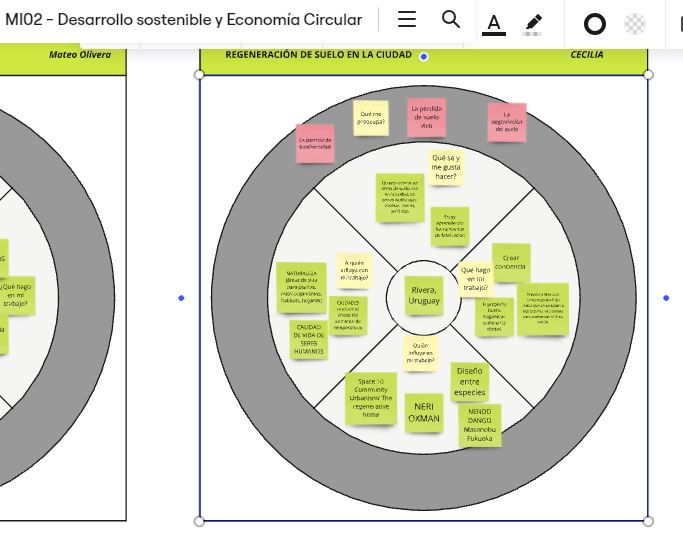
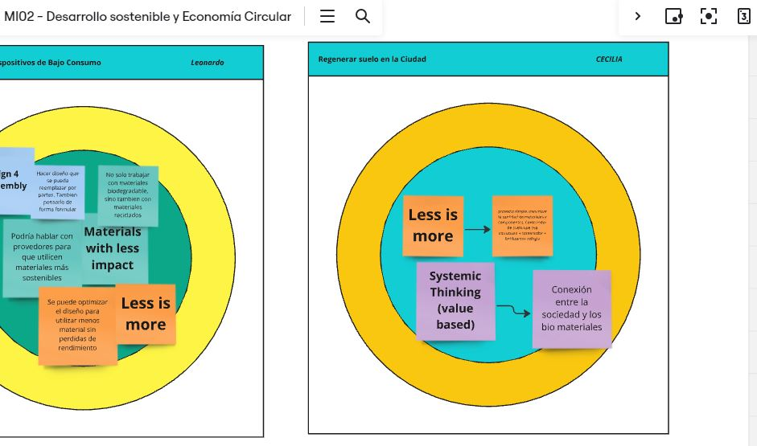
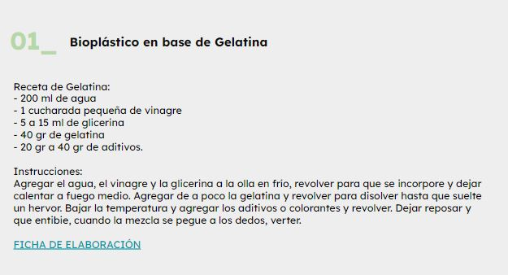
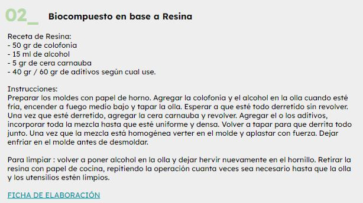
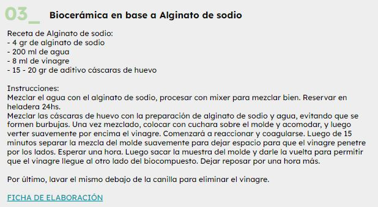
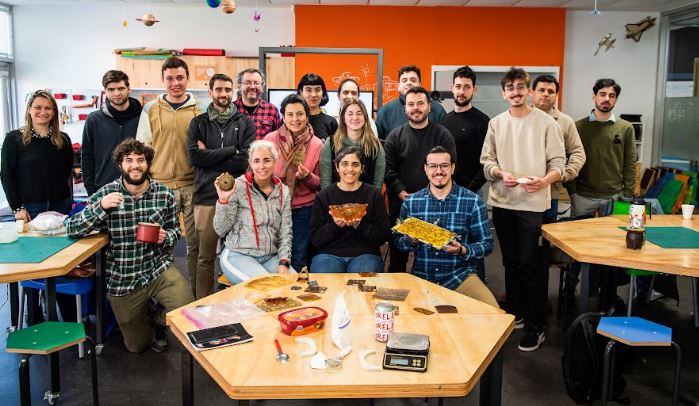

---
hide:
    - toc
---

# MI02 

Desarrollo Sostenible y Economía Circular con **Paola Zanchetta**

##  Clase 1 Cíclo de vida

Esta semana con Paola,  reflexionamos sobre  cuan Sostenibles es nuestro estilo de vida. Con un ejercicio práctico, realizamos una autoevaluación acorde a un rango de colores para definir nuestra situación actual.

Según las referencias estoy en un entorno de  gris y un rojo. Desearía ser un celeste!!!, al leer las referencias y pasar raya en lo que hago, reconozco que mis acciones diarias, mi rutina, el entorno me trasladan hasta la casilla del rojo. No es desinterés, y no creo que no sea lo mío,  he empezado a detectar que acciones puedo modificar para mejorar mis hábitos, la forma de consumir y la de mi familia. 

Se plantea pensar en los ciclos de los recursos, servicios y productos. El ciclo de vida  pasando de un proceso lineal actual(extracción, fabricación, utilización y eliminación) a transformarse en un proceso circular y regenerativo (devolver a la naturaleza).

El diagrama de la mariposa, de Ellen MacArthur:

Fundación que visibiliza el impacto de la economia circular en la Industria y acompaña a diferentes organizaciones en la implementación de estos procesos.

En la derecha, se ubican los materiales que no son biodegradables, como los metales, cuando se crea la pieza y llega al usuario,  se intente introducir en las 3 R (Reusar, Reutilizar y reducir), siendo el reciclaje  el ultimo recurso posible, ya que muchas veces requiere de largos y varios procesos. Buscar que la pieza se readapte para volver al mercado local.

En la izquierda se ubican los materiales renovables, como la comida, cómo hacer para que vuelvan a la naturaleza, mediante procesos anaerobicos, creando biogas a través del compostaje. 

Paola presentó un proyecto reciente donde aplica el concepto de LCA (Ciclo de vidad e los materiales), y los puntos críticos a analizar. Cual es el 20% del ciclo de vida de un material , que genera un 80% de impacto, los llama *Hotspots*, quiere decir la parte que genera mayor impacto. Están generando una libreria de materiales donde se clasifican por colores. En función de la sostenibilidad de cada material.  

intermatter
https://www.intermatter.nl/

Paola nos asesoró en cómo esta información, esta libreria, se podría replicar en en nustro contexto local, mediante una actualización de datos locales, como el traslado de los materiales.

##  Ejercicio 1 Círculo de influencia: 

Pasar de un enfoque reactivo a un enfoque activo en nuestro contexto local.
Respondiendo unas preguntas poder mapear y reflexionar cómo estoy con mi proyecto, dónde estoy, qué se hacer, en que estoy trabajando, quién influye en mi trabajo?, a quien puedo influir con mi trabajo? qué me preocupa?  

 

##  Ejercicio 2 Acciones Circulares

El ejercicio consiste en pensar en dos acciones de la economia circular introducidas por Paola e introducirlas al proyecto. 

 

##  Charla con JOSEAN VILAR de Naif factory lab

Entramos en el mundo de los Biomateriales y Josean nos presenta sus proyectos y colaboraciones. Lo interesante de reutilizar desechos locales y transformarlos en nuevos productos.

https://naifactorylab.com/proyectos/

Experimetamos la elaboración de materiales en un taller con Maria Clara Freire. 
 Componentes principales:
 - **Biopolímeros** (*aglutinan* a los demás componentes) ej: gelatina, agar agar, resina de pino, aliginato de sodio
 - **Plastificntes** (su cantidad determina que el material sea más rígido o flexible)ej: glicerina, cera.
 - **Aditivos** ej: residuos alimenticios, flora, materia orgánica, tintes y fibras. Todo seco y triturado!!
 - **Solventes** disuelven el biopolímero para que lo podamos integrar a los demás materiales. Ej: agua o alcohol dependiendo el biopolímero.

Bioplástico en base de gelatina:

Bioplástico en base a resina:

Biocerámica en base a aliginato de sodio:

Me sorprendió lo accesible que es, algo que parecia muy metodológico de laboratorio, resultó ser una experiencia muy enriquecedora, empecé a averiguar sobre bibliotecas de materiales y recetas y empecé a recolectar cáscaras y a cocinar! 

 

