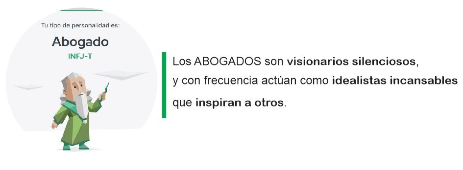
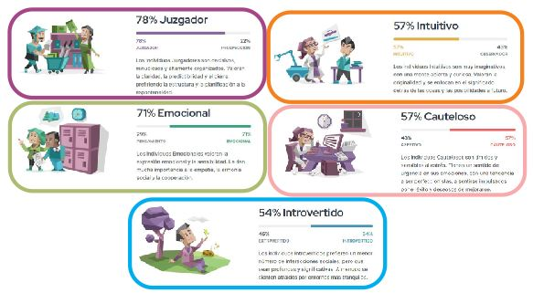
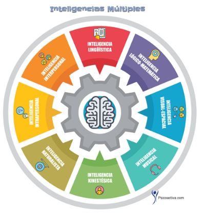
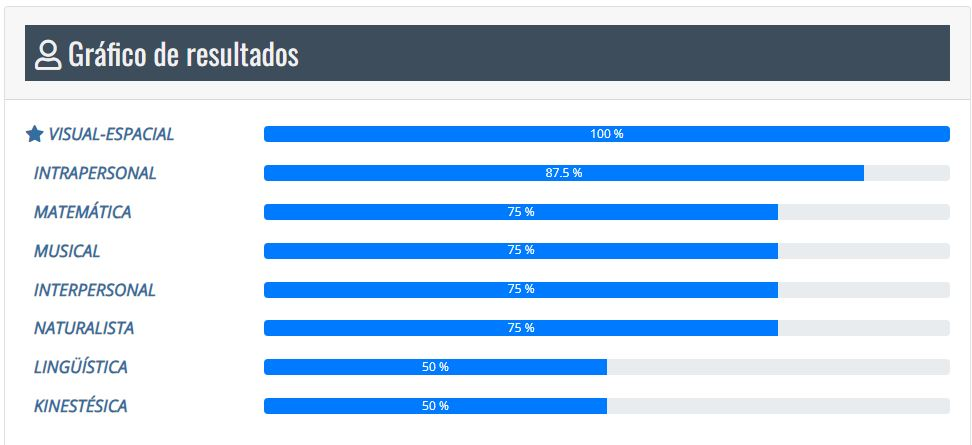
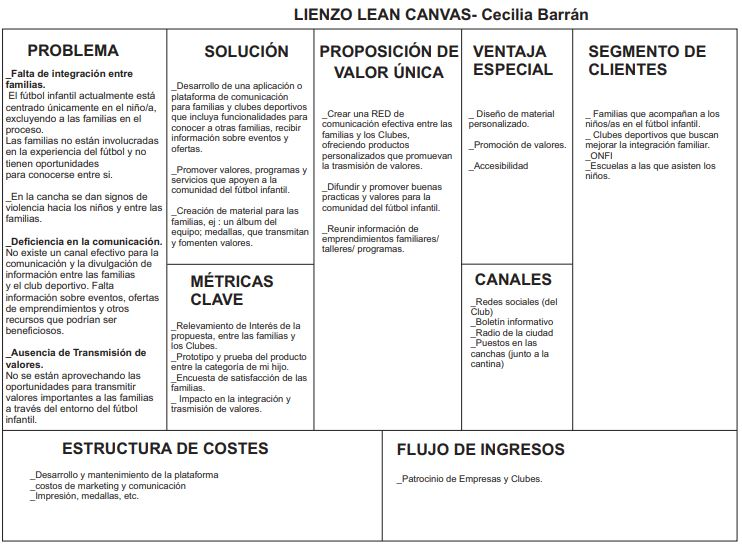

---
hide:
    - toc
---

# MI03 

EMPRENDIMIENTO Módulo dictado por el Programa de Emprendimiento de UTEC

###  INSTANCIA 1 **Curso Virtual: Actitud emprendedora**

En esta instancia nos dedicamos a conocernos y autoevaluarnos como emprendedores con el objetivo de identificar habilidades, capacidades y competencias. 

#### 1.	Abordaje conceptual

*"Conocer cuál es nuestra personalidad  ayudará a definir y reflexionar sobre aspectos de tu personalidad y entender cómo ponerla al servicio de tu actitud emprendedora."*

La herramienta para el autoconocimiento propuesta por el curso es el **test de Carácteristicas del Comportamiento Emprendedor (CCE)** desarrollado por David McClelland en la década de 1960. Quien mediante el estudio de emprendimientos, identificó cuales son las características  que influyen en un comportamiento emprendedor y  las organizó según las más comunes que tienen los emprendedores de exito.  

El test consta de 55 preguntas sobre determinadas situaciones y uno tiene que ponderarlas según cómo se identifique, en relación de 1 a 10 siendo 1:nunca es cierto, y 10:siempre es cierto. Una vez finalizado el cuestionario, se realiza una operación ya preconfigurada y da como resultado un número, un código de verificación. 

Mi tipo de personalidad, según el Test, es *INFJ-T (Abogado): inspira a los demás* 

Las características que se dan en mi de forma más acentuada , según el test, son:
_busqueda de información,
_fijar metas,
_cumplimientos,
Las características que debería trabajar para mejorar como emprendedora son:
_correr riesgos calculados,
_persuación y redes de apoyo. 

Me reconozco con la descripción de este perfil, con la busqueda de un propósito y la necesidad de ayudar.

Cuál es mi tipo de inteligencia?
según *La Teoría de las inteligencias múltiples* desarrollada por el psicólogo Howard Gardner en la década de 1980. 

El test consta de preguntas sobre lo que me resulta más facil y lo que me cuesta mas hacer, las respuestas son afirmativa o negativamente. 

El resultado obtenido:

Donde se desprende que mi fortaleza predominante es la INTELIGENCIA VISUAL-ESPACIAL: *capacidad para integrar elementos, percibirlos y ordenarlos en el espacio y poder establecer relaciones de tipo metafórico entre ellos.*
y mi debilidad, en la cual debería trabajarpara mejorar, es la Inteligencia linguistica y la Kinestésica.

Análisis FODA:

###  INSTANCIA 2 **Curso Virtual especial: Generación de Ideas de Negocio**
En esta instancia aprendimos actitudes y herramientas para detectar y generar oportunidades de negocio en nuestro día a día.

Aprendi sobre la importancia de enfocar y detectar problemas y necesidades de mis clientes que se puedan transformar en oportunidades. 

Mediante dos encuentros sincrónicos con Ricardo Rodríguez de Emprendimientos de UTEC, descubrí que no basta con tener una buena idea para tener éxito con un emprendimiento sino todo el trabajo que es necesario realizar enprevio de  investigación, creación de VALOR,validación y seguimiento para perdurar y seguir creciendo.

La importancia de identificar y armar un buen equipo de trabajo, los recursos cubiertos y los necesarios adquirir.  

Dentro de la bibliografía del curso la que me ayudó a reformular mi idea es :
https:file:///C:/Users/User/Desktop/postgrado%20FABRICACION%20Y%20DISE%C3%91O%20DIGITAL/Memprendedor/MODULO%202/BIBLIOGRAFIA/01%20Disenando-la-propuesta-de-valor-Alexander-Osterwalder-Yves-Pig.pdf

###  INSTANCIA 3 **Tutorias Sincrónicas**

En esta Instancia con el asesoramiento de Laura Di Giovanni, de Emprendimientos Utec, armé el Lean Canvas de un proyecto que tenia en mente hace un tiempo sobre el Futbol infantil.

Esta herramienta sirve para describir cómo crea, ofrece y captura valor mi empresa.

En el libro "Diseñando la propuesta de valor", por Alex Osterwalder y Yves Pigneur, desarrollan dos herramientas necesarias para toda empresa que quiera emprender, porque para hacerlo se necesita un **método**: "propuesta de valor" y "modelo de negocio". 

