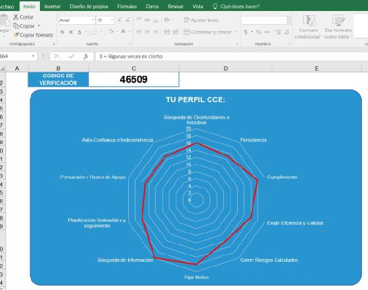

---
hide:
    - toc
---

# MI03 

EMPRENDIMIENTO Módulo dictado por el Programa de Emprendimiento de UTEC

###  INSTANCIA 1 **Curso Virtual: Actitud emprendedora**

En esta instancia nos dedicamos a conocernos y autoevaluarnos como emprendedores con el objetivo de identificar habilidades, capacidades y competencias. 

#### 1.	Abordaje conceptual

*"Conocer cuál es nuestra personalidad  ayudará a definir y reflexionar sobre aspectos de tu personalidad y entender cómo ponerla al servicio de tu actitud emprendedora."*

La herramienta para el autoconocimiento propuesta por el curso es el **test de Carácteristicas del Comportamiento Emprendedor (CCE)** desarrollado por David McClelland en la década de 1960. Quien mediante el estudio de emprendimientos, identificó cuales son las características  que influyen en un comportamiento emprendedor y  las organizó según las más comunes que tienen los emprendedores de exito.    

El test consta de 55 preguntas sobre determinadas situaciones y uno tiene que ponderarlas según cómo se identifique, en relación de 1 a 10 siendo 1:nunca es cierto, y 10:siempre es cierto. Una vez finalizado el cuestionario, se realiza una operación ya preconfigurada y da como resultado un número, un código de verificación. 

###  INSTANCIA 2 **Curso Virtual especial: Generación de Ideas de Negocio**

###  INSTANCIA 3 **Tutorias Sincrónicas**

