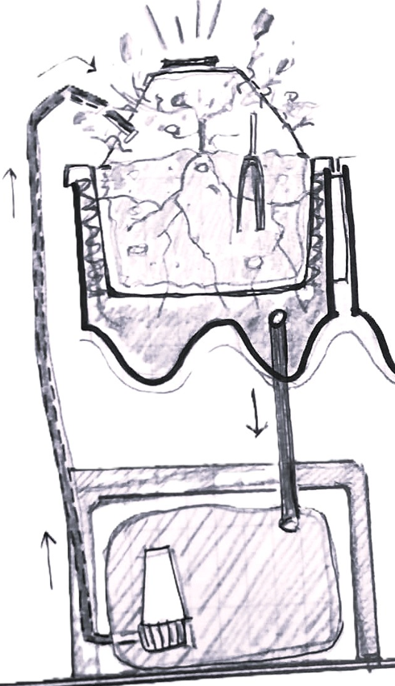

---
hide:
    - toc
---

# **Entrega Proyecto Final**

## 1 - Proceso para IDEAR y FABRICAR mi PF

**¿Qué hace?**

El proyecto busca implementar un sistema de suelo vivo en espacios urbanos, a diferentes escalas pudiendose adaptar en superficies  como cubiertas, fachadas, equipamientos urbanos y vehículos. 
Es un **contenedor de suelo Vivo acondicionado**, un sistema modular, escalable que incorpora mecanismos de auto-riego y recolección de lluvia con el objetivo de proporcionar superficies que favorecen a la biodiversidad urbana, mejoran la calidad del aire y contribuyen a la mitigación del cambio climático. En un primer abordaje el proyecto se implanta en las paradas de omnibus de la Ciudad de Rivera, buscando co-habitar el territorio. 
Mi lucha consiste en visibilizar la importancia que tiene el suelo intrinsecamente e involucrar a la comunidad en el proceso.

**¿Cómo llegue a la idea?**

Si bien se mantuvo el tema desde el inicio del curso, la idea fue mutando hasta decantar en la investigación final. 

> - La idea surge como respuesta a la problemática de la **pérdida de biodiversidad del suelo.** Uno de los factores de pérdida de suelo vivo es la expanción descontrolada de la ciudad y el reemplazo del suelo natural por superficies impermeables. A partir de la investigacion sobre el cambio climático, las proyecciones de las variables climaticas y el efecto que tendrán en las ciudades, nuestra forma actual de habitar y  la relación  que tiene el suelo con la vida en el planeta, es que  surge la necesidad de poner foco en el suelo perdido y analizar la posibilidad de regenerarlo.

> - El aumento de temperatura global mueve a los seres vivos en busca de alimento y mejores condiciones de vida. En mi barrio qué áreas se pueden transformar para contribuir con este movimiento? Las paradas de omnibus son un equipamiento urbano  con una superficie de 2m2 aproximadamente cada una, si la multiplicamos por la cantidad total de paradas que hay hoy en Rivera transformaríamos x m2 

> - Integrar referentes locales, diversos actores que se involucren en el proceso de creación del sistema, en el suministro de materiales, en la gestión y el mantenimiento.
Viveros, Escuelas, Laboratorios de impresión 3d, la Intendencia, peluquerias caninas.  

**¿Quién lo ha hecho de antemano?**

En el mundo: techos y fachadas verdes, huertas urbanas. 

Maceta "pixel plant" para techos verdes de verde fácil, web:https://verdefacil.com/ficha-tecnica-verdefacil.com-COMPRIMIDO4.pdf

Proyecto de referencia: Tesis de graduación *Ciudades + Verdes* de Santiago Epifanio. Web para descargar el archivo: https://www.colibri.udelar.edu.uy/jspui/handle/20.500.12008/4745

Proyectos que me inspiran:
Emerging objects: 
> - *Torre GEOtube*, habitab especializado para la vida silvestre que prospera con su entorno web: https://emergingobjects.com/project/geotube-tower/
> - *BALDOSA DE JARDINERA EN CEMENTO* web: https://emergingobjects.com/project/planter-tile-in-cement/

OXMAN *MAN-NOATA* Ciudades emergentes: A través del crecimiento, las ciudad se reconfigura para satisfacer las necesidades cambiantes de sus ocupantes.

**¿Qué diseñé?**

Un sistema que pretende mejorar las condiciones del suelo *en maceta* con el objetivo que se pueda instalar en las cubiertas de chapa acanalada de las paradas de omnibus de la Ciudad de Rivera y así transformarlas en superficies vivas  brindando condiciones para la biodiversidad urbana. Para mostrar el sistema el prototipo se armó en base a un módulo reducido, independiente:

**¿Qué materiales y componentes se utilizaron?**

 

Materiales: 
Tierra preparada + humus de lombriz  1 kg de cada uno, vivero local total $100,
Planta $300,
Módulo impreso en 3d dim: ancho= 20cm por largo=15cm por alto=14cm, contenedor + filtro + tapa, material PET $1300, tiempo de impresión total = 65 horas,
Base fabricada en CNC $ XX, Tiempo de fabricación: 1hs,
Electrónica: sistema de auto riego  $1000 + $300 envío (desde Montevideo),
Arduino Uno + Sensor de humedad (kit Efdi),
Pelos de perros (residuo de la Veterinaria),
Depósito inferior de agua: Botella reciclada 2lts.
Canilla desague $50 + manguera diam. 5mm largo = 1m $ 100

**¿Qué partes y sistemas se fabricaron?**

Impresión 3d en lab A rIVERA, se imprimieros la cascara, el filtro y la tapa del contenedor. 
la barrera absorvente, con tratamiento de pelos de perros,

**¿Qué procesos se utilizaron?**
Diseño CAD para modelar y crear prototipo de los múdulos se utilizó Fusion 360
Proceso aditivo, impresion 3d. 

**¿Qué preguntas se respondieron?**

**¿Qué funcionó? y ¿qué no?**
encastres entre piezas más holgado.

**¿Cuales son las conslusiones?**
un aprendizaje total de tecnologís, de registro, de ejecución

**¿Cuáles son los pasos a seguir?**

## 2 - Presentación, 5 slides.

## 3 - VIDEO, 1 min.

