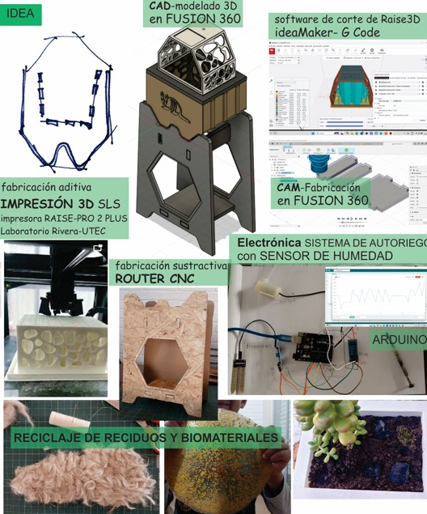

---
hide:
    - toc
---

# **Entrega Proyecto Final**

## 1. Proceso para IDEAR y FABRICAR mi PF

### **¿Qué hace?**

El proyecto busca implementar un sistema de suelo vivo en espacios urbanos, a diferentes escalas pudiendose adaptar en superficies  como cubiertas, fachadas, equipamientos urbanos y vehículos. 
Es un **contenedor de suelo Vivo acondicionado**, un sistema modular, escalable que incorpora mecanismos de auto-riego y recolección de lluvia con el objetivo de proporcionar superficies que favorecen a la biodiversidad urbana, mejoran la calidad del aire y contribuyen a la mitigación del cambio climático. 
En un primer abordaje el proyecto se realiza a escala "maceta" y se realizan bosquejos de su posible implantación  en las paradas de omnibus de la Ciudad de Rivera, buscando generar superficies vivas. 
Mi lucha consiste en visibilizar la importancia que tiene el suelo intrinsecamente e involucrar a la comunidad en el proceso.

### **¿Cómo llegue a la idea?**

Si bien se mantuvo el tema desde el inicio del curso, la idea fue mutando hasta decantar en la investigación final. 

> - La idea surge como respuesta a la problemática de la **pérdida de biodiversidad del suelo.** Uno de los factores de pérdida de suelo vivo es la expanción descontrolada de la ciudad y el reemplazo del suelo natural por superficies impermeables. A partir de la investigacion sobre el cambio climático, las proyecciones de las variables climaticas y el efecto que tendrán en las ciudades, nuestra forma actual de habitar y  la relación  que tiene el suelo con la vida en el planeta, es que  surge la necesidad de poner foco en el suelo perdido y analizar la posibilidad de regenerarlo en la Ciudad.

> - El aumento de temperatura global mueve a los seres vivos en busca de alimento y mejores condiciones de vida. En mi barrio qué áreas se pueden transformar para contribuir con este movimiento? Las paradas de omnibus son un equipamiento urbano  con una superficie de 2m2 aproximadamente cada una, si la multiplicamos por la cantidad total de paradas que hay hoy en Rivera transformaríamos 600 m2 de superficie en desuso en áreas para la biodiveersidad exparcidos por toda la ciudad. Estas áreas ayudarían a **mitigar los efectos del aumento de temperatura** en las ciudades, las llamadas "islas de calor".

> - Con el objetivo de **Integrar** referentes locales, diversos actores que se involucren en el proceso de creación del sistema, en el suministro de materiales, en la gestión y el mantenimiento. Pensado a escala "maceta" tiene un objetivo "disparador", me lo imagino aplicado en programas escolares promoviendo la reflexión ambiental, creando instancias de investigación, introduciendo el diseño y la producción 3d de forma temprana, sumando talleres de biomatriales como actores de cambio. Revalorizando los residuos domésticos y gestionandolos de forma mas responsable.
Viveros, Escuelas, Laboratorios de impresión 3d, Intendencia Departamental, peluquerias caninas, talleres de producción de biomateriales  

En la pestaña *problemática* (https://ceciliabarran.github.io/cecilia_barran/proyecto/problematica/) se amplia el abordaje del problema.

### **¿Quién lo ha hecho de antemano?**

En el mundo: techos y fachadas verdes, huertas urbanas. 

Maceta "pixel plant" para techos verdes de verde fácil, web:https://verdefacil.com/ficha-tecnica-verdefacil.com-COMPRIMIDO4.pdf

Proyecto de referencia: Tesis de graduación *Ciudades + Verdes* de Santiago Epifanio. Web para descargar el archivo: https://www.colibri.udelar.edu.uy/jspui/handle/20.500.12008/4745

Proyectos que me inspiran:
Emerging objects: 
> - *Torre GEOtube*, habitab especializado para la vida silvestre que prospera con su entorno web: https://emergingobjects.com/project/geotube-tower/
> - *BALDOSA DE JARDINERA EN CEMENTO* web: https://emergingobjects.com/project/planter-tile-in-cement/

OXMAN *MAN-NOATA* Ciudades emergentes: A través del crecimiento, las ciudad se reconfigura para satisfacer las necesidades cambiantes de sus ocupantes.

### **¿Qué diseñé?**

Un sistema que pretende mejorar las condiciones del suelo *en maceta* con el objetivo que se pueda instalar en las cubiertas de chapa acanalada de las paradas de omnibus de la Ciudad de Rivera y así transformarlas en superficies vivas  brindando condiciones para la biodiversidad urbana. Para mostrar el sistema el prototipo se armó en base a un módulo reducido, independiente:

### **¿Qué materiales y componentes se utilizaron?**

 

Materiales: 

> Tierra preparada + humus de lombriz  1 kg de cada uno, vivero local total $100,

> Planta $300,

> Módulo impreso en 3d dim: ancho= 20cm por largo=15cm por alto=14cm, contenedor + filtro + tapa, material PET $1300, tiempo de impresión total = 65 horas.

> Base fabricada en CNC $ XX, Tiempo de fabricación: 1hs,

> Electrónica: sistema de auto riego  $1000 + $300 envío (desde Montevideo),

> Arduino Uno + Sensor de humedad (kit Efdi),

> Pelos de perros 2kg (residuo de la Veterinaria),

> Depósito inferior de agua: Botella reciclada 2lts.

> Canilla desague $50 + manguera diam. 5mm largo = 1m $ 100

> Biomaterial en base a gelatina y residuos de la cocina. $300

Costo total estimado= $3400
Peso del prototipo seco= 1880kg. 

### **¿Qué partes y sistemas se fabricaron?**

**Diseño y Prototipo**

En la etapa de diseño del proyecto, utilicé la herramienta **Fusión 360**, si bien es nuevo para mí, con práctica logré entender el proceso de diseño y los comandos claves para realizar los bocetos. Para poder llegar a la versión final realicé más de 10 versiones y aún tiene ajustes por hacer.

Para realizar el diseño del **contenedor** se tomó como punto de partida la forma ondulada de la chapa acanalada, uno de los casos más comunes de cubiertas existentes en Rivera.

Para lograr el objetivo de crear un contenedor *escalable y adaptable* se definieron algunos parámetros: largo del contenedor, el alto del sustrato y el espesor del contenedor. El largo y el alto se modificarían en función de querer más tierra en la maceta. 

El encastre entre módulos se da por "encaje", con la impresión de la pieza se verificó su funcionamiento y se hicieron ajustes para lograr un armado más holgado.

 Mediante la herramienta *patrón* y definiendo unas medidas en función del largo del contenedor, se logró parametrizarlos con el conjunto.

El diseño del **filtro** se realiza tomando como base el contenedor, su unión es mediante un encastre  tipo "tapa". Logrando ser ambas piezas parametrizables en conjunto.

 

 Para realizar las perforaciones inferiores, se crearon los parámetros "columnas" y "filas" con la idea de poder ajustar su cantidad en función del largo de la pieza. 

 Para el calado vertical, el de las paredes del filtro, intenté hacer un diseño más orgánico, pero me resultó más complejo a la hora de parametrizarlo:

 

 El diseño de la **tapa** calada, tiene el objetivo de brindar sombra en la hora de radiación más comprometida, sostener al panel solar (alimentación alternativa de la bomba) y crear una película de agua para aves e insectos. 

 El calado es similar al del filtro, tiene un rebaje en su superficie para colocarle una película de biomaterial. En este caso se realizó una mezcla de gelatina, glicerina y cáscaras de frutas y verduras secas. La idea de incorporar un **biomaterial** como protección es para sumar materia orgánica a la tierra cuando se descomponga, pero además hacer visible la degradación en si misma. Es una escusa perfecta para sumar reflexión, reciclaje, cocina e intercambio.

 

**Fabricación:** 

Para realizar la fabricación concurrí al Lab A de Rivera, con la ayuda de Maxi Torres revisamos los diseños, ajustamos los detalles para imprimir y registramos el proceso.

Se utilizó un proceso aditivo de Impresión 3d en tres piezas: el contenedor, el filtro y la tapa. El material elegido para resistir la temperatura ambiente fue PET G, color blanco.

Registro de impresión de filtro: 

<iframe src="https://player.vimeo.com/video/1039760238?badge=0&amp;autopause=0&amp;player_id=0&amp;app_id=58479" frameborder="0" allow="autoplay; fullscreen; picture-in-picture; clipboard-write" style="position:absolute;top:0;left:0;width:100%;height:100%;" title="videofiltro"></iframe>

Se realizó una impresión parcial de la pieza para verificar el encastre diseñado. 

El resultado no es el esperado, si bien el encastre se conecta bien, cuando llega a la mitad se tranca y hay que hacer mucha fuerza para desencastrarlo. Se entiende que la holgura debe ser myor a 0.5mm. Para corregir este error se modifica el diseño aumentando la holgura entre las piezas a 1mm.

Se re hicieron piezas que no se lograron imprimir por errores del diseño. Por ejemplo la tapa de la maceta, para corregir el error se cambió el diseño de la pieza.

Mediante un proceso sustractivo de corte CNC, se fabricó la base de la maceta en madera.

**Electrónica:**

Teniendo en cuenta que el agua es vital para la vida en maceta, el proyecto de electrónica incorpora un sistema de auto riego acorde a la necesidad de la planta o el sustrato.

La idea es medir y registrar los valores de humedad de una  maceta de plástico y registrarlos. Luego medir los valores de humedad del prototipo y  compararlos. El proyecto se valida, en los numeros, si el período húmedo se alarga en función de las mejores condiciones que brinda el prototipo y el riego a demanda.

Se incorpora el sistema de auto riego con su batería (4 pilas AAA) y se prueba el código.

video: "entendiendo el sistema": 
<iframe src="https://player.vimeo.com/video/1039878325?badge=0&amp;autopause=0&amp;player_id=0&amp;app_id=58479" frameborder="0" allow="autoplay; fullscreen; picture-in-picture; clipboard-write" style="position:absolute;top:0;left:0;width:100%;height:100%;" title="electronica riego"></iframe>

Se instala el sistema de riego en la base de la maceta, para ello se consigue una caja estanca para contener los componentes. Se realiza monitoreo de los valores obtenidos y se los compara con las mediciones en maceta común.

Se realizan las conexiones y se verifica el código:

**Doble Reserva de agua**

*La reserva de agua inferior* es fundamental para asegurar el abastecimiento del contenedor. Para el prototipo se recicla una botella de bebida de 2lt se le agrega la bomba de 5v sumergida y la cañería de subida de agua y la de bajada de agua. 

Pensando el sistema adaptado a la parada de omnibus, la reserva inferior sería debajo del banco de hormigón. El bidón de agua debería ser de un material resistente, de medidas máximas : ancho:1m por largo:0.60m por alto: 0.30m para mantener el banco existente. Deberia incluir una bomba sumergible de 1 caballo aprox, mangueras para canalizar el circuito del agua, un rebose para canalizar el exceso de agua al cordón. Un sistema de abastecimiento alternativo, para la época de sequía, siendo preferible que sea de algun arroyo cercano y no del abastecimiento de ose.
Debería incorporar un sistema de control del nivel del agua, con un semáforo de colores indicando el estado del nivel del agua mediante luces led para que el encargado del mantenimiento realice las acciones que sean necesarias para garantizar el funcionamiento.

*La reserva de agua superior* se da en el propio contenedor y es la primer respuesta en caso de sequía. El agua que llega por lluvia o por riego, se almacena  en la base del contenedor y en los laterales del filtro que están acondicionados con un material que mantiene la humedad, pelo de perros. Los pelos son recogidos de la veterinaria, donde diariamente desechan xx kg de pelo, aumentando este dato en épocas de calor.

**Barrera Húmeda**

Como material absorvente de humedad se experimeta con pelor de perro, desecho de las peluquerías caninas, según la información que brinda la veterinaria, se tiran a la basura 10kg de pelo en época de verano. Incorporando este residuo al proyecto se busca fomentar la economía circular del barrio.

### **¿Qué procesos se utilizaron?**

### **¿Qué preguntas se respondieron?**

¿El sistema mejora las condiciones de humedad del suelo, ampliando el tiempo de suelo humedo?

### **¿Qué funcionó? y ¿qué no?**

Funcionó la programación y el sistema de auto riego con batería. No se instaló el panel solar.

No funciono el encastre entre piezas, es preciso un diseño más holgado que facilite el montaje. Se ajustó el diseño en fusión, queda  pendiente volver a imprimir sector para verificar.

La parametrización del calado vertical en el filtro y la tapa no funcionó aún, el diseño del filtro no se ajusta a un nuevo tamaño de la pieza, se deforma. 

Me surgen dudas con el tiempo de fabricación total para crear el prototipo, quizás es excesivo. ¿Se podría probar construir el contenedor con otro material, por ejemplo en un sistema de moldes?

 

### **¿Cuáles son las conclusiones?**

El proyecto, más que un producto terminado, es un primer prototipo; por lo tanto, aún hay muucho par ajustar y corregir tanto en el diseño como en la electrónica, debido al poco tiempo que tuve para elaborarlo. En la útima etapa del curso logré encaminar cual sería el prototipo a elaborar. 
Para validar la hipótesis, sería necesario realizar un seguimiento simultáneo del prototipo y de una maceta común, comparando los valores bajo las mismas condiciones ambientales.  

El aprendizaje de nuevas tecnologías y herramientas ha sido muy enrriquecedor e intenso. Haber logrado redesarrollar este primer prototipo en un tiempo tan corto fue todo un logro.

Pensando en todos los procesos involucrados en la creación de este prototipo, me parece que no es económicamente rentable escalarlo para su aplicación en superficies grandes. 
Sin embargo, me parece que es un proyecto aplicable a un progrma escolar, integrandose a la dimensión ambiental del programa tradicional, aportando tanto en la etapa de investigación como en la puesta en práctica. En una nueva versión, se podría mejorar el diseño y  la electrónica, sumar instancias de talleres de 
recolección de pelos de las veterinarias y elaboración de biomateriales con residuos de la cocina. 
Mas que un producto es una excusa para crear conciencia ambiental.

### **¿Cuáles son los pasos a seguir?**

<ol>

<li> Realizar dos seguimientos en simultaneo, el prototipo vs maceta tradicional y comparar los resultados. </li>

<li> Completar la electrónica, incorporando un sensor de nivel de agua en la reserva inferior con semáforo de colores.  Incorporar un sensor de Temperatura del sustrato para complementar el valor de la humedad del suelo. </li>

<li> Registrar datos en un tiempo más prolongado y verificar que pasa los días de lluvia con el sistema de drenaje. </li>

<li> Imprimir nuevamente el encastre modificado para verificarlo.</li>

<li> Realizar una interface para leer los valores de humedad. </li> 

## 2. PRESENTACIÓN FINAL, 5 slides.

[Enlace Presentación final Cecilia Barrán:](https://docs.google.com/presentation/d/1kQ2y0fpqecpEQlJla_X6IUQJuFRPDfngLsWjQ3vbZLY/edit?usp=sharing)

## 3. VIDEO, 1 min.

