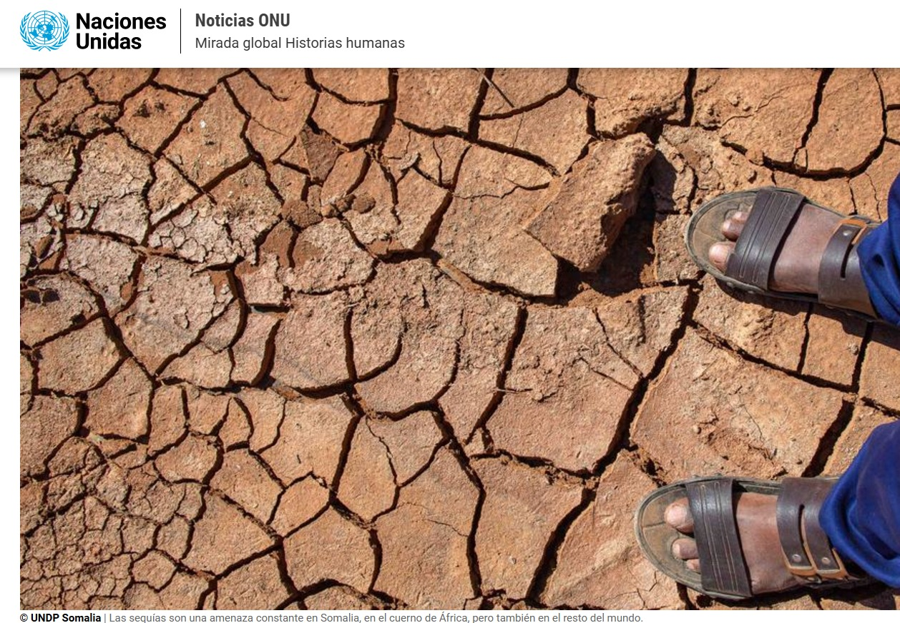
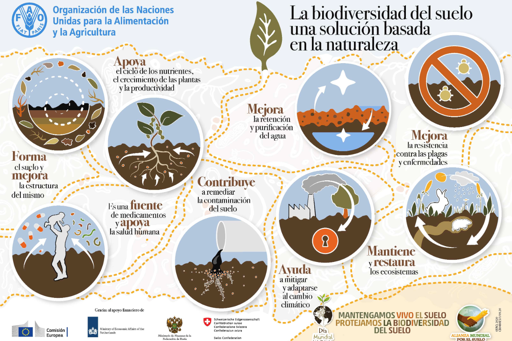
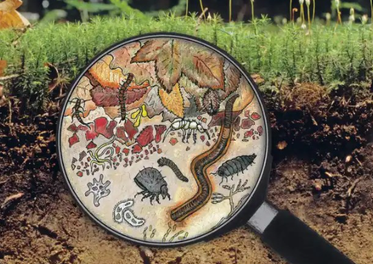
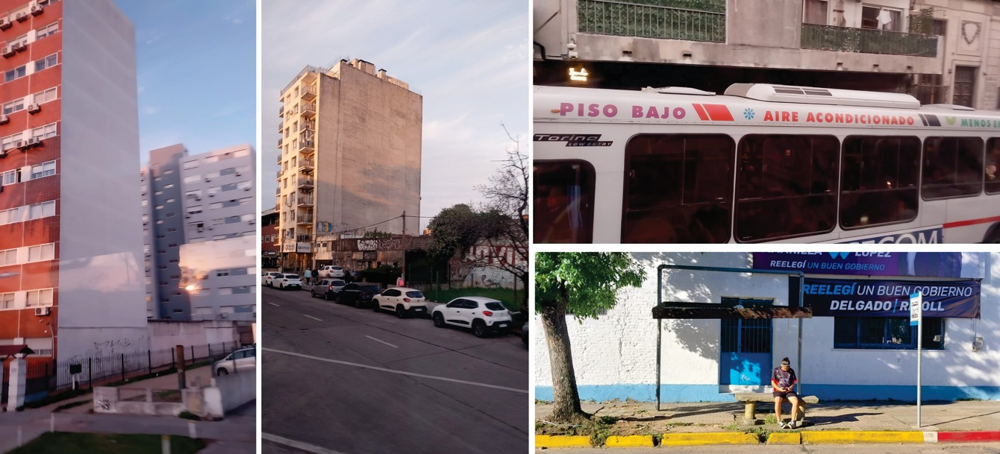

---
hide:
    - toc
---
# Mi lucha surge a partir de la siguiente noticia:

## ONU : La desertificación y la degradación del suelo afecta a 3000 millones de personas en todo el mundo

**Hasta el 40% de las tierras del mundo están degradadas**, *lo que significa que su productividad biológica o económica se ha reducido.*
https://news.un.org/es/story/2024/12/1534741

Es una pérdida invisible, es silenciosa, sin repercusión mediática.

La naturaleza está en constante movimiento, evolucionando generación tras generación. Moviéndose para sobrevivir y adaptarse a los cambios. Pero ¿qué pasa con las especies que no se pueden adaptar ni trasladar, o aquellas que necesitan de la ayuda de otras especies para esparcirse y sus vehículos se extinguen?.

El texto "Lagartijas de huracán y calamares de plástico" de Thor Hanson fue clave para cambiar la perspectiva de mi proyecto. La forma en que los animales y las plantan están respondiendo al cambio climático es asombroso, moviendose, adaptándose o evolucionando. Comparto el texto:  https://thorhanson.net/hurricane-lizards 

Inicialmente mi busqueda estaba orientada a regenerar suelo degradado mediante la representación, buscando entender cómo es esa ciudad enterrada, para así poder mediante técnicas de bio remediación poder recuperar el suelo dañado. En el proceso entendí que el suelo no necesita que yo lo represente necesita tiempo para sanar y  mis conocimientos son muy limitados al respecto.  Así que cambié de escala y de enfoque poniendo atención en los demás factores que causan la pérdida de suelo vivo.

La biodiversidad del suelo cumple un papel fundamental en la evolución de la vida, entender al suelo no solo como un soporte o un recurso agotable nos puede ayudar a protegerlo y respetarlo. Entender al suelo como un organismo vivo es clave ya que *en un gramo de suelo están presentes de 50 a 200 millones de microorganismos, que son el suelo mismo*.

 ¿Cómo puedo contribuir a REGENERAR SUELO desde mis posibilidades o conocimientos y cómo puedo poner al servicio de este tema lo aprendido en el curso?

Uno de los factores de pérdida de suelo vivo es la expansión urbana descontrolada. Implica la conversión de tierras agrícolas, bosques y otros ecosistemas naturales en infraestructura urbana, como edificios, rutas y zonas industriales. Esta pérdida de hábitat tiene importantes consecuencias para la biodiversidad porque reduce el espacio disponible para las especies. Así como también conduce al deterioro de los ecosistemas naturales, contaminación del aire y del agua y de la calidad del medio ambiente. 

Si a esta pérdida de biodiversidad por cambio de suelo le sumamos el aumento de temperatura en el mundo por el cambio climático, se reduce aún más el espacio disponible para habitar.  

Teniendo en cuenta que un hábitat por definición es: *lugar de condiciones apropiadas para que viva un organismo, especie o comunidad animal o vegetal,* **¿qué necesita un suelo para considerarse SANO?**

¿Y si existiese una normativa que obligue a pagar con suelo vivo por cada m2 modificado? ¿Se podrían revestir azoteas y fachadas con suelo?  Existen en el mercado sistemas para azoteas verdes como por ejemplo: https://www.verdefacil.com/. ¿De qué forma mi proyecto podría aportar valor?

¿Y si junto todos los tapers de helado vacíos que tengo, botellas de agua vacías,  les pongo tierra y planto en ellos? ¿estaré ayudando con esta acción a crear m2 de suelo? ¿Cómo se podrían mejorar las condiciones de mis macetas?

La pandemia nos encontró viviendo en Ciudad de la Costa, Canelones. En esos años encerrados aprendimos a conectar con el patio y la naturaleza que teniamos. Creamos una huerta familiar y fue hermoso.

Aprendimos a compostar, a nutrir el suelo, a tener paciencia, a respetar el calendario y las estaciones para plantar, cosechar, a recolectar semillas y preservarlas e intercambiarlas, a respetar el tiempo y los procesos. Aprendimos a OBSERVAR, a maravillarnos con los detalles. A valorar el alimento, no como un producto perfecto sino a valorar los sabores.
Hace un año y medio casi que nos mudamos a Rivera, nos trasladamos 500km hacia el noreste del Pais, un contexto muy muy distinto, muy caluroso y de lluvia intensa en escaso tiempo.

## Desafío propuesto:

¿Y si pudiese crear un *contenedor acondicionado para el suelo*? Sería con doble muro y cámara de aire, con paredes húmedas, agua a demanda de la planta, con sombra y un sustrato nutrido. 

Se definen ciertos objetivos a cumplir:

> - Aspectos funcionales: contenedor estanco y resistente, con filtros , capacida de retener agua para aborber cuando necesite la planta, con drenajes para que no se hinunde, material resistente a la temperatura.
> - **Adaptable** a las superficies existentes.
> - Incorporar un sistema de recolección de agua de lluvia y riego automático en función de la necesidad del sustrato. Con el objetivo de minimizar el stres que sufre la planta por falta de agua.
> - Incorporar energías renovables.
> - Aplicable en programas de huerta de escuelas, escalable a equipamiento urbano. 
> - Reutilizar residuos domiciliarios y fomentar los biomateriales como agentes de cambio.
> - **Involucrar** a la comunidad en el proceso.
> - Que tenga sombra más alla de su ubicación específica.

**Manos a la obra**...

