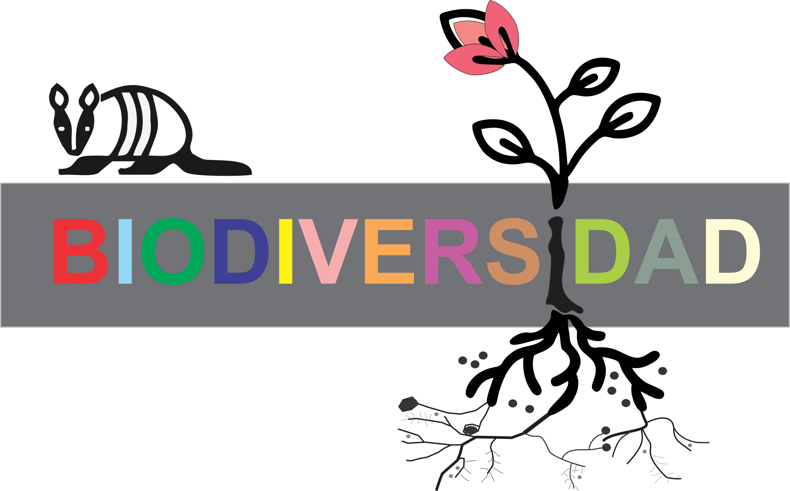

---
hide:
    - toc
---

# Ideas Iniciales

Ideas iniciales en MIRO 
https://miro.com/app/board/uXjVKAVYfr8=/ 

# Información sobre Uruguay

    *...Si bien Uruguay es un país pequeño en cuanto a superficie y población, posee grandes extensiones de 
áreas rurales. Se encuentra íntegramente en la zona templada y sus paisajes se caracterizan por presentar 
un mosaico de ambientes diferentes (bosques, humedales, lagunas, etc.) en una matriz de pradera y una 
densa red hidrográfica.*

    *...Uruguay y su entorno geográfico representan una unidad diferenciada del resto del continente en lo que 
refiere a la composición de su flora y fauna, constituyendo un ecotono terrestre y marino de importancia 
global para la biodiversidad. La evidencia apunta a que Uruguay no es la misma provincia que las “pampas” 
argentinas sino que probablemente deba considerarse como perteneciente a una “formación” o 
“provincia” subtropical húmeda, heterogénea en su fisonomía, como en su composición florística. Es 
razonable concebir a esta región como una gran **zona de transición**.*  

Proyecto Fortalecimiento del Proceso de Implementación del Sistema Nacional de Áreas Protegidas de Uruguay 

## **Presentación 27 Noviembre 2024**

[Enlace a mi presentación:](https://docs.google.com/presentation/d/1PSvSOZfJQ5Ut-72sCIYmQvXgEmUQrWkcyO-5pVy9E1E/edit?usp=sharing)
