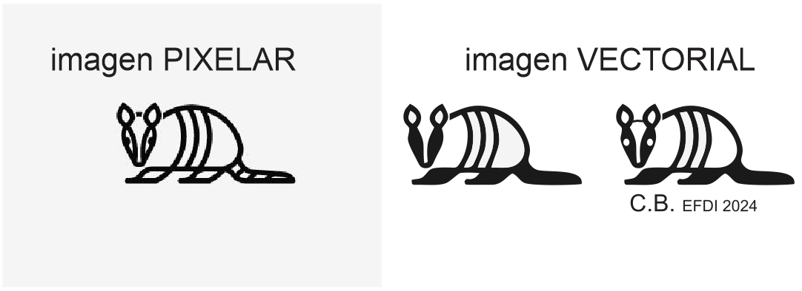

---
hide:
    - toc
---

# MT02
## Diseño 2D y Modelado 3D

Esta semana aprendimos sobre las herramientas de diseño y de fabricación asistida por computadora para experimentarlas y producir con ellas nuestro primer trabajo.
Entendí el porqué de las diferentes resoluciones que  tenemos entre una imagen pixelar y una imagen vectorial y como se forman. Los tipos de formato y las posibilidades de conseguir una mejor calidad   acorde al trabajo que estemos realizando. 

## Desafío MT02 con Joaquín Vega
*Diseñar un objeto utilitario compuesto por al menos dos piezas y contar con un logo.*
*Generar una lámina de presentación.*

Siguiendo el tutorial de la clase, elegí el programa vectorial **Corel** para editar la imagen del logo así como para diseñar la lámina de entrega. Y el Programa de modelado 3d **Tinkercad** para diseñar el objeto, a través de un diseño paramétrico.

Me propuse hacer un objeto que esté vinculado con la temática de mi interés.

1- LOGO

Para diseñar el logo elegí al tatú, un animal  que habita en todo mi país y  se considera una especie susceptible y prioritaria para su conservación por ser objeto de aprovechamiento por parte del ser humano, tanto para alimentación como para fabricación de adornos y utensilios.
Elegí una imagen de internet que me gustó, la importé en Corel y transformé esa imágen pixelar en vector utilizando la herramienta “vectorización por contorno”. En ese proceso  sufrió algunos cambios y tuve que editarla, como por ejemplo,  agregar los ojos. Sumé  un texto con mis iniciales, las del curso y el año. 

2- OBJETO

Empecé con un boceto de mi idea, investigando en internet y conversando con mis hijos decidimos realizar un **hogar para insectos**, el cual podríamos instalar en nuestro patio. Elegimos al polígono de 6 lados para la base, como una forma básica fácilmente acoplable y en escala macro recrea esa idea de celdas de un panal “donde pasan cosas”. Para generar  la estructura tome la sección de un tronco, con los anillos y los rayos se crean sectores independientes. Para modelarlo  me sirvió la forma básica “scribble”, para dibujar la estructura. Me hizo falta un lápiz que me permitiera realizar un diseño más orgánico así como también me permitiera ajustar el grosor de la línea.  Al momento de crear el encastre entre la estructura y la base, copíe la forma de la estructura y le di la característica de transparente para interceptarlas y así generar la hendidura necesaria para la unión.  Pero al no poder ajustar el espesor de la línea del dibujo, aumenté el espesor en la base manualmente  redibujando la línea, y eso me parece que será un problema al momento de ejecutarlo realmente.
Utilizando las formas básicas cree una tapa perforada con círculos , sector de las abejas solitarias y las avispas. En el centro irá una trama tipo malla pensada para las arañas y más arriba unos palos que intentaron parecerse a una tela de araña, pero quedó muy grueso. Completaremos los vacios con trozos de cañas, ramitas, piedras, pasto. Posiblemente precisemos sumar un tejido para contener los elementos. 

