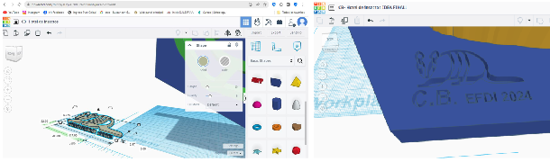
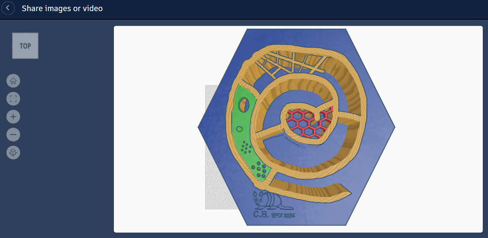
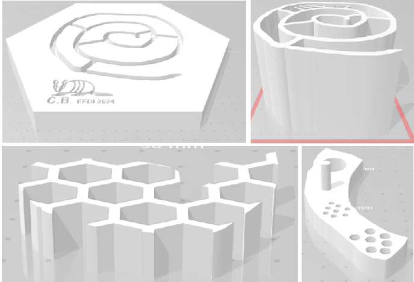
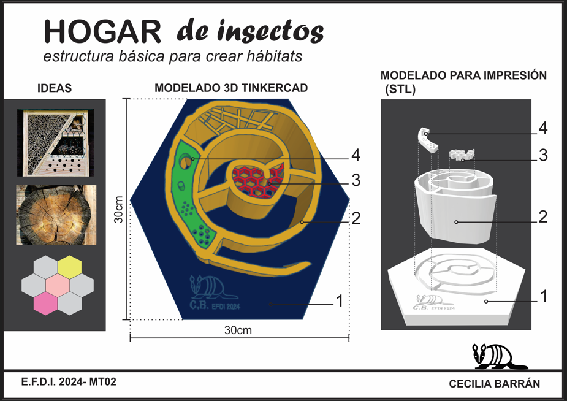

---
hide:
    - toc
---

# MT03
## Corte láser controlado por computadora

Esta semana aprendimos sobre la tecnología del corte láser. Sus carácteristicas, funcionamiento y posibilidades. Las diferencias que existen entre las de CO2 y las de fibra.
Los tipos de materiales con los que se puede trabajar, las maquinas de corte y sus diferentes aplicaciones. 
**CORTE vs GRABADO (raster y vectorial)**

## Desafío MT03 con Joaquín Vega
*Diseñar un objeto simple compuesto por al menos tres piezas parametrizables resolviendo su encastre.*
*Practicar las tres opciones básicas vistas en clase: CORTE/ GRABADO VECTORIAL/ GRABADO RASTER.*
Enregar el diseño exportado en .dxf y el **g-code** para el corte laser en el programa RDworks.

Siguiendo el tutorial de la clase, elegí el programa de modelado 3D  **FUSION 360** para diseñar el objeto. El espesor del material es el valor parametrizable. El diseño está pensado para cortarse en mdf de 3mm de espesor, pero si quisieramos trabajar con una madera de espesor más grueso o más fino, ajustando el valor del espesor, el diseño se ajusta a ese nuevo dato (modificandose tanto el espesor de las piezas así como también la unión de las mismas)   
El logo elegido es el que ya tenía preparado en MT02, el cual se va a grabar de forma raster y el grabado vectorial será el nombre del animal.

2- OBJETO

Empecé con un boceto de mi idea, investigando en internet y conversando con mis hijos decidimos realizar una unidad basica que se pudiera replicar y crear una estructura. Elegimos el polígono de 6 lados al igual que el diseño realizado en MT02, los cuales se van a unir mediante un conector encastrable. 

 Elegimos al polígono de 6 lados para la base, como una forma básica fácilmente acoplable y en escala macro recrea esa idea de celdas de un panal “donde pasan cosas”. Para generar  la estructura tome la sección de un tronco, con los anillos y los rayos se crean sectores independientes. Para modelarlo  me sirvió la forma básica “scribble”, para dibujar la estructura. Me hizo falta un lápiz que me permitiera realizar un diseño más orgánico así como también me permitiera ajustar el grosor de la línea.  Al momento de crear el encastre entre la estructura y la base, copíe la forma de la estructura y le di la característica de transparente para interceptarlas y así generar la hendidura necesaria para la unión.  Pero al no poder ajustar el espesor de la línea del dibujo, aumenté el espesor en la base manualmente  redibujando la línea, y eso me parece que será un problema al momento de ejecutarlo realmente.
Utilizando las formas básicas cree una tapa perforada con círculos , sector de las abejas solitarias y las avispas. En el centro irá una trama tipo malla pensada para las arañas y más arriba unos palos que intentaron parecerse a una tela de araña, pero quedó muy grueso. Completaremos los vacios con trozos de cañas, ramitas, piedras, pasto. Posiblemente precisemos sumar un tejido para contener los elementos. 

3- INCORPORACIÓN DEL LOGO DISEÑADO AL OBJETO

4- IMAGEN DEL PRODUCTO DISEÑADO

5- MALLA EN FORMATO PARA IMPRESIÓN 3D (STL)

6- LAMINA DE PRESENTACIÓN

Comparto mi diseño https://www.tinkercad.com/things/aDgxaT9RDT9-cb-hotel-de-insectos-final/edit?sharecode=YRifUEYt4YD7rQR1ToaW3T23jb4PsZWtu6cLJzcHsGo

