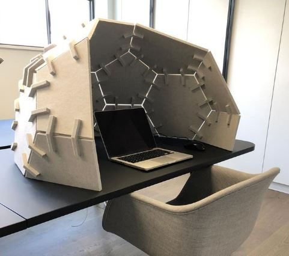
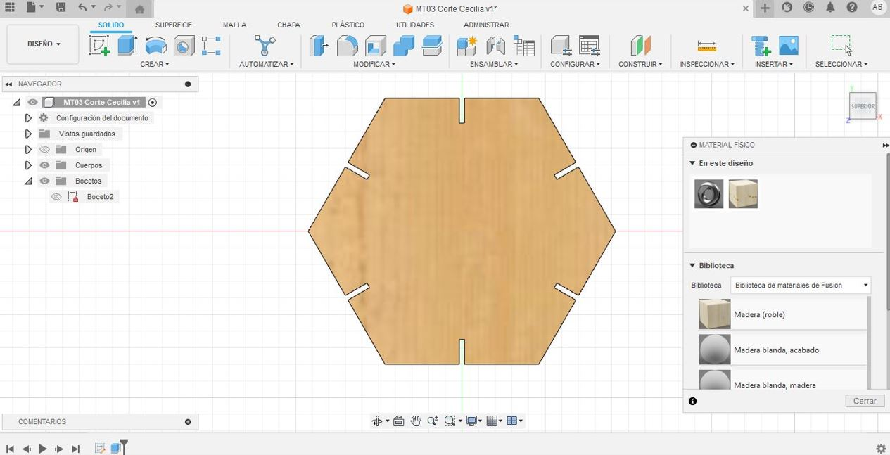
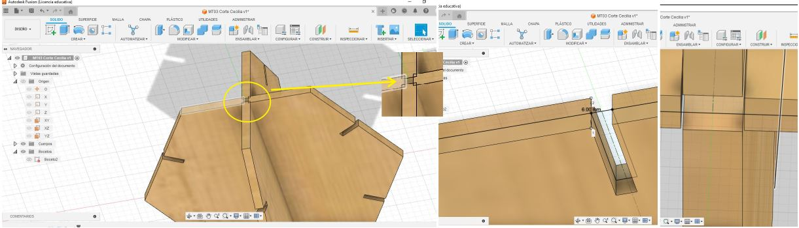
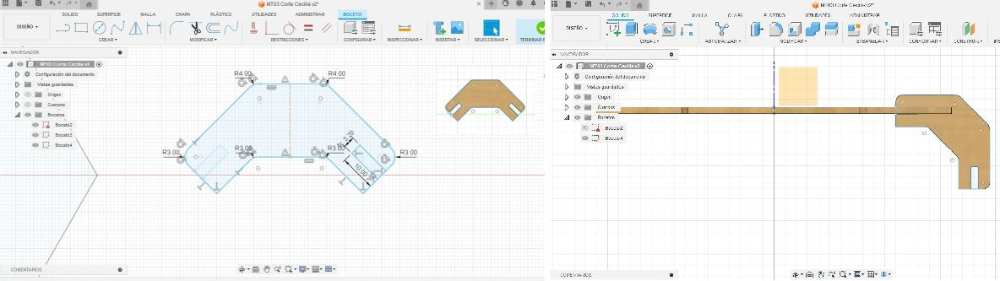
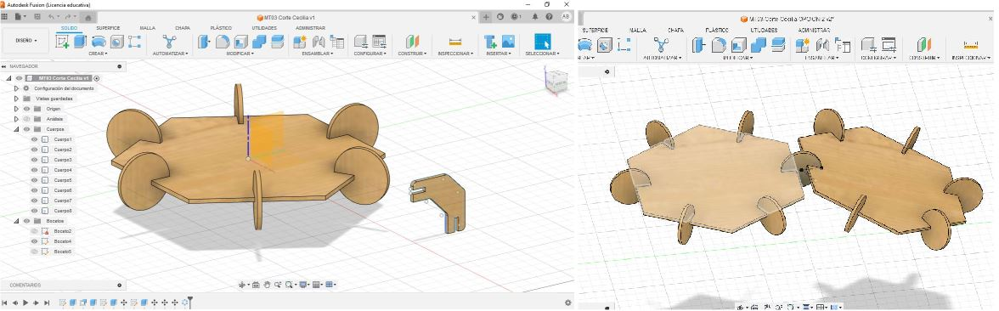
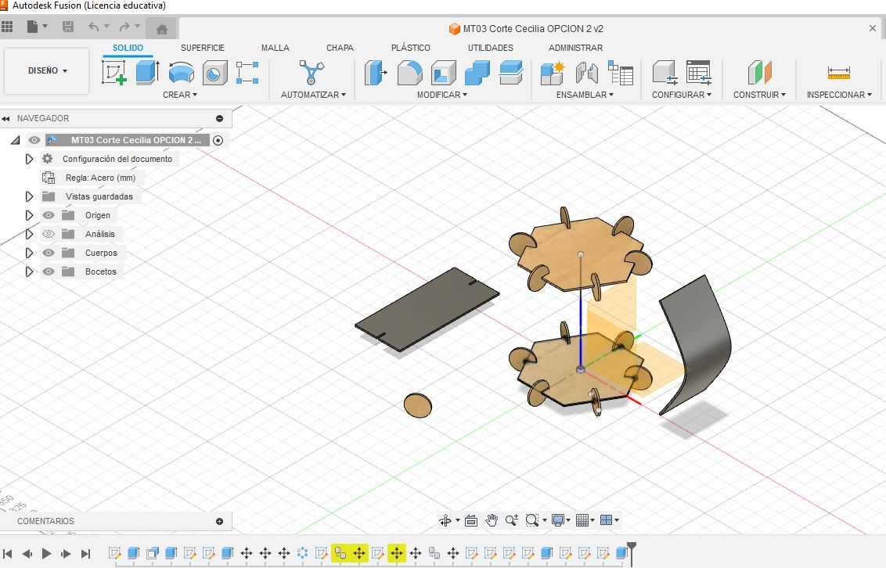
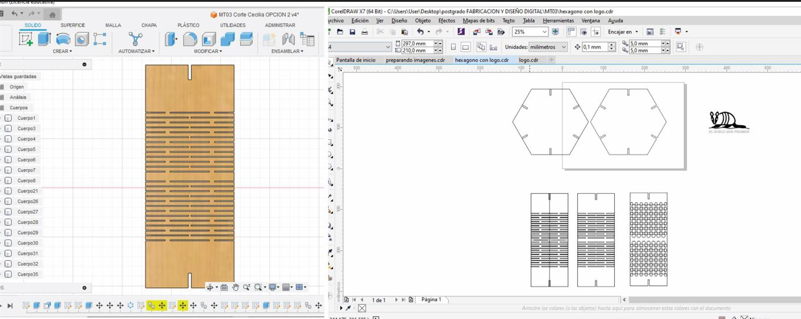
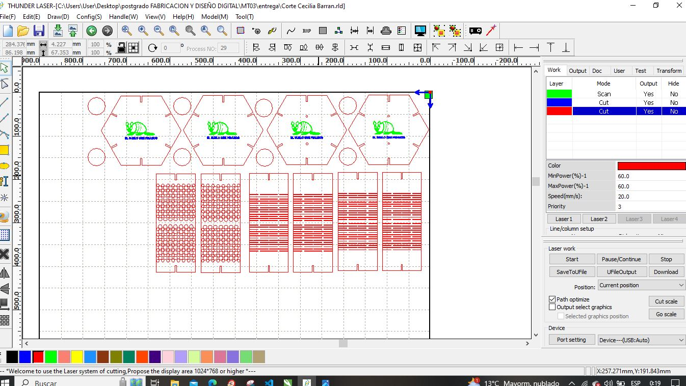

---
hide:
    - toc
---

# MT03
## Corte láser controlado por computadora

Esta semana aprendimos sobre la tecnología del corte láser. Sus carácteristicas, funcionamiento y posibilidades. Las diferencias que existen entre las de CO2 y las de fibra.
Los tipos de materiales con los que se puede trabajar, las maquinas de corte y sus diferentes aplicaciones. 
**CORTE vs GRABADO (raster y vectorial)**

## Desafío MT03 con Joaquín Vega
*Diseñar un objeto simple compuesto por al menos tres piezas parametrizables resolviendo su encastre.*
*Practicar las tres opciones básicas vistas en clase: CORTE/ GRABADO VECTORIAL/ GRABADO RASTER.*
Enregar el diseño exportado en .dxf y el **g-code** para el corte laser en el programa RDworks.

Siguiendo el tutorial de la clase, elegí el programa de modelado 3D  **FUSION 360** para diseñar el objeto. El espesor del material es el valor parametrizable. El diseño está pensado para cortarse en mdf de 3mm de espesor, pero si quisieramos trabajar con una madera de espesor más grueso o más fino, ajustando el valor del espesor, el diseño se ajusta a ese nuevo dato (modificandose tanto el espesor de las piezas así como también la unión de las mismas)   
El logo elegido es el que ya tenía preparado en MT02, el cual se va a grabar de forma raster y el grabado vectorial será el nombre del animal.

OBJETO

Empecé con un boceto de mi idea, investigando en internet y conversando con mis hijos decidimos realizar una unidad basica que se pudiera replicar y crear una estructura. Elegimos el polígono de 6 lados al igual que el diseño realizado en MT02, los cuales se van a unir mediante un conector encastrable. 

Imágen de referencia:

Proceso:
 Siguiendo el totorial de la clase, realicé el ejercicio acorde los pasos indicados como primer acercamiento con el programa, ya que en la semana de MT02 no lo habia logrado entender y tuve que realizar el ejercicio con tinkercad.

Al introducir el espesor no active la herramienta que indica que el valor del espesor es centrado en el eje de la pieza, y surgió el siguiente error: 

Intenté diseñar  un conector que me permitiera unir las piezas en diferentes ángulos, para tener la libertad de crear curvas o pliegues con la sucesiva incorporacion de piezas.

Pero no funciono como esperaba, entonces decidí eliminarlo e ir por una forma que me diera mas libertad de posiciones. Un círculo maciso resulto ser el ideal para funcionar como conector.

Para incluir la técnica de curvado, *Kerfing*, la incorporé en rectangulos que se sumarán a las piezas anteriores mediante encastre. 
Intenté probar la herramienta plegado de chapa, siguiendo los pasos del video que se compartió en el grupo, pero me tranque a la hora de definir los ajustes de la pieza.

Elegí uno de los diseños que se mostraban en el video de clase y lo dibuje en un rectángulo. Inicialmente dibuje lineas y cuando quise extruir el objeto no me las reconoció. Asique volví a dibujar el diseño pero esta vez con rectángulos, finalmente al darle el espesor a la pieza logré que el diseño de kerfing deseado. 

Guardé los bocetos como archivos dxf y los importé en Corel para ajustarlos. 
Importé el logo diseñado en MT02 como formato svg y lo modifique a extensión dxf.

Instalé el programa RDworks siguiendo el tutorial de clase, ajusté la dimensión de la hoja, importé los archivos finales y elaboré las capas, la programación para realizar el corte y los grabados solicitados.

ARCHIVO DXF:

ARCHIVO DEL PROGRAMA RDWORKS:

ARCHIVO G-CODE:

