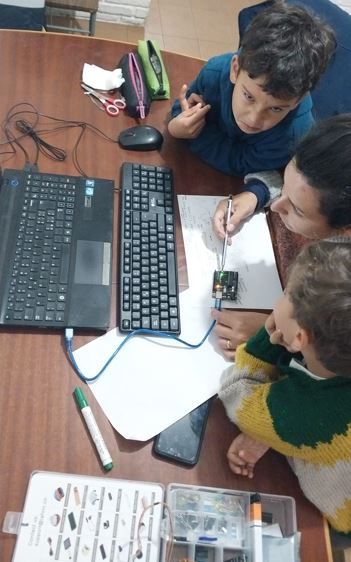
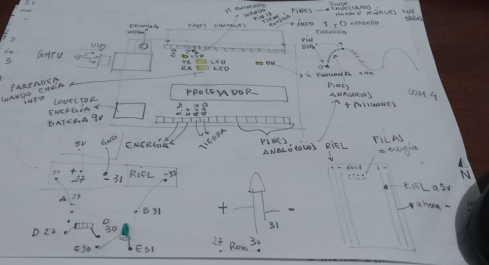
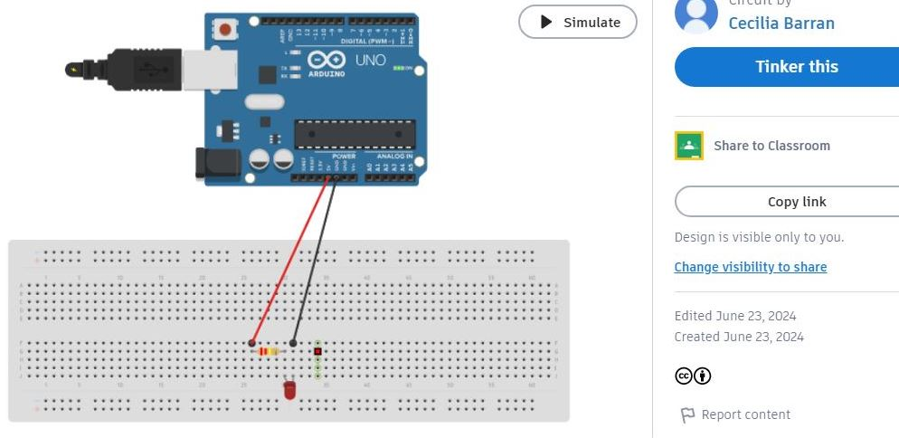
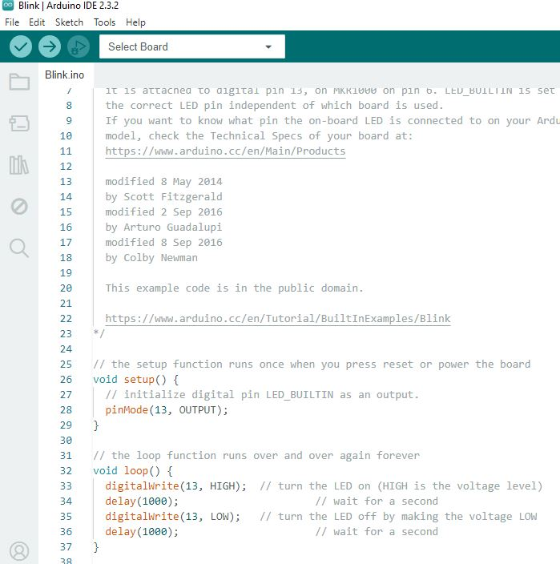
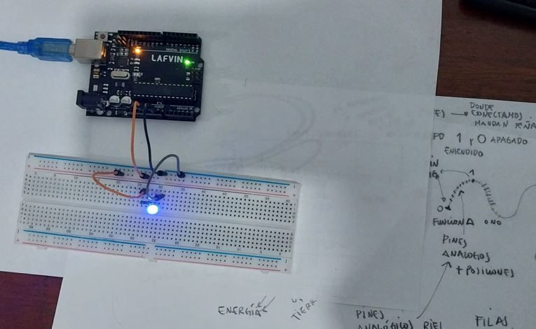
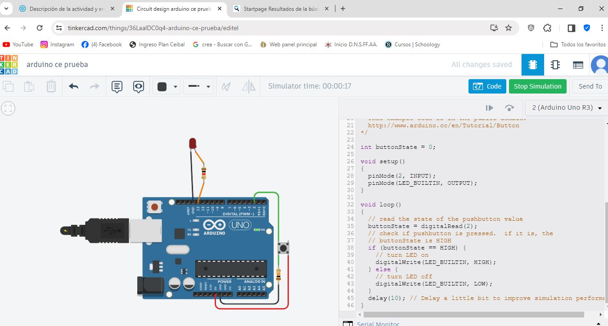
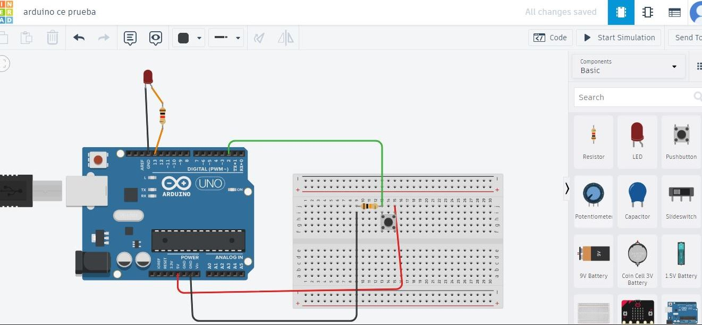
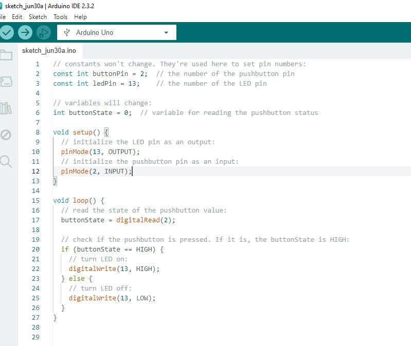

---
hide:
    - toc
---

# MT04
## Electronica y Programación *Arduino IDE* con Josep

Esta semana aprendimos sobre la electrónica y programación recibimos el kit de Arduino y comenzamos a experimentar con INPUTS y OUTPUTS.

## Desafío MT04 con Josep
*Leer mínimo dos INPUTS*
*Actuar mínimo dos OUTPUTS*
Utilizar Tinkercad Electronics y kit de Arduino

Empece revisando las clases y los tutoriales, elegí el programa Tinkercad para experimetar con los circuitos, ya que este tema es nuevo para mi. 
Me fue de gran ayuda un tutorial paso a paso de Arduino donde explicaban desde cero todo los componentes del kit y realizaban los circuitos basicos. 
Me resultó de gran ayuda![curso arduino en español]<a href="https://www.youtube.com/watch?v=gx5yFvVDUsY&list=PLyLh25DppBIe40j3VBAslnVfs4Pz-B3ZB" target="_blank">gracias!</a>

## LED
En TINKERCAD probé el led inicialmete con encendido y apagado mediante pin digital, probando valores de tiempo de 1000ms a 50ms. 

En el programa Arduino me guié con la libreria utilizando *Blink* :

Utilicé la *breadboard* para probar las conexiones y entender como estan conectadas, las diferencias entre riel, filas y columnas. 

ejercicio LED [tiempo del LED 50]
    
   

## LED + PULSADOR
Sumé un pulsador al circuito de la led realizado. 
La luz Led actua como la salida de información y se acciona cuando el pulsador es encendido.

Primero lo probé en Tinkercad:

pero no me queda claro como se conecta fisicamente las piezas del modelo asique trabaje con la breadboard,la inclui en el modelo para realizar las conecciones y probar con el simulador si funcionaba.

Una vez que funcionó el modelo pase el código para Arduino:

![<video>]
<source src="2.mp4" width="350px" height="350px" controls></video> 
