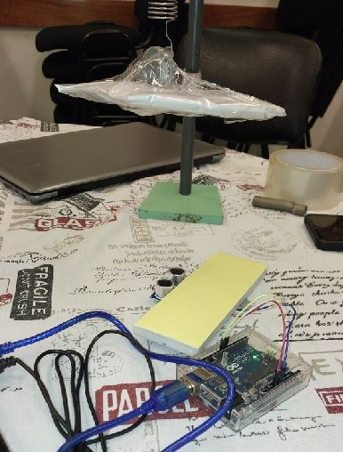
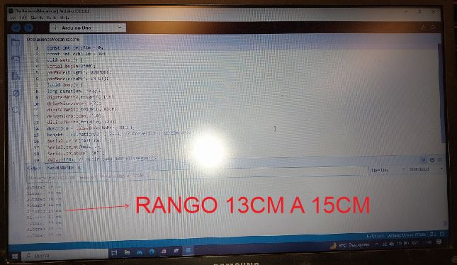
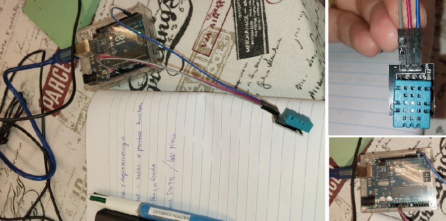

---
hide:
    - toc
---

# MT04
## Electronica y Programación *Arduino IDE* con Josep

Esta semana aprendimos sobre la electrónica y programación recibimos el kit de Arduino y comenzamos a experimentar con INPUTS y OUTPUTS.

## Desafío MT04 con Josep
*Leer mínimo dos INPUTS*
*Actuar mínimo dos OUTPUTS*
Utilizar Tinkercad Electronics y kit de Arduino

Empece revisando las clases y los tutoriales, elegí el programa Tinkercad para experimetar con los circuitos, ya que este tema es nuevo para mi. 
Me fue de gran ayuda un tutorial paso a paso de Arduino donde explicaban desde cero todo los componentes del kit y realizaban los circuitos basicos. 
Me resultó de gran ayuda![curso arduino en español]<a href="https://www.youtube.com/watch?v=gx5yFvVDUsY&list=PLyLh25DppBIe40j3VBAslnVfs4Pz-B3ZB" target="_blank">gracias!</a>

## LED
En TINKERCAD probé el led inicialmete con encendido y apagado mediante pin digital, probando valores de tiempo de 1000ms a 50ms. 

En el programa Arduino me guié con la libreria utilizando *Blink* :

Utilicé la *breadboard* para probar las conexiones y entender como estan conectadas, las diferencias entre riel, filas y columnas. 

ejercicio LED [tiempo del LED 50]
    
   ![video]<a href="https://youtube.com/shorts/uBsUlIbIJyY?feature=share"target="_blank">ver!</a>

<iframe src="https://player.vimeo.com/video/1029356217?title=0&amp;byline=0&amp;portrait=0&amp;badge=0&amp;autopause=0&amp;player_id=0&amp;app_id=58479" width="478" height="850" frameborder="0" allow="autoplay; fullscreen; picture-in-picture; clipboard-write" title="video.mp4"></iframe>

## LED + PULSADOR
Sumé un pulsador al circuito de la led realizado. 
La luz Led actua como la salida de información y se acciona cuando el pulsador es encendido.

Primero lo probé en Tinkercad:

pero no me queda claro como se conecta fisicamente las piezas del modelo asique trabaje con la breadboard,la inclui en el modelo para realizar las conecciones y probar con el simulador si funcionaba.

Una vez que funcionó el modelo pase el código para Arduino:

Armé el circuito y lo concté al programa:

<iframe src="https://player.vimeo.com/video/1029356246?title=0&amp;byline=0&amp;portrait=0&amp;badge=0&amp;autopause=0&amp;player_id=0&amp;app_id=58479" width="478" height="850" frameborder="0" allow="autoplay; fullscreen; picture-in-picture; clipboard-write" title="2"></iframe> 

Me cuesta leer las resistencias, los colores no son tan claros. 

## SENSOR DE DISTANCIA

Intenté con el sensor de distancia en tinkercad:

 

 El modelo de sensor era distinto al que trae el kit. Siguiendo el ejemplo que realizó Jusep en clase conecte el sensor y copie el código al programa.

En el taller que curse en UTU,de aproximación a arduino, realizamos un ejercicio de física con el sensor de distancia:

 El ejercicio consistia en realizar una medición del rango y la amplitud del movimiento de la superficie blanca, es un ejercicio básico de física que tiene la novedad de incorporar el sensor de sistancia para recolectar los datos, que normalmente se realizaria con una cinta o regla.

![video]<a href=https://youtube.com/shorts/JwHbvm7lnEs?feature=share feature=share target="_blank">ver!</a> 

## **SENSOR DE TEMPERATURA Y DE HUMEDAD**

En el taller de arduino que brindaron en ETSR (UTU de Rivera) y logré armar el sensor de Temperatura y de humedad:

 

Armé el circuito y lo concté al programa:
![video]<a href=https://youtu.be/j7gtrSMCDoQ feature=share target="_blank">ver!</a> 

<iframe src="https://player.vimeo.com/video/1029363806?title=0&amp;byline=0&amp;portrait=0&amp;badge=0&amp;autopause=0&amp;player_id=0&amp;app_id=58479" width="1080" height="1920" frameborder="0" allow="autoplay; fullscreen; picture-in-picture; clipboard-write" title="20240710_092515"></iframe>

En el local teniamos una temperatura de 18 °C y humedad de 60 %. Acerque el sensor al café y registré los datos obtenidos: 
Temperatura de 22°C y humedad de 90%:

![video]<a href=https://youtube.com/shorts/IBhaVu2L_VU feature=share target="_blank">ver!</a>   