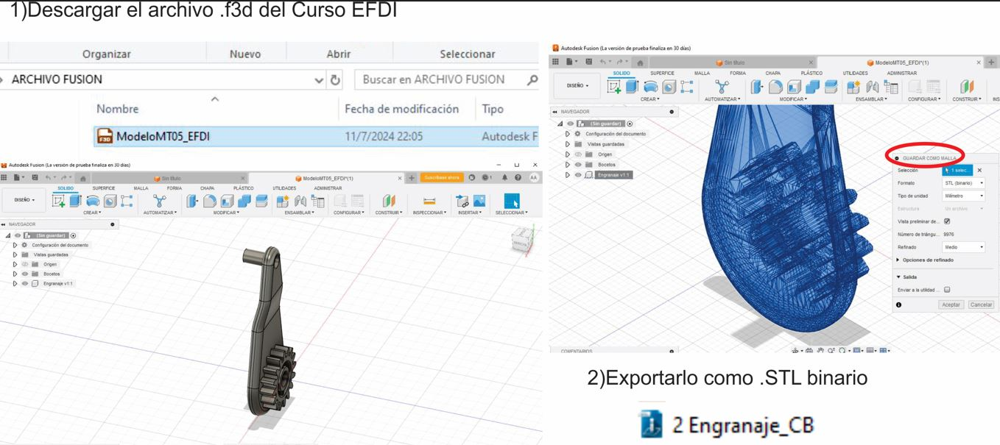
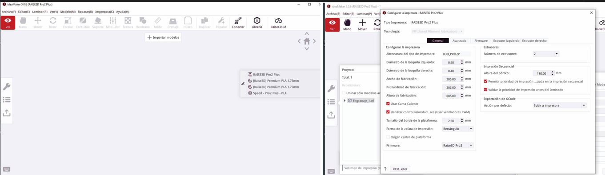

---
hide:
    - toc
---

# MT05
## Impresión y Escaneo 3D
con Maximiliano Torres- Docente de Fabricación Digital_UTEC.

En este módulo técnico nos enfocamos en la tecnología de fabricación digital, las maquinas  y la preparación necesaria (generación del archivo **G-CODE**) para que el diseño de forma digital  se pueda fabricar. 

A diferencia del MT03 donde experimentamos la fabricación sustractiva CNC en la cual creamos mediante el corte del material con un laser, en la fabricación 3d  creamos mediante el depósito de un material en capas, una sobre otras.

 Eduardo Chamorro nos enseño su trabajo y con el visualizamos la diversidad de posibilidades que esta forma de creación permite. 

## Desafío MT05
Generar un archivo *G-CODE* a partir de un modelo 3D realizado en FUSION 360, diseño preelaborado por el docente, para posteriormente poder imprimirlo en la semana de concurrencia al LAB A.

Para poder transformar el diseño 3D en un archivo imprimible hay que seguir algunas indicaciones:

-Realizar el diseño del objeto en un progrma de 3D como el FUSION 360 (se parte de la base de un diseño elaborado por el docente con el objetivo de poder experimentar el proceso posterior al diseño, el de preparación del archivo G-CODE).

Exportar el archivo como **.STL(binario)**.

 Descargar el software de impresión *3D ideaMaker*, para preparar el archivo G CODE.

Me paso que no pude visualizar correctamente el software en mi computadora debido a poca tarjeta de video, no podia ver el plano de trabajo con las coordenadas x, y ,z.

Cambie de computadora con mas tarjeta de video y logre visualizar todo correcto.

Para iniciar configuré la impresora siguiendo el tutorial paso a paso creado por Maxi, el cual fue muy claro y accesible. Acorde a la impresora que disponemos en el Laboratorio, en este caso *RAISE3D Pro 2 Plus*. 