---
hide:
    - toc
---

# MT05
## Impresión y Escaneo 3D
con Maximiliano Torres- Docente de Fabricación Digital_UTEC.

En este módulo técnico nos enfocamos en la tecnología de fabricación digital, las maquinas  y la preparación necesaria (generación del archivo **G-CODE**) para que el diseño de forma digital  se pueda fabricar. 

A diferencia del MT03 donde experimentamos la fabricación sustractiva CNC en la cual creamos mediante el corte del material con un laser, en la fabricación 3d  creamos mediante el depósito de un material en capas, una sobre otras.

 Eduardo Chamorro nos enseño su trabajo y con el visualizamos la diversidad de posibilidades que esta forma de creación permite. 

## Desafío MT05
Generar un archivo *G-CODE* a partir de un modelo 3D realizado en FUSION 360, diseño preelaborado por el docente, para posteriormente poder imprimirlo en la semana de concurrencia al LAB A.

Para poder transformar el diseño 3D en un archivo imprimible hay que seguir algunas indicaciones:

-Realizar el diseño del objeto en un progrma de 3D como el FUSION 360 (se parte de la base de un diseño elaborado por el docente con el objetivo de poder experimentar el proceso posterior al diseño, el de preparación del archivo G-CODE).

Exportar el archivo como **.STL(binario)**.

 Descargar el software de impresión *3D ideaMaker*, para preparar el archivo G CODE.

Me paso que no pude visualizar correctamente el software en mi computadora debido a poca tarjeta de video, no podia ver el plano de trabajo con las coordenadas x, y ,z.

Cambie de computadora con mas tarjeta de video y logre visualizar todo correcto.

Para iniciar configuré la impresora siguiendo el tutorial paso a paso creado por Maxi, el cual fue muy claro y accesible. Acorde a la impresora que disponemos en el Laboratorio, en este caso *RAISE3D Pro 2 Plus*.

3) Con la herramienta *Importar  modelo* importe el archivo .stl :

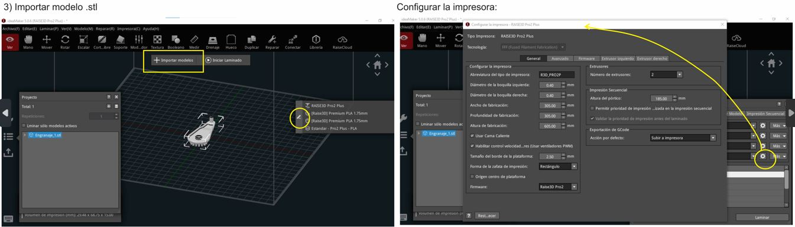

4) Con la herramienta *Mover* y *Rotar* se determina la posición del objeto. Pero, cuál es la posición más conveniente? 
Teniendo en cuenta que se trata de una Impresora 3D FDM:

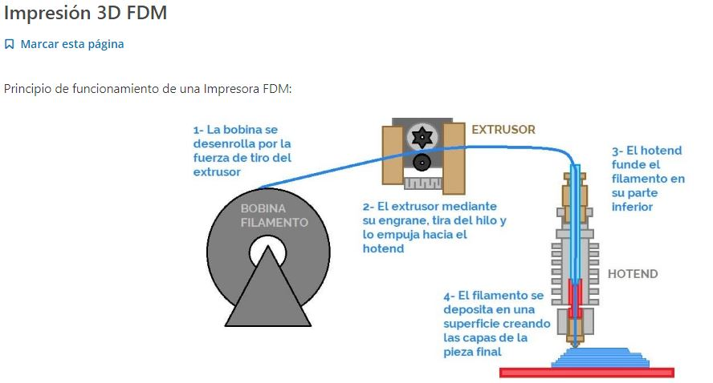

*"La impresión 3D FDM es un proceso de impresión 3D por extrusión de material. Un carrete alimenta filamento termoplástico a través de un extrusor que calienta, funde y extrude el plástico a través de una boquilla fina."*

El objeto se secciona en capas y la impresora va siguiendo las indicaciones que le dice el G CODE para ir dibujando cada capa, una despues de otra. Cuanto más alto sea el objeto, más capas habrá con lo cual, más tiempo de impresión.

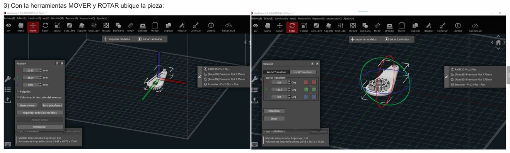

5) Con la herramienta *escala*, escalé el objeto a 150%, teniendo la precaución de activar *escala uniforme*. 

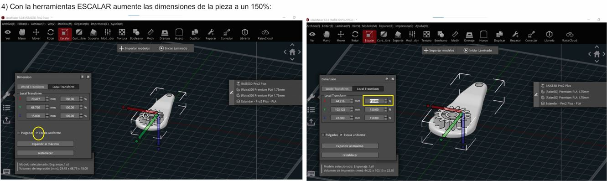

6) Generar soportes y base de construcción de tipo *BALSA*:
El soporte es una estructura que se imprime con el modelo, su función es sostener la parte que sobresale y será retirado una vez que la impresión finalice. 
Probé tres tipos de soportes: lineal, cuadrícula y panal. 

Agregue capas de soporte más denso, teiendo en cuenta que la pieza tiene voladizo horizontal,mayor a 45°, propenso a curvarse o caerse.

*El material de soporte es algo a evitar* ya que por más que lo retiremos con cuidado, dejará marcas en la pieza. Para optimizar la impresión es conveniente tener presente la **regla de los 45°**:

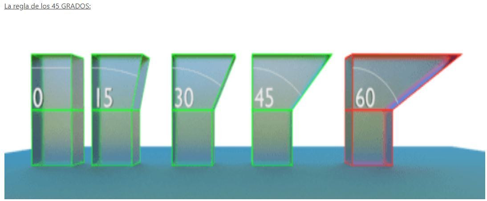

 *"si mantenemos las partes voladas de nuestro diseño por debajo de 45º de inclinación, eliminaremos la necesidad de usar material de soporte y conseguiremos que nuestra impresión sea limpia y uniforme. Por encima de esa inclinación, será necesario el uso de soportes, perjudicando el resultado final."*

Seleccioné la base de construcción de tipo balsa, con el objetivo de evitar el *warping*, problema que ocurre cuando la pieza se levanta en las esquinas. El **RAFT** se ve en color amarillo en la visualización del objeto, es una base más extensa que el objeto que brinda una mayor adherencia a la placa de construcción.

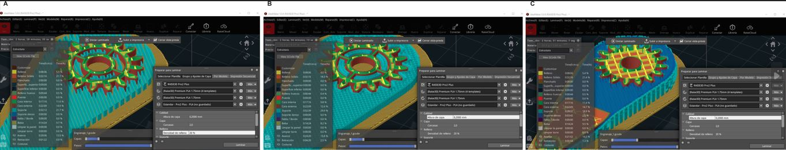

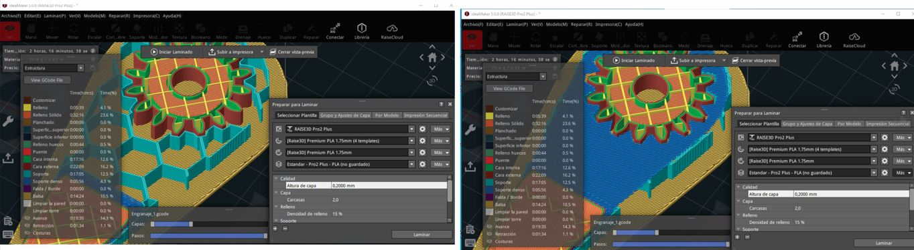

7) En la pestaña *Preparar para laminar*, determiné la altura de la capa de 0.2 mm, siguiendo las especificaciones de la actividad.

La altura de la capa define la calidad de resolución o definición del objeto:

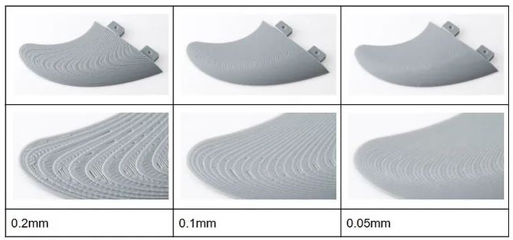

Una capa de 0.2mm de espesor se emplea como una resolución de uso general.
Si utilizaramos una capa de 0.05mm de espesor, obtendriamos una pieza muy lisa pero con mucho más tiempo de impresión. 

Es muy importante definir el grosor de la pared correctamente, ya que tanto una pared demasiado fina o demasiado gruesa puede dcausar problemas. Se definen 2 perímetros de pared, indicando en la variable capas la cantidad de 2 carcasas.

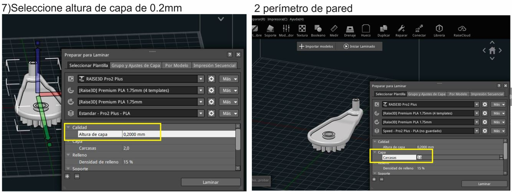

8) Seleccionar el extrusor (pico) Izquierdo para realizar el código:

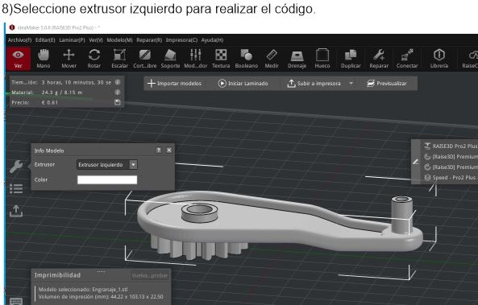

9) Realizar el feteo o corte del modelo, previsualizarlo:

En la herramienta *iniciar laminado* se realiza el feteo de la pieza, y  en la herramienta *previsualización* se puede ver la evolución de la impresión, capa por capa. Con una estimación del tiempo de impresión y el costo.

Se realizan varias pruebas con distintas posiciones de la pieza, en horizontal y en vertical. Se evalúa el tiempo de fabricación y la generación del soporte.

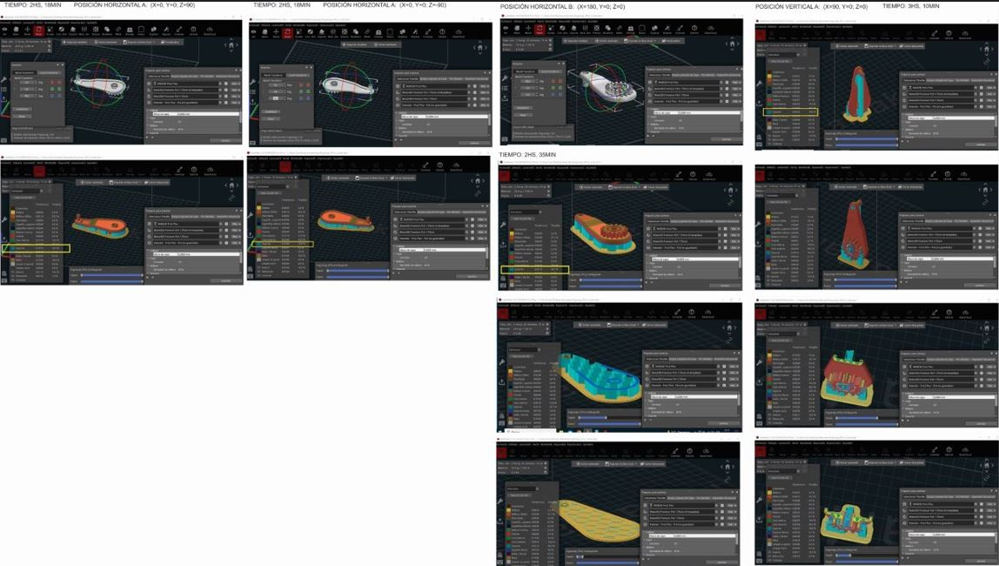

10) Exportar el archivo G CODE y enviarlo por mail.
Una vez se han definido todas las especificaciones necesarias, para eportar el G CODE, se selecciona *exportar al disco local* y se guarda el archivo .gcode con el cual se va a imprimir en laboratorio. 

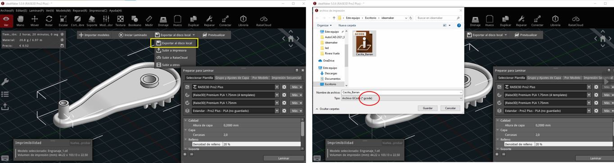

<a download="archivos" href=
>Descargar archivo g code</a>

## Impresión 3D en Lab A

En el Lab A de Rivera, pude experimentar por primera vez la impresión 3D con material FDM, en una **impresora 3D del tipo RAISE-  modelo PRO 2 PLUS**.

Con el asesoramiento de Maxi revisamos el modelo en idea MAKER y realizamos los ajustes necesarios para adecuarlo a la impresión del laboratorio. A modo de ejemplo, en mi caso tenia programado para imprimir en el extrusor izquierdo y por ajustes en la máquina lo tuve que modificar para el extrusor derecho, y volví a generar el archivo  código G para enviar a la máquina.

Aprendí a cargar el filamento y realizar los pasos de preparación en el menú:

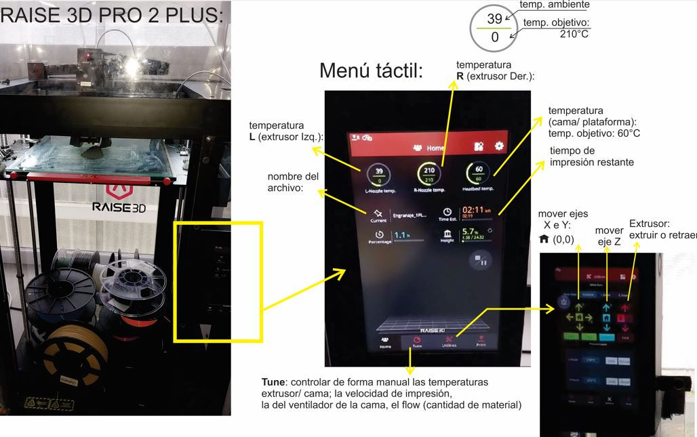

Una vez que el etrusor (pico) y la cama llegan a la temperatura deseada, se ejecuta el archivo g code y la máquina realiza los movimientos para empezar a imprimir la pieza.

<body>

<video>
<video src="/EFDI/cecilia_barran/docs/tecnicos/video/3.mp4" width="250px" controls></video>

<body>
    <h1>Mi Video MP4</h1>
    <video width="640" height="360" controls>
        <source src="video/3.mp4" type="video/mp4">
        Tu navegador no soporta el elemento de video.
    </video>

Una vez impresa la pieza,en tan solo 2,19 hs, comienza el trabajo de limpieza. 

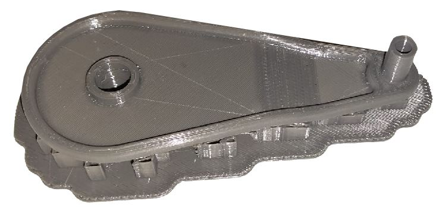

El objetivo es retirar la estructura de soportes y balsa que no es parte del diseño.
Mediante el uso de una trincheta retiro el material excedente.

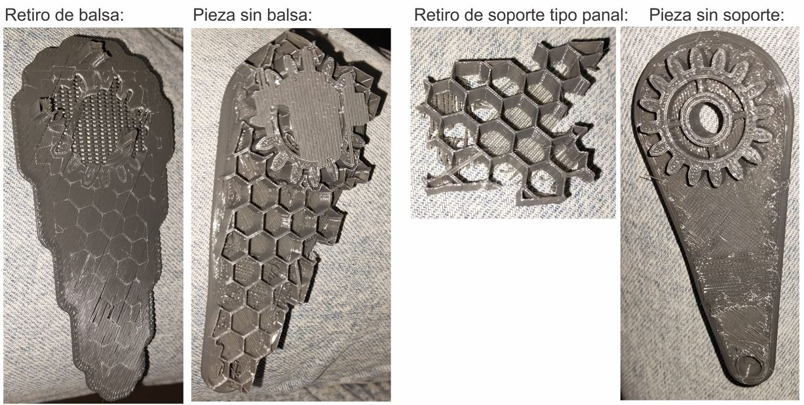