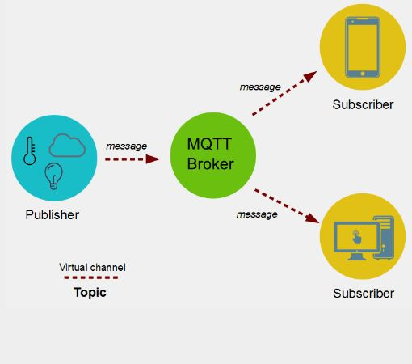

---
hide:
    - toc
---

# MT06
## NETWORKING y COMUNICACIÓN en microprocesadores
con Josep - Fab Lab Barcelona.

En este módulo técnico nos enfocamos en la comunicación entre los objetos y la PC. Conceptos, Protocolos y Tecnologías inalambricas. 

El uso de Redes y Protocolos de comunicación se basa en la idea de distribuir y conectar sistemas por motivo de comment: ubicación/ paralelismo/ modularidad/ interferencia.

Qué es necesario para que se de una comunicación?:
-Emisor, Receptor y mensaje
-Lenguaje
-Protocolo

Una **RED** es un conjunto de ordenadores conectados entre si a través de LINEAS DE COMUNICACIÓN. 
Los **PROTOCOLOS** son un conjunto de NORMAS sobre formato de mensajes y procedimientos que permiten a máquinas y programas de aplicación intercambiar INFORMACIÓN.

**MQTT** es un protocolo que utiliza un modelo de publicación/ suscripción basado en eventos para poder enviar mensajes a los clientes. 

  

 La comunicación pasa por un punto central llamado "broker", que se encarga de gestionar el envío de mensajes entre emisores y receptores. Cada cliente, al enviar un mensaje, lo hace incluyendo un *topic* en el mensaje. **Cada cliente que quiere recibir un mensaje se suscribe a un determinado topic del broker** y éste le envía los mensajes correspondientes.

## Desafío MT06

 

 

 

 