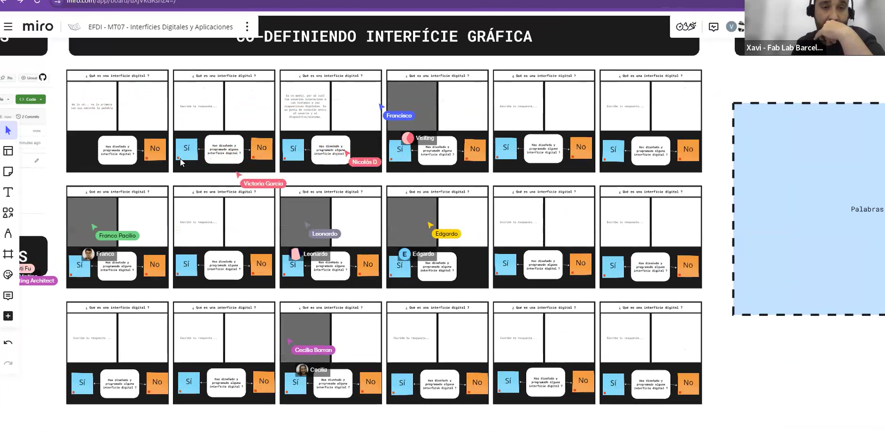
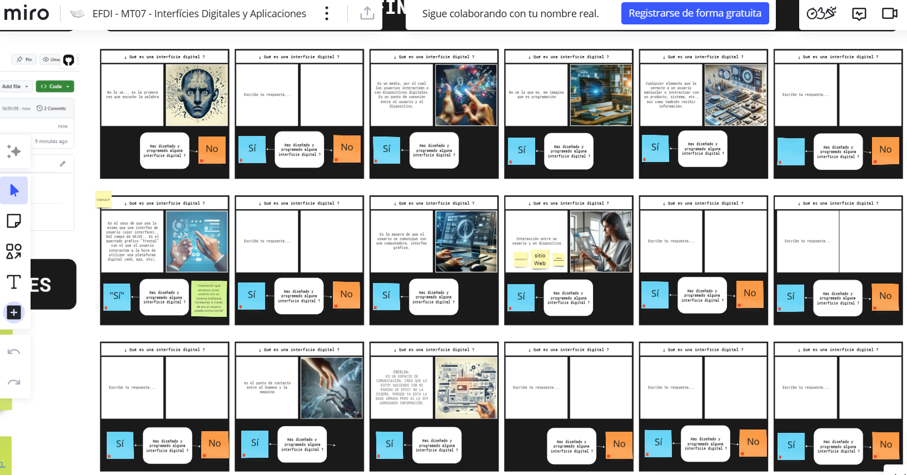
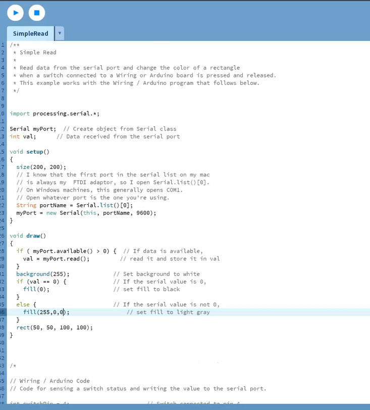
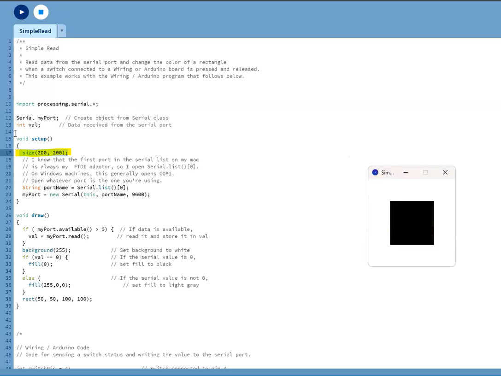
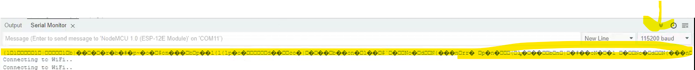
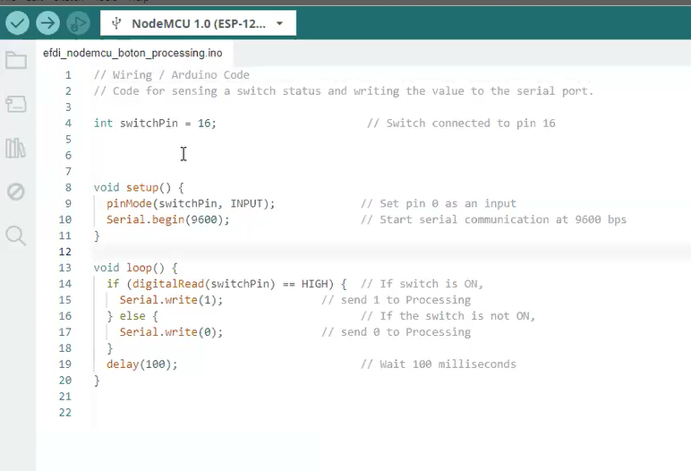
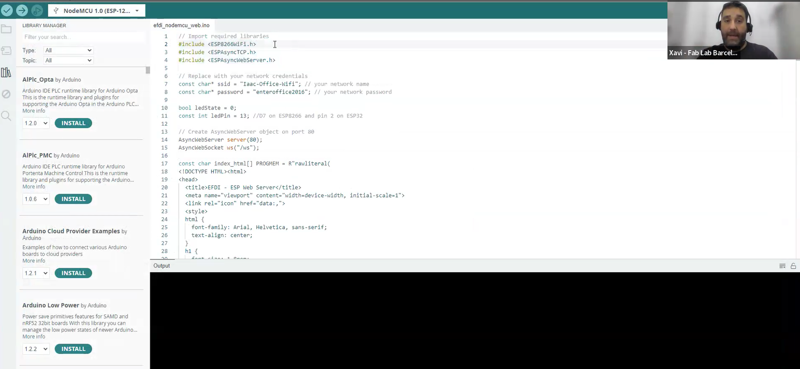
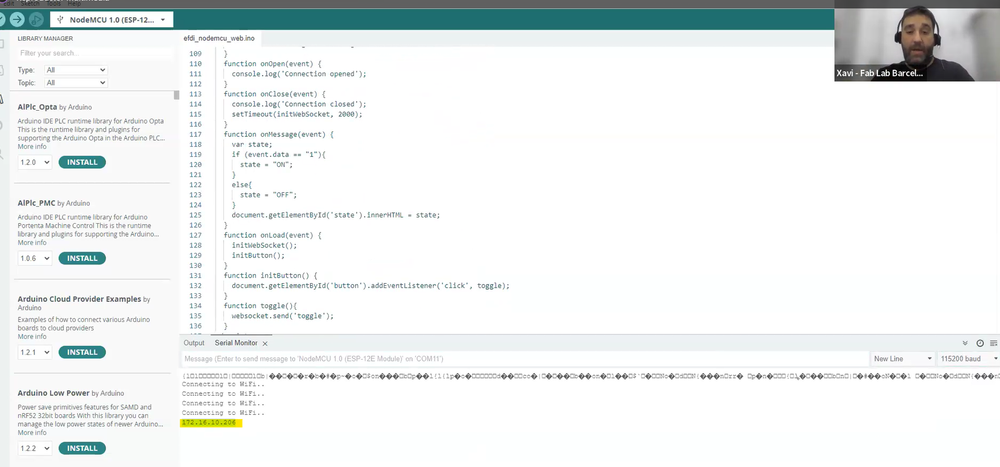
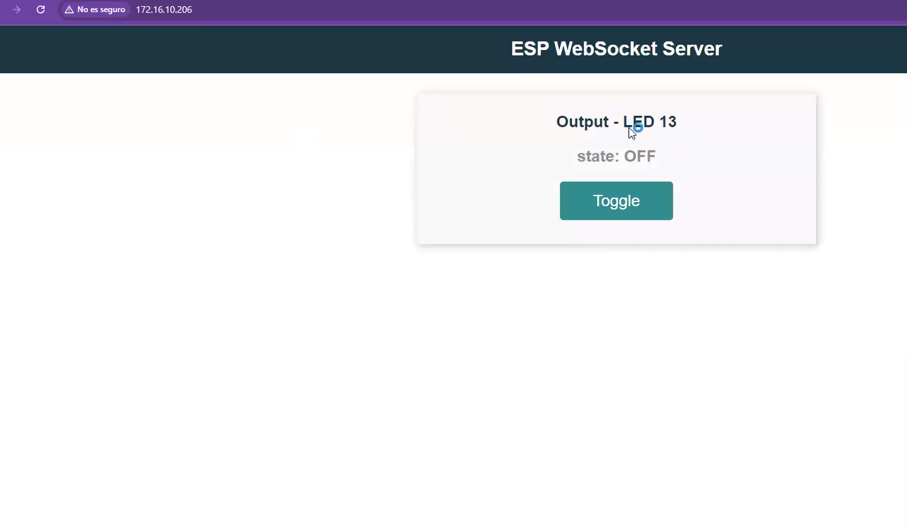
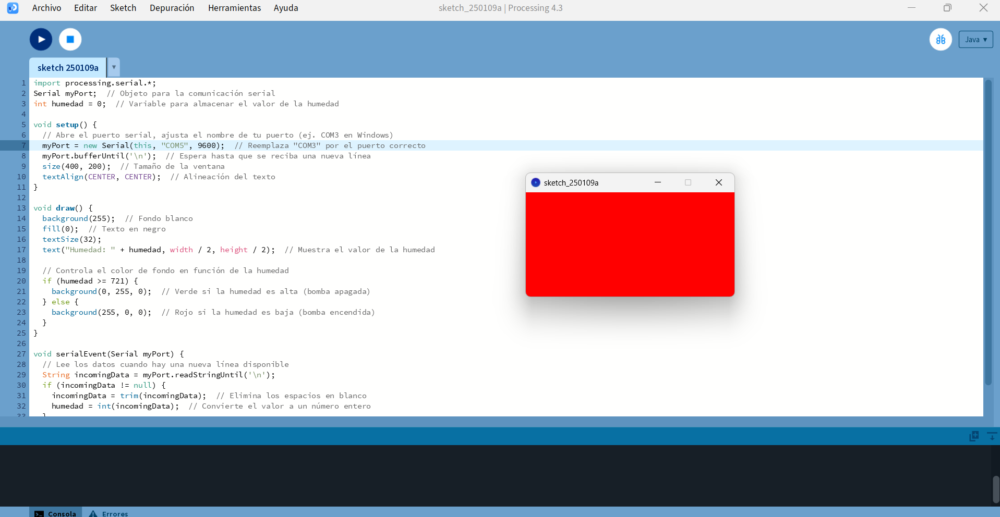

---
hide:
    - toc
---

# MT07
## INTERFACES Y APLICACIONES
con Xavier - Fab Lab Barcelona.

En este módulo técnico nos introducimos en los principios de programación y electrónica aplicada a interfaces. Una *interfaz* implica la **conexión entre un sistema informático y los usuarios**. Es conectarse con un dispositivo o sistema y tener algun tipo de comunicación.

Los objetivos específicos de este módulo son:

 - Interpretar e implementar protocolos de diseño y programación para crear una Interfaz Gráfica de Usuario (GUI).

 - Programación de Interfaz sencilla.

 - Asociar GUI con el mundo real (entradas, actuadores).

 - Adquirir conocimientos prácticos para poder aplicar soluciones en situaciones reales.

La presentación del tema se realiza a través de la herramienta *miro* donde participamos en la elaboración de la pizarra de trabajo respondiendo preguntas sobre el tema. 

Comparto el miro: https://miro.com/app/board/uXjVKGRsnZ4=/ 

A medida que la información se fue incorporando en el miro, y mediante programación por detras que conecta el miro con chatgpt, aparecieron imágenes representativas de las definiciones que escribiamos.

Entendiendo  la *interficie* como lo que vemos y a *interfaz* como el acto de comunicarse un usuario con un sistema digital sea un sofware o hardware. Los usuarios sepueden comunicarse, recibir, controlar o visualizar información de un sistema.

Existen distintos tipos de interfaces:

>  - **Interfaz Gráfica de Usuario (GUI)**: usa elementos visuales, como íconos, menús y ventanas para permitir que los usuarios interactúen con el sistema. Por ej: computadoras o teléfonos inteligentes.
>  - **Interfaz de línea de comandos (CLI)**: permite interacuar ingresando comando de textos. Por ej: Linux o en herramientas de programación. Lo realizamos en GIT.
>  - **Interfaz Táctil**: usa pantallas táctiles para que el usuario interactue directamente con el dispositivo. Ej: teléfonos móviles y tablets.
>  - **Interfaz de voz**: los usuarios interactuan mediante comandos de voz, por ejemplo: Alexa, Google assistant.

Para diseñar y programar la interficie, necesitamos responer algunas preguntas claves: 

¿Cuál es el objetivo?, ¿De qué manera nos vamos a relacionar con el usuario?,  ¿quién lo va a utilizar? ¿Qué tipo de información vamos a mostrar? si son imágenes, datos, etc. Esta información de dónde viene? de nuestro servidor en una base de datos o proviene de un servicio externo?
Entender dónde va a estar alojada la información, si la aplicación es local o está en un servidor. Esto influye si queremos que todos tengan acceso o no. 
¿Qué tipo de interacción queremos tener con el usuario?, si es por voz, por botones, por formularios?

La interficie forma parte de un sistema, no es solo lo que vemos sino también dónde está, cómo conseguimos la información, qué protocolo de comunicación vamos a utilizar?, dónde está la base de datos?

Por ejemplo si la información proviene de un sensor, la información pasa a la placa *arduino* que es el "cerebro" y se encarga de enviarlo a la interficie, que puede estar alojada en la placa o puede enviarla a un servidor.

Mediante ejemplos prácticos, entendimos el lenguaje de programación:

**Processing**, proviene de java, es un lenguaje de programación sencillo que permite a través de código, realizar interficies a partir de gráficos.

La estructura es similar a la de arduino, tiene una función **setup**, que es la configuración de la aplicación y una función que se llama **draw** que se ejecuta todo el rato en mi programa y va leyendo. 
El ejemplo que muestra Xavi es el de una placa que tiene un boton, el cual interactua con la aplicación diseñada con processing. El código está en la placa ESP 32 CON WIFI, la aplicación está hecha en processing, en el código con la función *size (200,200)* define el tamaño de la interficie. Cuando el botón es accionado el cuadro cambia de color negro a rojo. 

Este ejemplo lee por serie, el processing se conecta al puerto serie. Tiene que ser el mismo puerto donde tenemos colocado la placa!!.
Es importante tener en cuenta la velocidad de comunicación entre la placa (arduino) y la compu, tienen que ser la misma. La velocidad es bits por segundos y se mide en baudios. Si no están a la misma velocidad en el monitor serial no se lee claramente el mensaje, aparecen unos íconos extraños:

Con la función **read** va a leer el valor que le envía la placa de arduino, en este caso es un valor numérico pero podría ser texto.
En este caso cuando el botón no está apretado, el valor es cero y se pinta el cuadrado de la interficie de color negro. Si se aprieta el botón cambia de color a rojo (255,0,0) si lo quiero en verde, detengo, cambio el número del color (0,255,0) y vuelvo a cargar.

El código en arduino es el siguiente:

Librerias, es importante importar la libreria processing.serial.*, para comunicarse con el puerto serie.

**Arduino**, es una plataforma de software y hardware, en este ejemplo la página web está alojada dentro de la placa de arduino:

Con este ejemplo se enciende y se apaga una led desde la web.
En el código de arduino:
Se importan las librerias necesarias, de la placa y de la web server,
Se configura el wifi, es una red local.
En este caso se conecta arduino con la web, mediante "ESP WebSocket Server". En este caso la información no va por serie, como el ejemplo de processing, sino que va por web. Es importante configurar la placa como un servidor.
Se configuran los pins, el led.
Se configura el código html, que será la web visible para el usuario.

Se carga el código y lo primero que conecta es la wifi, luego la IP: 

Es importante que la wifi de la placa sea la misma que la wifi de la compu.
En la web, se abre la siguiente pagina: 

**P5 js**, la versión online de Processing es P5 de java scrip. Es un lenguaje que funciona para hacer gráficos en tiempo real. Esta opción tiene el editor online, se va modificando el código de forma online.

**NODE-RED**, es una herramienta pensada para conetar dispositivos entre si y se envía la información. Es multi plataforma. Programas por nodos, no por código. Se instala un servidor a la vez que se instala Node Red, de forma local, carga y aparece la interficie de programación de Node Red, cáda nodo tiene una función.

## DESAFÍO MT07

Diseña y Desarrolla una interficie digital interaccione INPUT/OUTPUT con el usuario.

> - Objetivo: leer y graficar la humedad del suelo de una maceta.  
> - La información proviene de un sensor de humedad instalado en la maceta y programado con arduino.
> - El dato que vamos a recibir es un valor que puede ir de 0 a 1023. Definimos el valor 0 cuando el sustrato está húmeda, y 1023 cuando el sustrato está seco.
> - La interficie es una gráfica de este valor en función del tiempo. 
> - La información es local.

El sensor está vinculado a un sistema de auto riego, con el objetivo de disminuir el estres hídrico que sufre la planta cuando no la riego. 
Quiero saber cada cuánto tiempo se activa el auto riego. 

Mediante processing, leeremos a través del puerto serie los datos obtenidos.

Importo de la libreria el puerto serie. 

Con la ayuda de chatgpt armo el código para processing: 

 

 

 

 