---
hide:
    - toc
---

# MT07
## INTERFACES Y APLICACIONES
con Xavier - Fab Lab Barcelona.

En este módulo técnico nos introducimos en los principios de programación y electrónica aplicada a interfaces. Una *interfaz* implica la **conexión entre un sistema informático y los usuarios**. Es conectarse con un dispositivo o sistema y tener algun tipo de comunicación.

Los objetivos específicos de este módulo son:

 - Interpretar e implementar protocolos de diseño y programación para crear una Interfaz Gráfica de Usuario (GUI).

 - Programación de Interfaz sencilla.

 - Asociar GUI con el mundo real (entradas, actuadores).

 - Adquirir conocimientos prácticos para poder aplicar soluciones en situaciones reales.

La presentación del tema se realiza a través de la herramienta *miro* donde participamos en la elaboración de la pizarra de trabajo respondiendo preguntas sobre el tema. 

Comparto el miro: https://miro.com/app/board/uXjVKGRsnZ4=/ 

A medida que la información se fue incorporando en el miro, y mediante programación por detras que conecta el miro con chatgpt, aparecieron imágenes representativas de las definiciones que escribiamos.

Entendiendo  la *interficie* como lo que vemos y a *interfaz* como el acto de comunicarse un usuario con un sistema digital sea un sofware o hardware. Los usuarios sepueden comunicarse, recibir, controlar o visualizar información de un sistema.

Existen distintos tipos de interfaces:

>  - **Interfaz Gráfica de Usuario (GUI)**: usa elementos visuales, como íconos, menús y ventanas para permitir que los usuarios interactúen con el sistema. Por ej: computadoras o teléfonos inteligentes.
>  - **Interfaz de línea de comandos (CLI)**: permite interacuar ingresando comando de textos. Por ej: Linux o en herramientas de programación. Lo realizamos en GIT.
>  - **Interfaz Táctil**: usa pantallas táctiles para que el usuario interactue directamente con el dispositivo. Ej: teléfonos móviles y tablets.
>  - **Interfaz de voz**: los usuarios interactuan mediante comandos de voz, por ejemplo: Alexa, Google assistant.

Para diseñar y programar la interficie, necesitamos responer algunas preguntas claves: 

¿Cuál es el objetivo?, ¿De qué manera nos vamos a relacionar con el usuario?,  ¿quién lo va a utilizar? ¿Qué tipo de información vamos a mostrar? si son imágenes, datos, etc. Esta información de dónde viene? de nuestro servidor en una base de datos o proviene de un servicio externo?
Entender dónde va a estar alojada la información, si la aplicación es local o está en un servidor. Esto influye si queremos que todos tengan acceso o no. 
¿Qué tipo de interacción queremos tener con el usuario?, si es por voz, por botones, por formularios?

La interficie forma parte de un sistema, no es solo lo que vemos sino también dónde está, cómo conseguimos la información, qué protocolo de comunicación vamos a utilizar?, dónde está la base de datos?

Por ejemplo si la información proviene de un sensor, la información pasa a la placa *arduino* que es el "cerebro" y se encarga de enviarlo a la interficie, que puede estar alojada en la placa o puede enviarla a un servidor.

Mediante ejemplos prácticos, entendimos el lenguaje de programación:

**Processing**, proviene de java, es un lenguaje de programación sencillo que permite a través de código, realizar interficies a partir de gráficos.

La estructura es similar a la de arduino, tiene una función **setup**, que es la configuración de la aplicación y una función que se llama **draw** que se ejecuta todo el rato en mi programa y va leyendo. 
El ejemplo que muestra Xavi es el de una placa que tiene un boton, el cual interactua con la aplicación diseñada con processing. El código está en la placa ESP 32 CON WIFI, la aplicación está hecha en processing, en el código con la función *size (200,200)* define el tamaño de la interficie. Cuando el botón es accionado el cuadro cambia de color negro a rojo. 

Este ejemplo lee por serie, el processing se conecta al puerto serie. Tiene que ser el mismo puerto donde tenemos colocado la placa!!.
Es importante tener en cuenta la velocidad de comunicación entre la placa (arduino) y la compu, tienen que ser la misma. 
Con la función **read** va a leer el valor que le envía la placa de arduino, en este caso es un valor numérico pero podría ser texto.
En este caso cuando el botón no está apretado, el valor es cero y se pinta el cuadrado de la interficie de color negro. Si se aprieta el botón cambia de color a rojo (255,0,0) si lo quiero en verde, detengo, cambio el número del color (0,255,0) y vuelvo a cargar.

El código en arduino es el siguiente:

Librerias, es importante importar la libreria processing.serial.*, para comunicarse con el puerto serie.

**Arduino**, es una plataforma de software y hardware, en este ejemplo la página web está alojada dentro de la placa de arduino:

Una **RED** es un conjunto de ordenadores conectados entre si a través de LINEAS DE COMUNICACIÓN. 
Los **PROTOCOLOS** son un conjunto de NORMAS sobre formato de mensajes y procedimientos que permiten a máquinas y programas de aplicación intercambiar INFORMACIÓN.

**MQTT** es un protocolo que utiliza un modelo de publicación/ suscripción basado en eventos para poder enviar mensajes a los clientes. 

 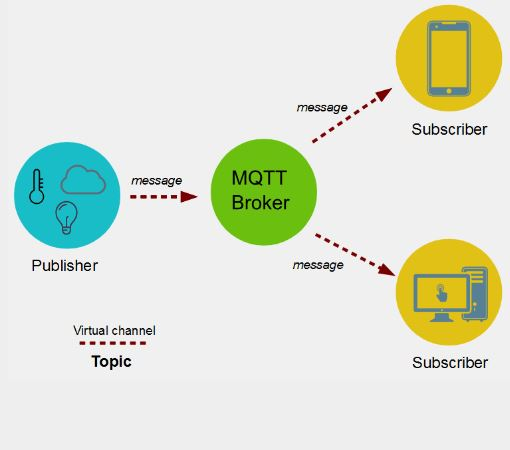 

 La comunicación pasa por un punto central llamado "broker", que se encarga de gestionar el envío de mensajes entre emisores y receptores. Cada cliente, al enviar un mensaje, lo hace incluyendo un *topic* en el mensaje. **Cada cliente que quiere recibir un mensaje se suscribe a un determinado topic del broker** y éste le envía los mensajes correspondientes.

 Broker es un servidos donde se puede publicar mensajes o subscribirte a un tópico.

  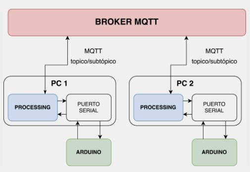

## Desafío MT06
Siguiendo el ejercicio realizado en la clase con Jusep, descargué e INSTALÉ la placa ESP32. Para poder programarla es necesario instalarla en Arduino. 

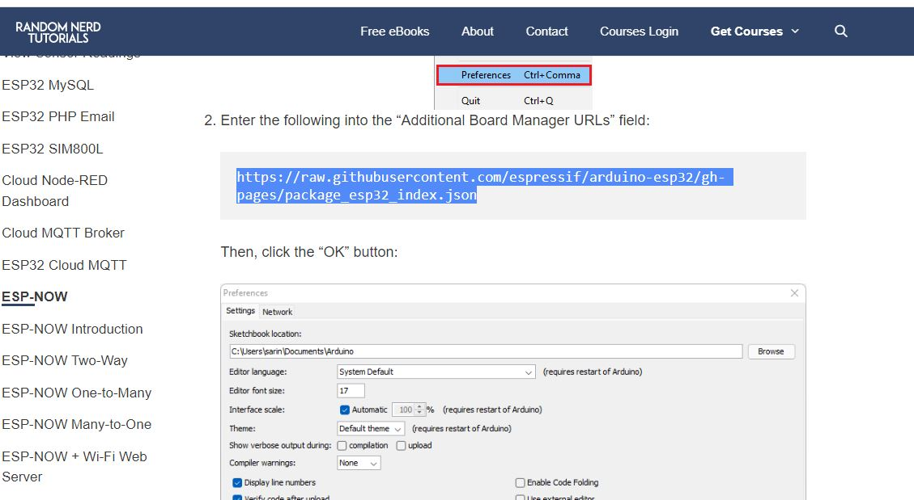

Video tutorial para instalarla: 
https://randomnerdtutorials.com/installing-the-esp32-board-in-arduino-ide-windows-instructions/

Copiar el link de la página (definiciones de distintas placas que vamos a poder controlar con Arduino) y lo pegamos en  file, preferences: 

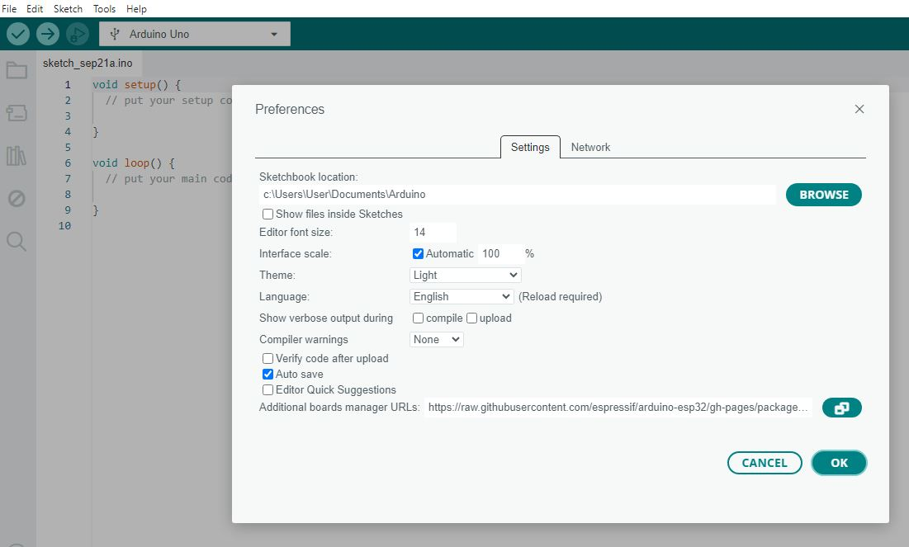

Segundo paso: Instalar estas placas en Arduino:

En "boards manager", busco ESP32 y elijo la segunda:

 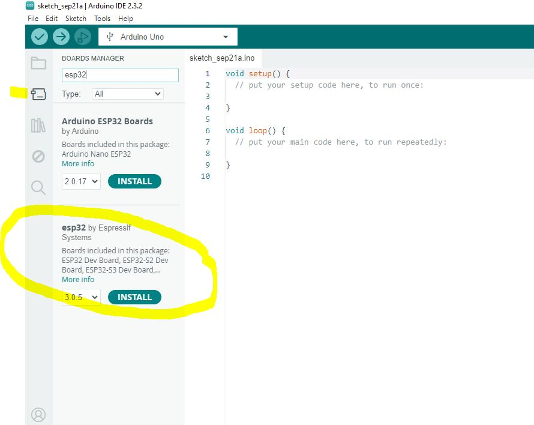

 Luego de unos minutos se instalan todas las placas:

  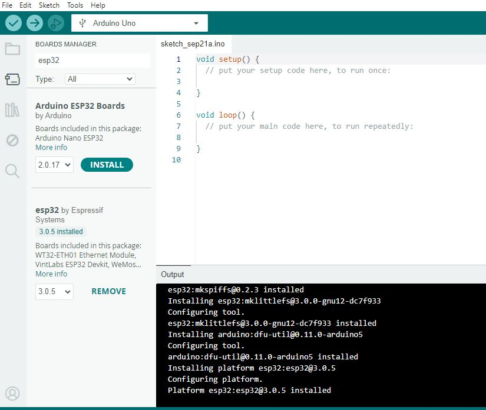

  En "tools", "boards", elegimos la más básica: 

  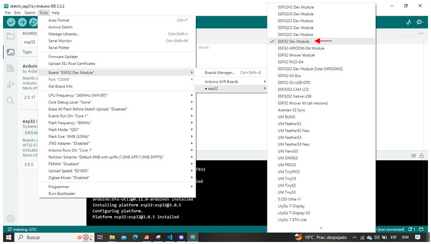

Tercer paso: Instalar las Librerias:
busco "pubsubclient"

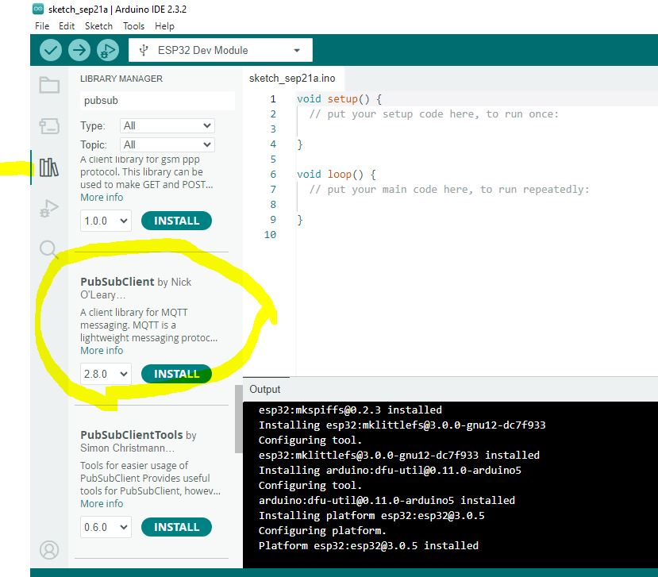   

Estamos prontos para copiar el código del WOKWI del ejercicio y pegarlo en Arduino.  

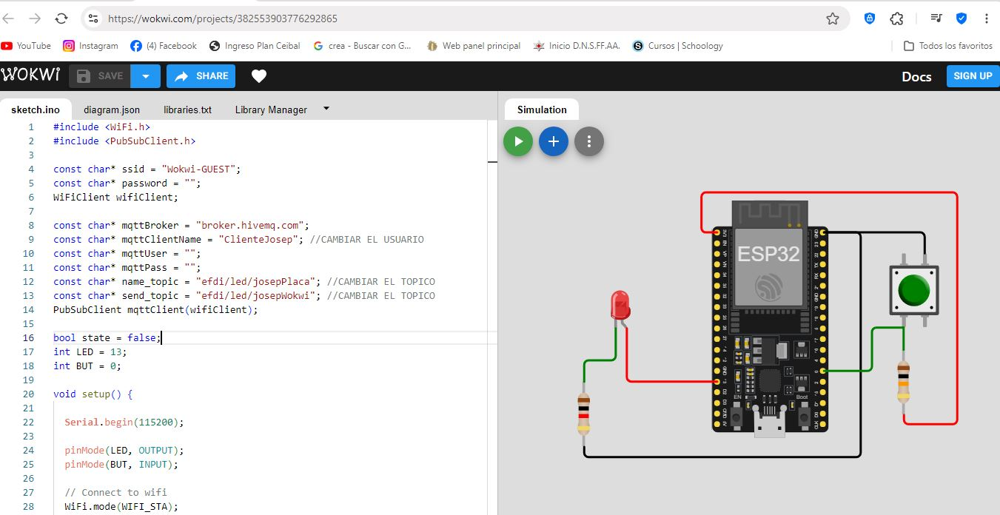 

Compilamos para verificar que el código no tenga errores, demora unos minutos. 

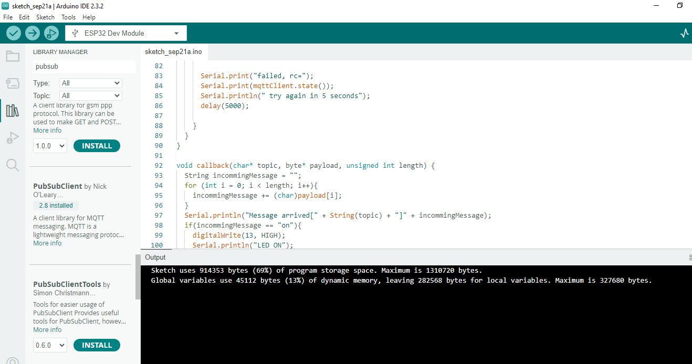 

Entender el código:

Al principo dos librerias:

 "WiFi.h" me permite conectarme a wifi

 "PubSubClient.h" me permite conectarme a un servidor de mqtt.

 Definir la red y contraseña de wifi.
 Me conecto desde el celu. Busco la Red y la contraseña. 

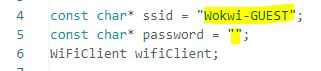 

 Definir nuestro nombre en mqtt:

 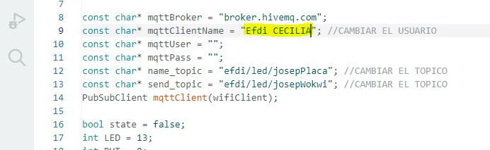 

 Vamos a leer el boton, si el botón está apretado voy a mandar "on" si el botón no está apretado voy a mandar "off", esperamos 1 segundo y volvemos a empezar.

 Error:

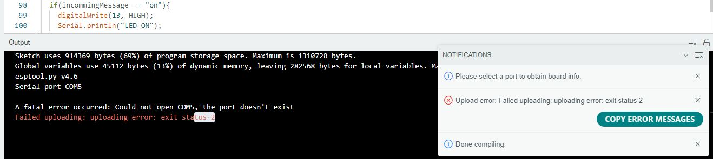 

 

 

 

 