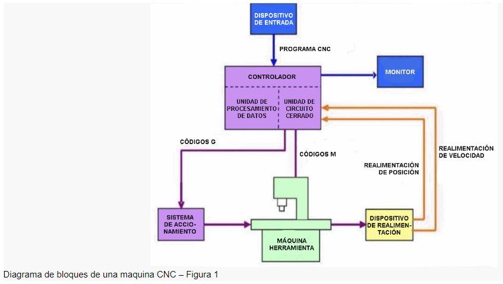
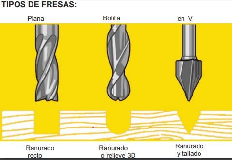
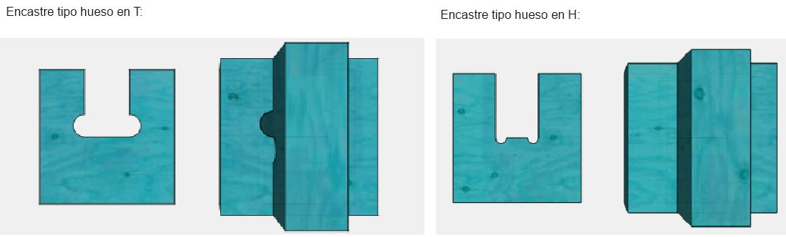

---
hide:
    - toc
---

# MT08
## Control numérico computalizado **CNC** con Maximiliano Torres

En eta etapa aprendimos a preparar piezas en el programa *fusion 360* que se puedan fabricar mediante CNC.
La fabricacion CNC es una tecnología sustractiva, que utiliza una **fresa** como herramienta para modificar el material y crear la pieza a partir de la informacion que recibe de un *codigo g*.

*El Control Numérico Computarizado, es todo aquel dispositivo que posee la capacidad de controlar la posición y velocidad de los motores que accionan los ejes de la máquina para realizar movimientos que no se pueden lograr manualmente como círculos, líneas diagonales y figuras complejas tridimensionales.*

Dentro de las ventajas de la tecnología se destacan:

> - Mayor precisión y mejor calidad de productos,

> - Reducción de tiempos de ciclos operacionales,

> - Control y normalización de sus productos,

> - Variedad de lenguajes de programación,entre otras.

Diagrama de bloques de una maquina CNC:

La herramienta que utiliza la máquina es una **fresa**, con la cual puede realizar operaciones de corte, como una mecha, pero ademas realizar operaciones de grabado, tallado y desbaste en materiales como madera, metal y plasticos. 

En la actividad de este módulo utilizamos tres tipos basicos de herramienta: **plana, tipo bolilla y tipo *V***. 

**Criterios para el diseño:**

- Orientar el material en su parte más larga hacia el eje de mayor capacidad,

- Respetar el espacio necesario para sujetar el material a la mesa, ya sea con tornillos o sujetadores. Distancia de seguridad= 2cm en todo el perimetro de la placa.

- Diámetro de la fresa, 6mm incide en operaciones de contorneado restando la dimensión de la pieza en función de cómo se posicione la herramienta.

- Tolerancias, dejar siempre una luz en los cortes más si son piezas que se encastraran. 

- Encastres: las fresas son herramientas circulares que al trabajar dejan un radio. Es importante dejar un margen extra para lograr encastres correctos. 

 

