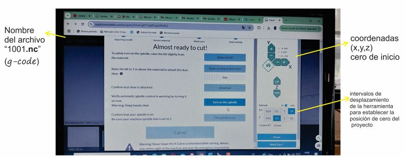

---
hide:
    - toc
---

# MT08
## Control numérico computarizado **CNC** con Maximiliano Torres

En eta etapa aprendimos a preparar piezas en el programa *fusión 360* que se puedan fabricar mediante CNC.
La fabricación CNC es una tecnología sustractiva, que utiliza una **fresa** como herramienta para modificar el material y crear la pieza a partir de la información que recibe de un *código g*.

*El Control Numérico Computarizado, es todo aquel dispositivo que posee la capacidad de controlar la posición y velocidad de los motores que accionan los ejes de la máquina para realizar movimientos que no se pueden lograr manualmente como círculos, líneas diagonales y figuras complejas tridimensionales.*

Dentro de las ventajas de la tecnología se destacan:

> - Mayor precisión y mejor calidad de productos,

> - Reducción de tiempos de ciclos operacionales,

> - Control y normalización de sus productos,

> - Variedad de lenguajes de programación, entre otras.

Diagrama de bloques de una maquina CNC:

La herramienta que utiliza la máquina es una **fresa**, con la cual puede realizar operaciones de corte, como una mecha, pero además realizar operaciones de grabado, tallado y desbaste en materiales como madera, metal y plásticos. 

En la actividad de este módulo utilizamos tres tipos básicos de herramienta: **plana, tipo bolilla y tipo *V***. 

**Criterios para el diseño:**

- Orientar el material en su parte más larga hacia el eje de mayor capacidad,

- Respetar el espacio necesario para sujetar el material a la mesa, ya sea con tornillos o sujetadores. Distancia de seguridad= 2cm en todo el perímetro de la placa.

- Diámetro de la fresa, 6mm incide en operaciones de contorneado restando la dimensión de la pieza en función de cómo se posicione la herramienta.

- Tolerancias, dejar siempre una luz en los cortes más si son piezas que se encastraran. 

- Encastres: las fresas son herramientas circulares que al trabajar dejan un radio. Es importante dejar un margen extra para lograr encastres correctos. 

 

- Largo de la herramienta, verificar que el largo de la herramienta sea mayor que la profundidad del diseño a mecanizar.

- Altura máxima del modelo, tener en cuenta la dimensión máxima del eje Z, para diseñar la pieza.

**Ruter X Carve:**

### Actividad MT08:

*A partir de un diseño elaborado por el docente, descargar el archivo y abrirlo en fusión 360 en el módulo de fabricación configurar la máquina, elegir la herramienta indicada y realizar las operaciones de 2d cajeras, taladro y contorneado siguiendo los tutoriales de referencia. Generar el g-code y documentar el proceso.*

Descargo el Modelo 3d, de la web y lo abro en fusión 360, le asigno el material madera a la pieza:

Siguiendo el tutorial de la clase, realizo la configuración de la máquina a partir de la biblioteca de maquinas eligiendo: **Autodesk Generic 3-axis Router** y del post procesador easel: **f360-easel.cps**

En la parte de Fabricación, en el comando 2D, selecciono  *2D CAJERAS* para empezar a ajustar la operación de rebaje del trébol. 
Se abre un menú con varias pestañas donde configuro el tipo de herramienta (*1/8" flat endmill*), la orientación de la misma respecto a los ejes x,y,z (cara horizontal del modelo perpendicular al eje z) y el orígen (punto del bloque del material), la geometría de cajeras, las diferentes alturas del proyecto: de espacio libre, de retracción, de avance, la superior y la inferior, las pasadas que realiza la herramienta(varias profundidades, reducción de desbaste maximo:1mm)

En acciones, simular: permite simular el movimiento de la herramienta, su trayectoria y verificar que este todo ok.

Una vez realizados todos los ajustes en las operaciones solicitadas se genera el codigo g. En una primer instancia mi código tenia un error, en la operación 2d cajeras del trébol, en la línea 27 del código especificaba que la orientación de la herramienta no era correcta, revise varias veces y estaba todo ok. Con Maxi en el Laba A, revisamos el ejercicio paso por paso y así encontró el error que se estaba dando, las operaciones estaban bien pero la posición original de la herramienta no, asique ajuste la posición de la herramiente nuevamente en todas las operaciones y así pude corregir el error y obtener un código correcto.

#### Actividad MT08-LabA Rivera

En el programa **EASEL** de post procesado se ajustan los detalles de configuración de la maquina y se confirman paso a paso las medidas de seguridad necesarias. Se ubica el cero del proyecto, Se verifica que el extractor de polvo esta encendido, Se enciende el husillo y cuando todo esta chequeado se inicia. 

  

 Video del proceso de ejecución de la operación 2d cajeras, rebaje del trébol.

 
<iframe src="https://player.vimeo.com/video/1028416163?badge=0&amp;autopause=0&amp;player_id=0&amp;app_id=58479" frameborder="0" allow="autoplay; fullscreen; picture-in-picture; clipboard-write" style="position:absolute;top:0;left:0;width:100%;height:100%;" title="Video1"></iframe>

Video del proceso de ejecución de contorneado de la pieza, ultima operación:
 
 
<iframe src="https://player.vimeo.com/video/1028451126?badge=0&amp;autopause=0&amp;player_id=0&amp;app_id=58479" frameborder="0" allow="autoplay; fullscreen; picture-in-picture; clipboard-write" style="position:absolute;top:0;left:0;width:50%;height:50%;" title="v2"></iframe>

 

##### Actividad MT08-Archivos

En el siguiente link se pueden descargar los archivos de fusion 360 y el *g-code*:
[link a archivos de MT08](https://drive.google.com/drive/u/0/folders/1d1gvrbjHcdId-HlJVtdz08_M3K1BHSTp)

##### Conclusión

El proceso de mecanizado desde el diseño hasta la configuración es muy accesible. Es importante tener en cuenta el órden de las operaciones para generar un flujo de trabajo optimo. El contorneado del centro fue mi primer operación y una vez que finalizó esta operación y continuó con el rebaje del trébol, el círculo excedente quedó suelto y comenzó a moverse, para evitar cualquier inconveniente Maxi detuvo el trabajo por unos segundos y retiró cuidadosamente la pieza. Este detalle en la simulación inicial no era visible, quizás si lo hubiese programado para el final, previo al contorneado perimetral de la pieza no hubiese generado el stop.