---
hide:
    - toc
---

# MT09
## Moldes con Julia Leirado (BCN)
En esta etapa del curso aprendimos sobre moldes y el proceso de
fundición: *fabricación en el que normalmente se vierte un material líquido en un molde, que contiene una cavidad hueca de la forma deseada, y luego se deja solidificar.* 

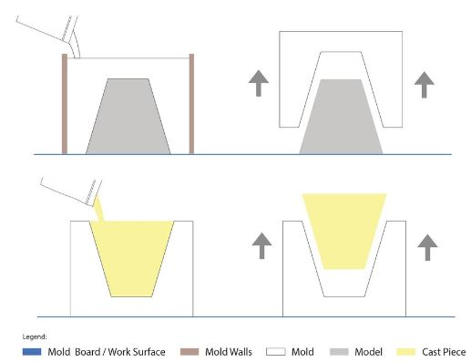 

Los moldes han sido parte de nuestra cultura desde los origenes de la humanidad. Se aplican en diversas especialidades, como por ejemplo en la industria de la joyeria, en prototipos dentales, en autopartes.  

El molde puede ser de una cara o de varias caras, dependiendo del diseño de la pieza a replicar.

- Moldes simples para colada de yeso, resina, caucho.

- Moldes complejos para resina con fibras de vidrio, carbono.

CRITERIOS DE DISEÑO:

- **Angulo de desmolde**: *el ángulo de desmolde proporciona una ligera conicidad que facilita la extracción de las piezas*.
Si los lados del molde y la pieza son paralelos verticales, será muy dificil desmoldar la pieza. 

 

- **Agujero de vertido**: orificio po el cual el material fluye a traves del molde en casos de dos o mas partes. 

- **Ventilación de aire**: respiraderos que permiten la salida de aire.
Se deben ubicar sobre el punto donde el canal de vertido se encuentra con la cavidad del modelo, así como tambien en los lugares donde se pueda formar bolsa de aire. 

- **Agujeros de centrado / almohadillas**: 
Permiten lograr una perfecta alineación entre dos piezas de un molde. 

MATERIALES: 

 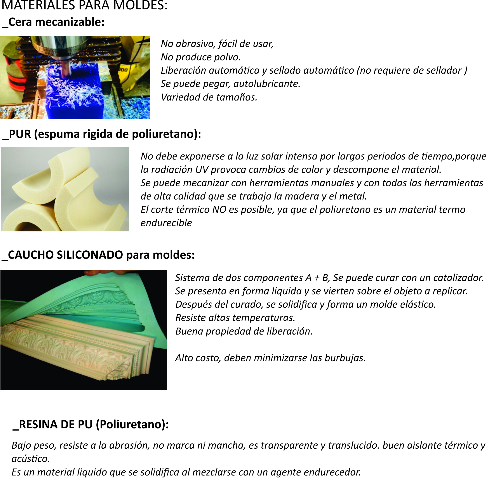 

 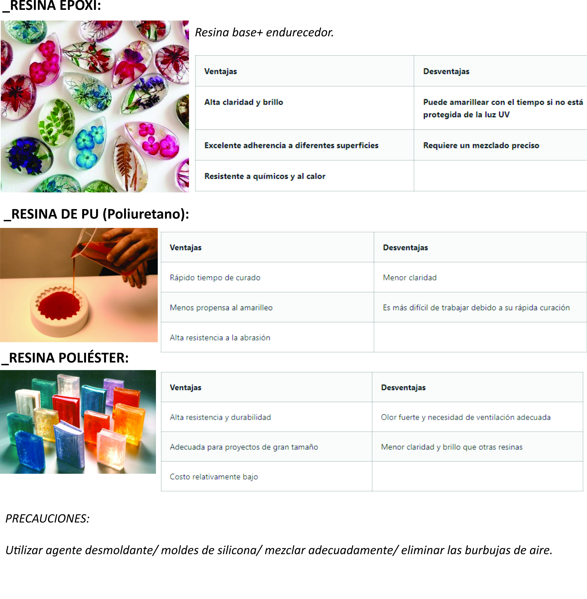 

### Actividad MTO9

 *Diseñar y modelar en **Fusion 360** una maceta de dimensiones máximas: alto 10cm y diámetro 15cm.
 Diseñar y modelar un molde para la maceta de mínimo 1 cara y máximo 4 caras, con guias de encastre. 
 Incluir angulo de desmolde en todas las caras de la pieza.*

Me fue de gran ayuda el tutorial:
de [makerLifeOn](https://www.youtube.com/watch?v=gVrJOnB1VHU)
para seguir descubriendo la herramienta fusion. Asi como tambien ver el diseño de la parte "negativa" de la pieza, cuestión que me costo asimilar y con el ejemplo fue muy claro.

En el diseño de la pieza es importante centrar el boceto respecto al sistema de ejes de coordenadas. 
En una primera instancia no lo tuve en cuenta y me generó retrabajos.

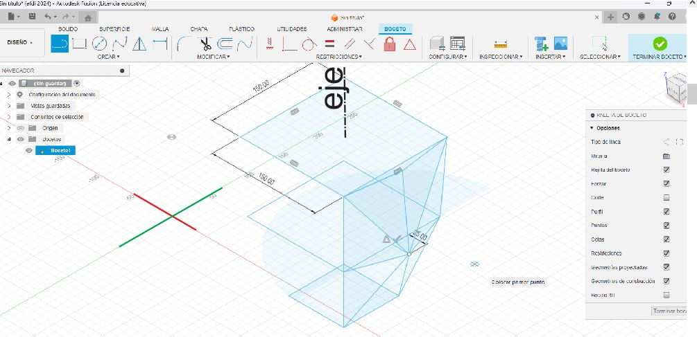 

al momento de generar el patrón referente al eje z, las caras quedaron desfasadas. 

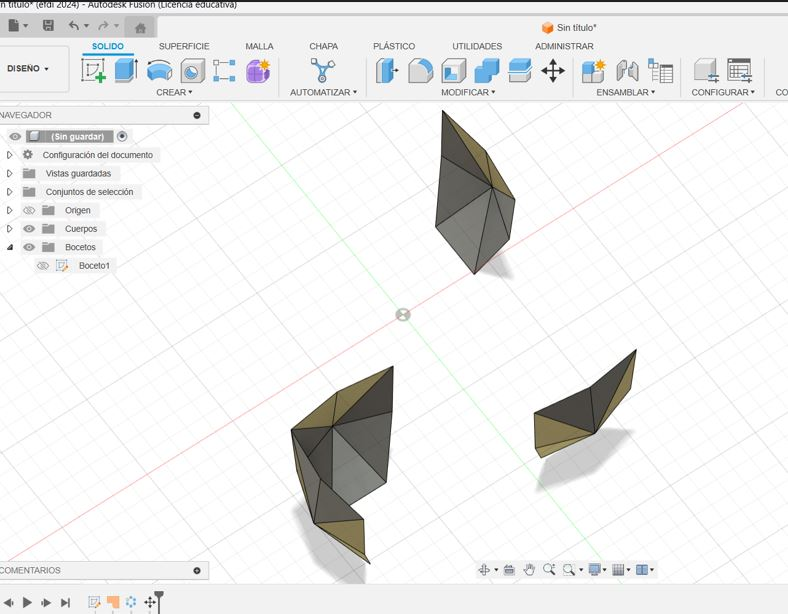

aprendi comandos nuevos, muy utiles para unificar la pieza, como por ejemplo la herramienta "coser" dentro de superficie: 

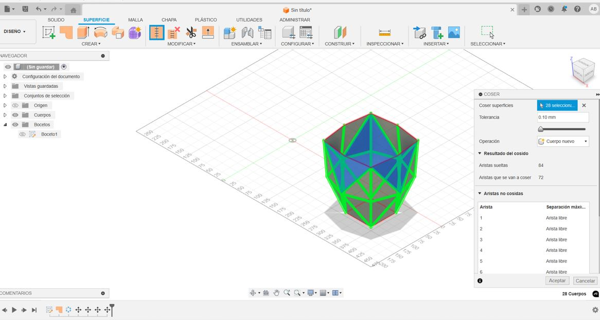

una vez que tenemos la cascara pronta con la herramienta "vaciado" generamos el espesor de la pieza.

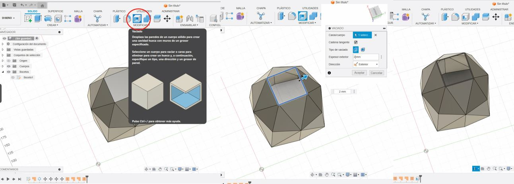

para que la maceta no sea un solido maciso, es que necesitamos diseñar el volúmen interior que generará el vacio. El desfase interior generará el espesor de la maceta. 
Es muy importante que las aristas del prisma no sean verticales y tengan un ángulo de desmolde adecuado. 

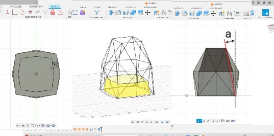

apagamos el cuerpo exterior, la "cascara", y trabajamos con el cuerpo interior con el comando empalme redondeamos las aristas con un valor de 2mm, y con el comando vaciado le damos el espesor a la pieza.

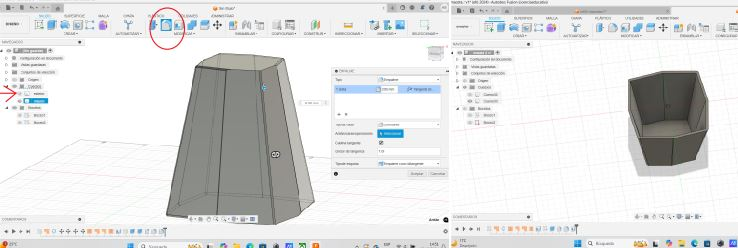

apagamos el cuerpo interior y prendemos el exterior para crear un nuevo boceto, por el cual dividiremos la pieza. 

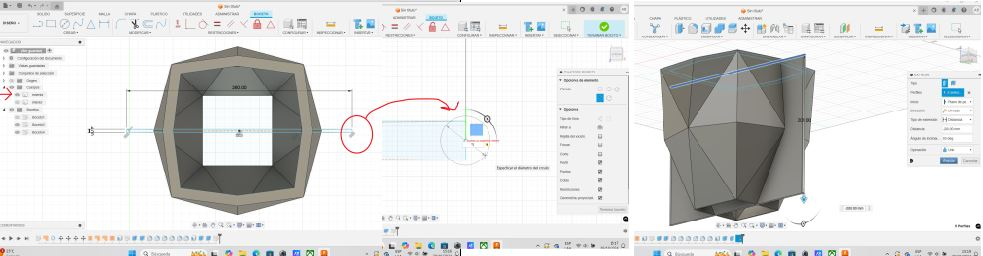

en solidos, dentro de modificar, con el comando "dividir cuerpo" seleccioné el plano vertical que pasa por el medio de la pieza y de divide en dos cuerpos. 

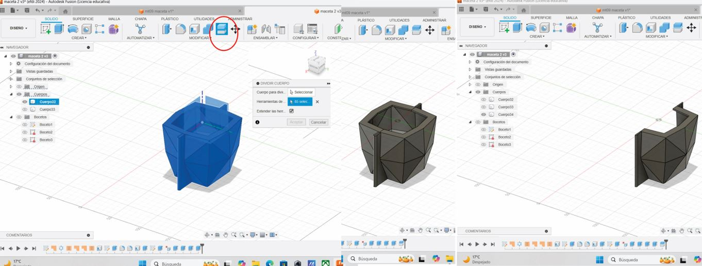

en el cuerpo interior diseño un desague para la maceta, con la forma de pilares cóncavos.

<a class="btn" href="/docs/files/maceta final MTO9 CE.f3d" download="/docs/files/maceta final MTO9 CE.f3d">
   Descargar el archivo.f3d
   </a> 
   
<link="\docs\files\ >

exporto los tres archivos de forma independiente, como STL binario y lo importo en idea Maker:

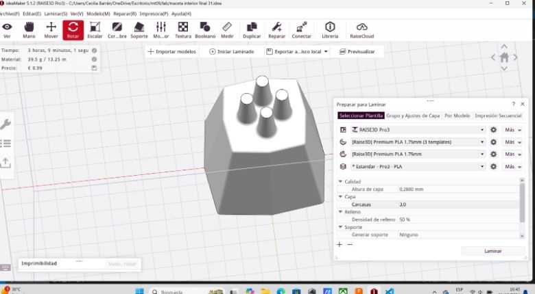

la pieza se rota para evitar soportes y se configura la base tipo balsa. 

