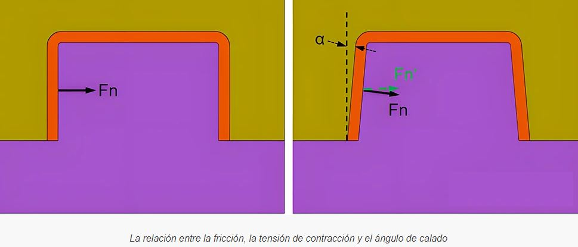
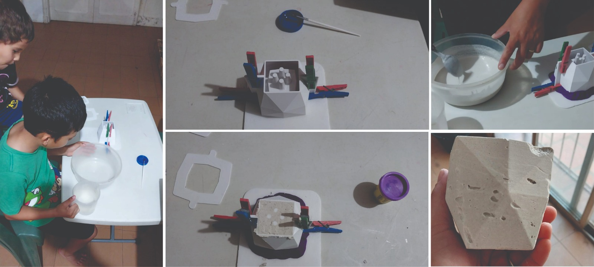

---
hide:
    - toc
---

# MT09
## Moldes con Julia Leirado (BCN)
En esta etapa del curso aprendimos sobre moldes y el proceso de fundición: *fabricación en el que normalmente se vierte un material líquido en un molde, que contiene una cavidad hueca de la forma deseada, y luego se deja solidificar.* 

 

Los moldes han sido parte de nuestra cultura desde los orígenes de la humanidad. Se aplican en diversas especialidades, como por ejemplo en la industria de la joyería, en prototipos dentales, en autopartes.  

El molde puede ser de una cara o de varias caras, dependiendo del diseño de la pieza a replicar.

- Moldes simples para colada de yeso, resina, caucho.

- Moldes complejos para resina con fibras de vidrio, carbono.

CRITERIOS DE DISEÑO:

- **Angulo de desmolde**: *el ángulo de desmolde proporciona una ligera conicidad que facilita la extracción de las piezas*.
Si los lados del molde y la pieza son paralelos verticales, será muy difícil desmoldar la pieza. 

 

- **Agujero de vertido**: orificio por el cual el material fluye a través del molde en casos de dos o más partes. 

- **Ventilación de aire**: respiraderos que permiten la salida de aire.
Se deben ubicar sobre el punto donde el canal de vertido se encuentra con la cavidad del modelo, así como también en los lugares donde se pueda formar bolsa de aire. 

- **Agujeros de centrado / almohadillas**: 
Permiten lograr una perfecta alineación entre dos piezas de un molde. 

MATERIALES: 

  

  

### Actividad MTO9

 *Diseñar y modelar en **Fusión 360** una maceta de dimensiones máximas: alto 10cm y diámetro 15cm.
 Diseñar y modelar un molde para la maceta de mínimo 1 cara y máximo 4 caras, con guías de encastre. 
 Incluir ángulo de desmolde en todas las caras de la pieza.*

Me fue de gran ayuda el tutorial de [makerLifeOn](https://www.youtube.com/watch?v=gVrJOnB1VHU) para seguir descubriendo la herramienta fusión 360. Así como también ver el diseño de la parte "negativa" de la pieza, cuestión que me costó asimilar y con el ejemplo fue muy claro.

En el diseño de la pieza es importante centrar el boceto respecto al sistema de ejes de coordenadas. 
En una primera instancia no lo tuve en cuenta y me generó re-trabajos.

 

Al momento de generar el patrón referente al eje z, las caras quedaron desfasadas. 

Aprendí comandos nuevos, muy útiles para unificar la pieza, como por ejemplo la herramienta "coser" dentro de superficie: 

Una vez que tuve la cascara pronta con la herramienta "vaciado" generé el espesor de la pieza.

Para que la maceta no sea un solido macizo necesitamos diseñar el volumen interior el cual genera el vacío. El desfase entre la cascara y el interior, generará el espesor de la maceta. 
Es muy importante que las aristas del prisma no sean verticales y tengan un ángulo de desmolde adecuado. 

Apagamos el cuerpo exterior, la "cascara", y trabajamos con el cuerpo interior con el comando empalme redondeamos las aristas con un valor de 2mm, y con el comando vaciado le damos el espesor a la pieza.

Apagamos el cuerpo interior y prendemos el exterior para crear un nuevo boceto, por el cual dividiremos la pieza. 

En solidos, dentro de modificar, con el comando *dividir cuerpo* seleccioné el plano vertical que pasa por el medio de la pieza y así se divide en dos piezas separadas. 

En el cuerpo interior diseño un desagüe para la maceta, con la forma de pilares cóncavos.
Exporto los tres archivos de forma independiente, como STL binario y lo importo en **idea Maker**:

Se realiza la rotación de la pieza para evitar la creación de soportes y se configura la base tipo balsa. 

#### Actividad MTO9-archivos 

En el siguiente [link a archivos de MT09](https://drive.google.com/drive/u/0/folders/185s9ItCN6rT45JQD6yXyU4WL12Q8dqM2) se puede descargar el modelo de la maceta en fusión 360 y los *g-code* de la parte interior y del exterior de la maceta. 

#### **LAB A Rivera**
Con Maximiliano Torres, encargado del Lab A. revisamos el modelo de la maceta y ajustamos algunos detalles del diseño con el objetivo de mejorar la impresión de la pieza y en pos de lograr un mejor desmolde. 

##### Conclusión
  Los moldes es todo un mundo para experimentar, muy amplio y diverso en cuanto a diseño y materiales.Me resulto un poco complejo al inicio, visualizar el negativo del diseño, siguiendo el ejemplo fui asimilando las partes y criterios del diseño que eran necesarios tener en cuenta para que se pueda fabricar la pieza mediante un molde exitoso. Es momento de probar si funciona el molde, primero tengo que fijar la pieza a una base porque tiene movimiento.

 